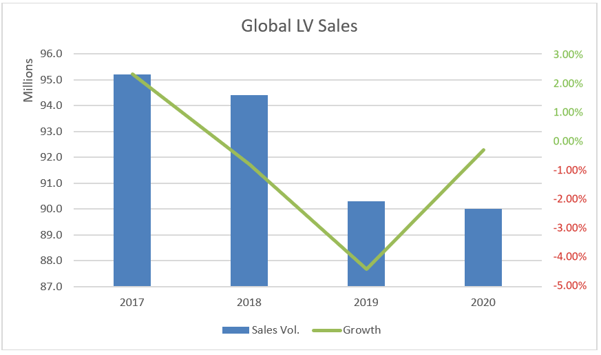
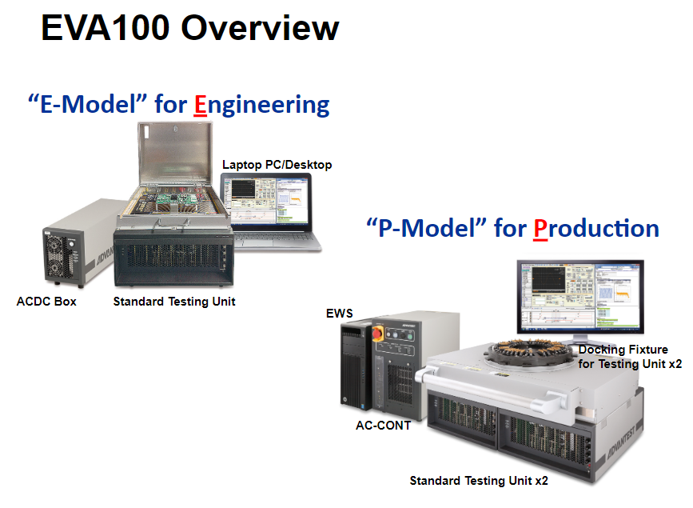

Posted  in [Featured](https://www.gosemiandbeyond.com/category/featured/)

# Finding the Optimum Test Solution for Next-Generation Automotive ICs

*By Masashi Nagai, Senior Executive Director, Strategic Planning Group, Advantest Korea Co., Ltd.*

Our world is changing, driven by technological advances in areas as varied as artificial intelligence, the Internet of Things, smart factories, green energy, energy storage, drones, security, and smart appliances. The automotive industry is leveraging the same technologies with the arrival of hybrid electric vehicles (HEV), plug-in hybrid vehicles (PHV), all-electric vehicles (EV), autonomous driving, and connected cars, and it will be a key driver of technology moving forward.

**Market data**

*Figure 1. LMC Automotive forecasts a return to growth after a falloff from global peak light vehicle sales in 2017. (Source: LMC Automotive, https://lmc-auto.com/news-and-insights/peak-auto/)*

 

It’s true that worldwide light vehicle sales are off their 2017 high of 95.2 million units, according to LMC Automotive. However, the market appears to be entering a period of recovery, with growth resuming this year (**Figure 1**). Jonathon Poskitt, director of global sales forecasts at the firm, writes in a recent blog post that he expects the market to reach new record highs in the first half of this decade, as vehicle ownership becomes more affordable in markets that have not reached maturity and as the demand for mobility grows.1

*Figure 2. Omdia (formerly IHS Markit) predicted a CAGR greater than 35% for hybrid-electric and electric-vehicle powertrain module unit shipments from 2018 through 2024. (Source – Omdia, Power Semiconductors in Automotive, May 2019. Results are not an endorsement of Advantest Corporation. Any reliance on these results is at the third-party’s own risk.)*

The research firm Omdia (formerly IHS Markit) forecasts significant growth for electric vehicles. The firm in 2019 predicted a CAGR greater than 35% for hybrid-electric and electric-vehicle powertrain module unit shipments from 2018 through 2024 (**Figure 2**).2

**Automotive paradigm shift**

Automotive technology is undergoing a paradigm shift. Sensors and high-end computing technologies began enabling driver-assistance capabilities in 2015. This year is seeing increasing use of sensor fusion. By 2030, full driverless functionality will appear with passengers embedded in a safety cocoon. 

Semiconductor technology has a key role to play in driving this shift. Advanced vehicles require semiconductor and electronic components in various automotive application areas, including infotainment (navigation, audio, networking), drivetrain (engine and transmission control), body and comfort (air-conditioning, lighting, seat, door/window, and mirror/wiper control), and chassis and safety (antilock braking systems, electronic power steering, airbag control, and advanced driver assistance systems).

In addition, electric and hybrid electric vehicles require semiconductors for motor-drive applications as well as battery monitoring and charging and power management. And modern cars require pressure, acceleration, magnetic, yaw-rate, gas, and other precision sensors.

The vehicle represents only the tip of the iceberg regarding the semiconductors that will populate the entire automotive ecosystem. Beyond the car itself, the next generation of automotive technologies will have a role to play in cost management and product planning in the factory and throughout the supply chain, for example.

Furthermore, the connected car offers many opportunities for semiconductor technology, with support for V2X and IoT connectivity, media integration, and integration with smartphones and wearables. Strong cybersecurity will be necessary to prevent malicious incursions. In addition to semiconductors within the vehicle, connected car technology will have implications for the semiconductors deployed in infrastructure such as datacenters and 5G networks, and demand for semiconductors to support infrastructure for cloud computing is expected to increase.

**Test systems**

Advantest offers SoC and memory testers and handlers to test the semiconductor devices that implement these advanced technologies, including the V93000 and T2000 for SoC test. The V93000 offers several test modules, including the FVI16 floating power VI source for testing power and analog ICs and the Wave Scale RF and mmWave card for 5G and future mmWave test. The V93000 Wave Scale Millimeter solution has the high multi-site parallelism and versatility needed for multi-band millimeter-wave (mmWave) frequencies. The operational range extends from 24 GHz to 44 GHz and FROM 57 GHz to 72 GHz. Advantest can also support over-the-air (OTA) test solutions including antenna-in-package (AiP) test and device test over 72 GHz, such as car radar.

The T2000 Series includes two application-specific testers for SoC test: the T2000 IPS (Integrated Power device test Solution), for mixed-signal devices and analog power ICs, and the T2000 ISS (CMOS Image Sensor test Solution), for CMOS camera and time-of-flight (ToF) sensors. For the T2000 IPS, the company offers several test modules, including the SHV2KV super-high-voltage arbitrary waveform generator/digitizer, the MMXHE multifunction mixed high voltage card, and the MFHPE multifunction floating high power card.

For memory ICs, Advantest offers the V93000 High-Speed Memory (HSM) system, the T5833 system for performing both wafer sort and final test of DRAM and NAND flash memory devices, the T5503HS system for double-data-rate SDRAMs and other next-generation memory chips, and the T5511 Memory Test System offering multifunctionality and industry’s top test speed of 8 Gb/s.

These systems can be applied to several types of test in automotive and related applications areas, as described below.

**High-voltage test**

As semiconductors become more pervasive in automotive applications, it will become important to ensure continuous safety and security—with zero failures. For example, with the shift to electric vehicles, the number of high-voltage components will increase, and achieving zero failures will become an issue.

Automotive applications for high-voltage parts include the HEV, PHV, and EV powertrain, requiring voltages to 700 V and incorporating silicon processes such as high-voltage BCD. (BCD is an integrated silicon-gate technology combining bipolar linear, CMOS logic, and DMOS power parts.) Alternator and related powertrain and efficient-system-drive (ESD) applications will operate from 200 V to 300 V and may incorporate silicon-on-insulator (SOI) BCD processes. And finally, safety/body applications such as anti-lock braking systems (ABS) and airbag control may incorporate BCD processes and operate at 80 V to 150 V. To test these high-voltage semiconductors, Advantest offers T2000 IPS test modules, including the SHV2KV super high-voltage (2,000-V, 20-mA) arbitrary-waveform generator (AWG)/digitizer (DGT) with two ports per card.3

**Operating-temperature test**

*Figure 3. A conventional temperature-test method based on a chamber requires a long time to apply the appropriate temperature and offers limited accuracy (left). An alternative dual-fluid temperature application method enables temperature to be switched in a short time, and temperature accuracy is ±1°C (right).*

In addition to high-voltage test, achieving zero failure for automotive SoCs and memory ICs will require accurate and quick actual-use temperature and operation test. The conventional temperature-test method based on a chamber requires a long time to apply the appropriate temperature, and accuracy is limited to ±3°C or ±5°C. Alternative Advantest solutions are a combination of a conductive heater and chamber solution on the M4841 and dual-fluid active thermal control (**Figure 3**) on the M4872. With the handler and device interface (DI) solution, Advantest can provide a test-cell automotive solution to its customers.

**Battery-monitoring test**

With the shift to HEV/PHV/EV, the market for battery-monitoring ICs will expand to maximize the use of battery capacity. Consequently, the demand for high-precision test of battery-monitoring ICs will increase. For the T2000 IPS system, Advantest offers two modules to test high-voltage and high-power devices used in the powertrains of electric vehicles. The enhanced MMXHE (multifunction mixed high voltage) and MFHPE (multifunction floating high power) modules enable massively parallel, high-performance testing by leveraging Advantest’s multifunctional pin design. The former provides ±300-V, 6-A pulsed outputs with 36 ports per card; the latter provides 120-V, 24-mA outputs with 64 ports per card. For the V93000 platform, Advantest offers the FVI16 floating power VI source for testing power and analog ICs. It supplies 250 W of high-pulse power and up to 40 W of DC power.

**Testing precision sensors**

Precision sensors are key components for automated driving applications. These sensors include CMOS image sensor chips and time-of-flight (ToF) sensors as well as millimeter-wave radar devices. The T2000 ISS provides the necessary features to test these devices, including control signals, and illuminator to provide an input light source to the device under test, serial and parallel capture of the output of the device under test, and the image processing necessary to derive the test result.

*Figure 4. Accelerometers include capacitor types (left), piezo-resistor types (center), and thermal types (right).*

Precision automotive sensors also include accelerometers, including capacitor types, which detect acceleration by finding differences in stray capacitance; piezo-resistor types, which detect acceleration by finding differences in piezo-resistance values; and thermal types, which detect acceleration by finding differences in a temperature profile (**Figure 4**). 

*Figure 5. The HA7200 physical stimulus unit can precisely control temperature and pressure for testing automotive sensors.*

 

 

*Figure 6. The EVA100 evolutionary value-added measurement system is available in an “E Model” for engineering (left) and a “P Model” for production.*

For automotive test, Advantest offers the HA7200 physical stimulus unit (**Figure 5**), which can precisely control temperature and pressure for testing automotive sensors. The HA7200 can be coupled with a handler and the EVA100 evolutionary value-added measurement system (**Figure 6**) to create a high-productivity test cell. The EVA100 is available in an “E Model” for engineering and a “P Model” for production.

**Conclusion**

In summary, Advantest offers optimal testers and handlers for next-generation automotive ICs, including SoC and memory. These solutions are available now to help your drive for perfection for next-generation automotive ICs.

 

**REFERENCES**

1. Poskitt, Jonathon, “Peak auto?” LMC Automotive, January 30, 2020.
2. Eden, Richard, and Anderson, Kevin, Power Semiconductors in Automotive Report-2019, IHS Markit, May 16, 2019.
3. Koo, Jerry, “Next-Generation Vehicles Pose Automotive Semiconductor Test Challenges,” GO SEMI & BEYOND, March 20, 2019.

  end .post_content

