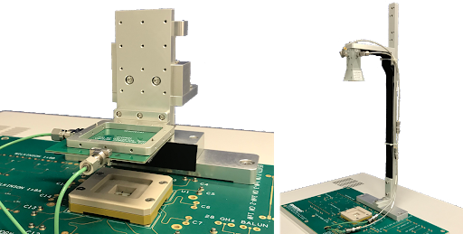
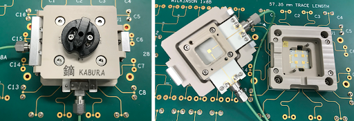
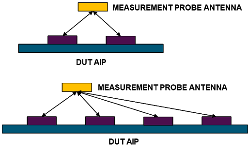
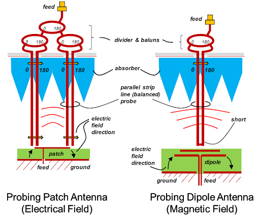
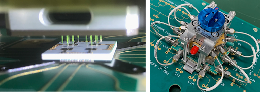

Posted  in [Top Stories](https://www.gosemiandbeyond.com/category/topstories/)

# High-Volume Production Test of AiP Modules for 5G Applications

*This article is a condensed version of an article published in the May-June 2020 issue of *Chip Scale Review*, p. 20. Adapted with permission. Read the original article at *[http://fbs.advantageinc.com/chipscale/may-jun_2020/22/](http://fbs.advantageinc.com/chipscale/may-jun_2020/22/)*. *

By Jose Moreira, Senior Staff Engineer, SOC R&D, Advantest

The arrival of 5G promises enhanced mobile broadband (eMBB), massive machine-type communication (mMTC), and ultrareliable low-latency communication (URLLC). But as 5G rolls out, the test community faces challenges and opportunities. That’s particularly true regarding the antenna arrays that will connect handsets to base stations.

5G New Radio (5G NR) defines two ranges, frequency range 1 (FR1) and frequency range 2 (FR2). FR1 includes the sub-6-GHz frequencies in use for previous generations of cellular technologies, but FR2 opens up mmWave frequencies above 24 GHz for 5G deployment. 5G NR leverages the FR2 frequencies to achieve larger modulation bandwidths (for example, 800 MHz). However, the high transmission losses at these frequencies require the use of antenna arrays for multiple-input and multiple-output (MIMO) functionality and to focus the transmission beam (beam forming) in both the base station and the consumer’s handset. These arrays come in the form of antenna-in-package (AiP) modules.

For the handset, these AiP modules will usually have an array of dual-polarized patch antennas for top firing and, in some instances, an array of dipole antennas for side firing (**Figure 1**). 

*Figure 1. This example of a generic antenna array module comprises 12 dual-polarized patch antenna elements and seven dipole antenna elements.*

To minimize RF losses to the antenna radiators, the AiP modules include RF integrated circuits that provide modulated mmWave signals to the AiP antenna array with the needed gain and phase to each radiating element. The modules then usually only require power, digital control signals, and modulated intermediate-frequency (IF) signals.

AiP modules for 5G handsets must be small to fit into the modern cellphone form factor, and multiples of them need to be used in a single cellphone because the user’s hand position has a significant impact on the transmitted beam loss. Also, the AiP modules in a cellphone might not be all equal, but in fact have different antenna configurations depending on the handset design.

Regardless of configuration, these AiP modules must be tested. The 3GPP standard defines three methods for the over-the-air (OTA) standard compliance testing of AiP modules: direct far field, indirect far field, and near-field to far-field transformation. Each of these methods have advantages and disadvantages, but they all require relatively large test chambers and a complex manipulator to rotate the AiP device under test (DUT) or the measurement antenna.

These methods are neither practical nor necessary for high-volume production testing, where the objective is to check the functionality of the antenna under test (AUT), not its compliance. Low cost of test is critical because most of the end applications are consumer oriented. Also, to keep costs down it is important to reuse as much as possible the test-cell infrastructure already deployed for testing RF integrated circuits.

This paper presents three possible options for the production OTA testing of AiP modules with ATE: far-field testing, radiating near-field testing, and reactive near-field testing. The book *Theory and Practice of Modern Antenna Range Measurements*1 provides details on the transition from the near field to the far field. For the purposes of this discussion, it suffices to note that there is no hard boundary between near and far field, but a continuous transition where the radiated waves become locally more planar as they propagate away from the radiating antenna. From an antenna-measurement perspective, the far-field region is the best because the radiated waves are locally planar, and the measurement antenna is too far away to have an impact on the AUT. 

But the far-field distances also imply large dimensions for the measurement setup, and radiating and reactive near-field testing approaches offer more compact alternatives.

*Figure 2. These examples of OTA ATE far-field measurement setup show a motorized linear stage (left) and a static setup (right).*

**OTA far-field testing**

**Figure 2** shows two examples of a simple far-field measurement setup on an ATE system. This approach is excellent for an initial start with OTA testing on ATE because one can start in the safety of the far-field measurement range while doing correlation and debugging of the AiP DUT using the ATE system. Calibration on a far-field setup is also trivial using standard antenna measurement calibration procedures1. The problem arises when considering high-volume production by integrating a far-field OTA methodology on a standard ATE test cell.

The mechanical dimensions required for a far-field OTA test solution prevent the usage of standard ATE test-cell commercial handlers, thereby requiring custom robotic handlers and creating additional costs. Cost reduction through multisite implementation on ATE is also nontrivial with a far-field OTA ATE implementation.

**OTA radiated near-field testing**

One approach to integrating an OTA measurement setup into a standard ATE test cell is to move the measurement antenna into the radiating near-field region. **Figure 3** shows low-cost radiating near-field test sockets for a patch-type antenna array AiP. In this example, the measurement antenna is 11 mm from the DUT AiP antenna array. A radiating near-field antenna test has the advantages of easy integration within a standard ATE test cell along with easy multisite implementation.

*Figure 3. These examples of low-cost radiating near-field OTA sockets support manual ATE-based OTA testing.*

Because in a production test environment the objective is to identify failed AiP modules and not to characterize them, one could assume that there would be some easy correlation between good AiP modules tested in a far-field setup with failing AiP modules tested on a near-field setup, assuming a comprehensive list of performed tests. This is a valid thinking, but one needs to be aware of two important drawbacks on a radiating near-field measurement setup. The first is that the measurement antenna is now so close to the AiP DUT antenna array that it will have an impact on the DUT AiP antenna elements (antenna detuning) and can even result in a standing-wave effect.

The second drawback is shown in **Figure 4**. 

*Figure 4. In this example, the distance from the measurement antenna to the different antenna array elements on an AIP DUT differs.*

Because only one measurement antenna is used, depending on the DUT AiP antenna array geometry, the distance of each DUT antenna array element to the measurement antenna will be different. This can have a significant impact on a worst-case scenario2,3. Finally, calibration in the radiating near-field is nontrivial. If a golden-device calibration is used, results are critically dependent on the golden device’s performance, and absolute measurements are not possible.

**OTA reactive near-field testing**

An alternative is to measure the DUT AiP antenna array in the reactive near field. In this case, a classical measurement antenna cannot be used because in the reactive near-field range it would have a dramatic effect on the DUT AiP antenna elements. To measure on the reactive near field, the antenna or probing element needs to be very small. **Figure 5** shows one reactive near-field probing concept for OTA ATE that has been patented by Advantest using two very thin parallel needles to probe the electric or magnetic field on the DUT AiP reactive near field. The main advantages are that each element of the DUT AiP array is individually measured (power and phase) and that the probe size is very small to minimize the disturbance of each radiating element. This concept is explained in more detail in other papers4,5. 

*Figure 5. This near-field probing concept for OTA ATE uses two very thin parallel needles to probe the electric or magnetic field on the DUT AiP reactive near field.*

**Figure 6** shows an example of a prototype reactive near-field socket3. Here, measurement of a dual-polarized 2×2 AiP array results in eight individual signals. To keep ATE resources to a minimum, a solid-state relay switches each of the antenna/polarization signals in series to the ATE measurement instrument. A parallel measurement approach is also possible but requires eight ATE measurement instruments. The optimal setup will depend on a detailed cost-of-test analysis.

*Figure 6. In this prototype reactive near-field socket, a dual-polarized 2×2 AiP array is measured resulting in eight individual signals.*

**Summary**

For OTA testing with ATE of AiP modules, there is no right or wrong answer. Depending on the testing requirements and testing stage (for example, initial ramp-up or mature high-volume manufacturing), the OTA test strategy might be different. **Figure 7** shows a high-level comparison of the different OTA test strategies presented in this paper.

In a future paper we will use a custom-designed 28-GHz 2×2 path antenna array in a 0.4-mm-pitch BGA package to compare the different approaches in terms of OTA measurement results with the Advantest V93000 Wavescale Millimeter CardCage ATE system.

*Figure 7. This chart shows the advantages and disadvantages of three OTA test strategies in an ATE environment.*

**ACKNOWLEDGEMENTS**

We would like to thank Natsuki Shiota, Aritomo Kikuchi, Hiromitsu Takasu, Hiroyuki Mineo, Sui-Xia Yang, and Frank Goh from Advantest for their support and collaboration on the OTA project development. We would like also to thank Prof. Jan Hesselbarth from the University of Stuttgart.

**REFERENCES**

1. Clive Parini, et al., Theory and Practice of Modern Antenna Range Measurements, IET, 2014.
2. Jose Moreira, Jan Hesselbarth, and Krzysztof Dabrowiecki, “Challenges of Over The Air (OTA) Testing with ATE,” TestConX China, Shanghai, October 29, 2019.
3. Natsuki Shiota, Aritomo Kikuchi, Hiroyuki Mineo, Jose Moreira, and Hiromitsu Takasu, “Socket Design and Handler Integration Challenges in Over the Air Testing for 5G Applications,” TestConX 2020, May 2020.
4. Jan Hesselbarth, Georg Sterzl, and Jose Moreira, “Probing Millimeter-Wave Antennas and Arrays in their Reactive Near Field,” 49th European Microwave Conference, 2019.
5. Utpal Dey, Jan Hesselbarth, Jose Moreira, and Krzysztof Dabrowiecki, “Over-the-Air Test of Dipole and Patch Antenna Arrays at 28 GHz by Probing them in the Reactive Near-Field,” To be presented at the 95th ARFTG Microwave Measurement Conference, August 6, 2020.

  end .post_content

