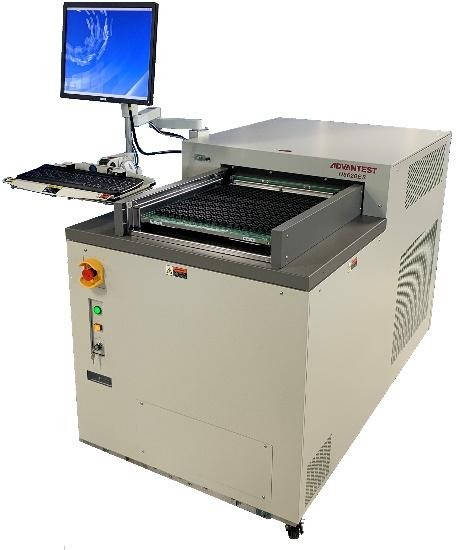

Posted  in [Featured Products](https://www.gosemiandbeyond.com/category/featuredproducts/)

# New Memory Tester Integrates Burn-In and Core Testing for 5G Product Development

Advantest has added to its H5600 family of memory testers by introducing the new, highly versatile H5620ES engineering test system, designed for both high-speed burn-in and core testing of today’s DDR4, next-generation DDR5, and low-power, double-data-rate (LPDDR) devices in laboratory environments.  By streamlining the number of accessories and reducing the time required between burn-in and core testing, the new H5620ES shrinks the cost of test for evaluating advanced memory devices used throughout 5G applications.  The new system ably addresses all barriers to cost-efficient development and qualification of the newest data-storage ICs that are in high demand for the rapidly growing 5G market.

Like its sister system, the [H5620 production unit](https://www.advantest.com/news?articleId=4223334) introduced in March of this year, the new tester delivers high productivity by parallel testing both DDR4 and DDR5 memories. It can accommodate memory ICs with 100-MHz frequencies and 200-Mbps data rates. 

The engineering system is optimized for ease of use in product development, enhancing testing efficiency in the lab prior to production.  Its compact design saves space and enables mobility in laboratory environments while its open-top architecture makes it easy to perform pick-and-place operations without removing the device interface board (DIB).

The H5620ES runs on the same FutureSuite™ operating system as the H5620 production unit, enabling testing with the same waveform.  It also allows pre-testing routines such as contact checking to be conducted on the H5620ES system before transfer to the H5620 tester, thereby reducing cycle times in production.

  end .post_content

