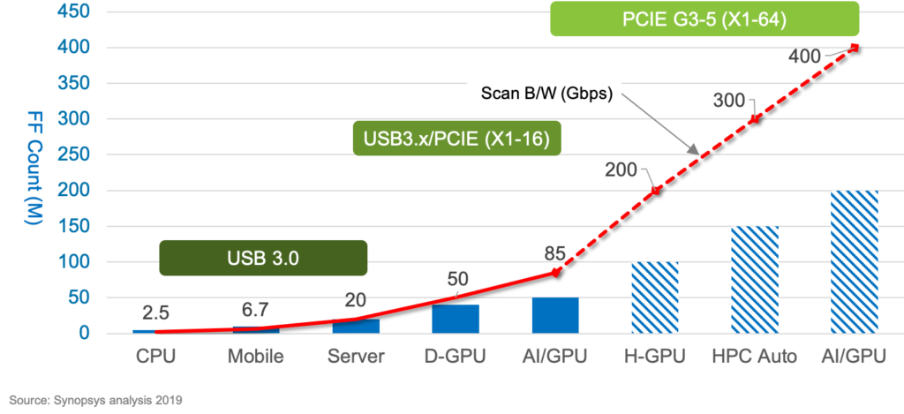
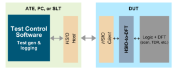

Posted  in [Q&A](https://www.gosemiandbeyond.com/category/qa/)

# Q&A Interview: Moving Test to the Fast Lane

**By: GO SEMI & BEYOND Staff**

*In this issue, our Q&A interview subject is Steve Pateras, Senior Director of Test Marketing for Synopsys. Steve provides a look at a new test capability, jointly developed by Synopsys and Advantest, that leverages high-speed communication interfaces such as USB and PCIexpress to improve test throughput. (NOTE: This piece was originally intended to serve as a preview of Steve’s VOICE 2020 keynote address; although canceled this year, the conference will return in 2021, as will Steve.)*

**Q: What was the catalyst for developing this approach?**

A: The industry is always looking for new ways to improve test throughput, in order to reduce test times and costs. As chip designs get larger and larger, you need more test data, so to keep test costs in line, you need to improve bandwidth to get better throughput.

Moore’s Law kept things growing and increasing in complexity over the past several decades, but periodically, fundamental paradigm shifts needed to happen. The first was in the 1980s, when we moved to structural test because chips had become too complex to cover all possible failure modes using functional verification. Looking only at the I/Os related to flip-flop scan chains, rather than every functional I/O, became the new norm, and this worked well for a couple of decades.

By 2000, scan alone had become inefficient – the number of scan chains and I/Os to scan kept growing larger and larger, and the sheer volume of data was too massive to store on the tester. This led to the next paradigm shift: compression channel I/O. Data is compressed on the tester, then sent to the chip, where it is decompressed on-the-fly into multiple scan chains. Again, this reduced the number of I/Os and test times to a manageable amount. Another 20 years passed, which brings us to today.

As chip features shrink down to 14nm, then to 7nm and beyond, we’re still seeing exponential growth in the numbers of patterns and pattern test data. We’ve again reached the point where we can’t accommodate the volume – even compressed, there is too much data to be stored, and it takes too long to scan data in and out. It’s time for a new approach.

**Q: You’re talking about the next paradigm shift?**

A: Exactly. Structural (scan) patterns form the primary test for digital logic – more patterns are required to maintain quality, with larger designs requiring more manufacturing tests, and new process nodes demanding advanced fault tests. At some point, things start to break; how do you achieve the necessary bandwidth when you have limited tester speeds and a limited number of available pins? Figure 1 shows real-time bandwidth limitations – that is, the actual number of gigabits you’d need to test some of the newer, larger devices. Existing approaches can’t accommodate moving from tens to hundreds of gigabits per second, let alone into the terabit range. 

*Figure 1. As data volumes increase with device complexity, test times rise sharply.*

What we’ve been developing with Advantest is the use of high-speed functional I/O (HSIO) to increase bandwidth. Instead of feeding the compression logic onto the chip via dedicated scan I/O, we’re using very high-speed serial functional interfaces, i.e., USB and PCIexpress, to achieve this. Once the data is entered, we can convert it into the parallel data we need to feed the compression logic. We use these very high-speed serial inputs to get the required bandwidth, and then we parallelize this widely to all the many parallel scan chains on the chip. 

**Q: How is the parallelism achieved?**

A: Via the on-chip logic that we provide, which works essentially like a transformer. It allows for very large amounts of data coming without the need for dedicated, lower-speed I/Os. We’re essentially reusing the high-speed interfaces that exist on virtually every chip today. Instead of reinventing the wheel and adding more dedicated pins per test, we simply piggyback on top of these interfaces during the test process to send high-speed test data through them [Figure 2].

Reusing these existing high-bandwidth functional interfaces offers three key benefits: it reduces test time; it eliminates the need for dedicated test I/O; and it provides test portability through the product lifecycle. 

*Figure 2. Reusing HSIO protocols improves scan bandwidth, significantly lowering test times.*

**Q: How long has the new solution been in development, and what does it entail?**

A: We’ve been working with Advantest on this new HSIO paradigm for over two years, combining key components from our TestMAX suite of software with Advantest’s V93000 SoC tester. The solution entails three key aspects, summarized in Figure 3:

1. Packetizing manufacturing test data to accommodate HSIO protocols. Integrated into the V93000, our software [dark green box] takes traditional parallel data from ATPG tools, converts it into high-speed packet data, then depacketizes the data coming back and maps it to known failure descriptions.
2. Enabling the tester to accommodate this approach [light green box]. Testers themselves need to be able to drive data through these high-speed interfaces, so through this joint effort, Advantest has added new hardware onto the V93000 to provide the HSIO function and ensure their SmarTest software can work with it.
3. Ensuring the chips can handle this high-speed packet data. We devised a bidirectional HSIO-to-DFT interface controller, which is added to the chip as IP [dark grey box] to actively manage incoming high-speed packet data on one end and receive the parallelized lower-speed test data on the other.

*Figure 3. The new HSIO test paradigm integrates key software, hardware and on-chip functionality.*

In addition, our Adaptive Learning Engine (ALE) adds more intelligence to the test process. It allows our software to actively look at failure data coming back from the device and adapt the test to deal with the kind of failures that are being seen on the tester, as well as perform more advanced diagnostics. This can be performed locally on individual testers, as well as on a Big Data level – each tester on the floor can send its results to a centralized analytics engine analyzing results and looking for systematic issues across multiple devices over time. In this way, we can help to greatly improve the test process at the test-floor level.

*For more details, real-world examples and updates on this new high-speed functional I/O test paradigm, make plans now to attend Steve’s keynote address at *[VOICE 2021](https://voice.advantest.com/)* in Scottsdale, Ariz*.

  end .post_content

