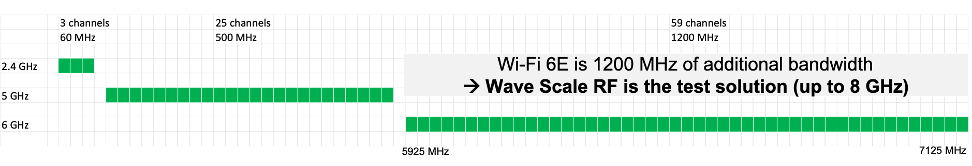

Posted  in [Top Stories](https://www.gosemiandbeyond.com/category/topstories/)

# Wave Scale RF8 – Enabling the Next WAVE in RF Communications Test

*By Dieter Ohnesorge, Product Manager, RF Solutions, Advantest Corp.*

Over the years, Advantest has remained at the forefront of test innovation through close collaboration with customers and partners, and by keeping our finger on the pulse of industry and market trends. We launched the Wave Scale family of test cards for our V93000 system-on-chip (SoC) test platform just over four years ago, and in that short time, we have greatly expanded the line with new products designed to meet burgeoning test demands – e.g., Wave Scale RF, Wave Scale MX, and Wave Scale Millimeter.

The test economics of state-of-the-art smartphones, tablets and routers demand highly parallel RF test. Now, we are addressing this next wave in RF communications test, enabled by Wi-Fi 6E, operating in the 6GHz band and coming up to 7.125GHz. This forthcoming update to the Wi-Fi standard will extend the features and capabilities, including higher performance, lower latency, and faster data rates—for this higher band. Our new Wave Scale RF8 card enables parallel test capabilities for Wi-Fi 6E, as well as for 5G-NR transceivers, LTE-Advanced Pro and internet of things (IoT) devices. 

The extension to Wi-Fi 6E will make available 1200MHz of additional bandwidth in the unlicensed frequency spectrum (see Figure 1). Compared to these 1200MHz, the 2.4GHz band has just three non-overlapping channels with a total bandwidth of 60MHz, and is already crowded with multiple users competing for bandwidth. Even with 25 channels and an additional 500MHz of bandwidth, the 5GHz band gets filled up quickly – a problem that has become even more apparent with many people in close proximity tapping into Wi-Fi to work in from home or attend school remotely. 

*Figure 1. The chart illustrates the importance and benefits of Wi-Fi 6E. Wi-Fi at 2.4GHz uses 60MHz total bandwidth with up three non-overlapping channels, while the 5GHz band adds 500MHz and up to 25 channels. Wi-Fi 6E now adds a massive 1200MHz to the existing Wi-Fi bandwidth, adding up to 59 additional channels.*

With the 6GHz band, however, comes added channels and a substantial extension of 1200MHz in usable bandwidth. Moreover, all three bands can be used simultaneously – e.g., users can read and send email in the 2.5GHz band, place Wi-Fi calls in the 5GHz band, and download streaming content in the 6GHz band. Good news for users, this nevertheless creates new challenges with respect to testing these communication devices.

Wave Scale RF 8 is capable of both highly parallel multisite and in-site parallel testing, providing a new dimension of test coverage and economics. Testing both the send and receive channels takes a fraction of the time that would be required using a traditional test flow, and it can perform high multisite testing using native ATE resources, all within the V93000 test head. Advantest is the first in the industry to enable such high multisite parallelism for these applications, providing an unmatched test time benefit (see Figure 2).

*Figure 2. The benefits of massively parallel test are illustrated here. Stacking tests test in a parallel test flow rather than one-by-one serial test drastically reduces test times; parallel mission-mode tests are reduced by up to 50%.*

The card’s RF-optimized architecture comprises four complete RF subsystems to achieve high-throughput testing. Within each subsystem is an independent modulated source, a waveform generator/digitizer, scattering parameters, and a test processor that can make multiple RF measurements in the shortest possible time. Each card includes 32 RF ports, true parallel stim measurement ports, and – as mentioned earlier – operates at up to 8GHz with a modulation bandwidth of 200MHz. Its wide-frequency capability is a vital aspect of Wave Scale RF8 – the Wi-Fi6E standard can actually go up to 7.125GHz, so is well covered by the 8GHz capability of the Wave Scale RF solution.

Continually staying ahead of the industry curve is an important aspect of Advantest’s brand promise to our customers. We focus on having the solution in place that customers will need in order to adapt to new test requirements. With Wave Scale RF8, we have made sure that we can accommodate the massively parallel testing that advanced communications devices demand. With multiple independent subsystems in a single card, Wave Scale RF8 delivers the cost-efficient production solution for next-generation Wi-Fi 6E and cellular devices.

  end .post_content

