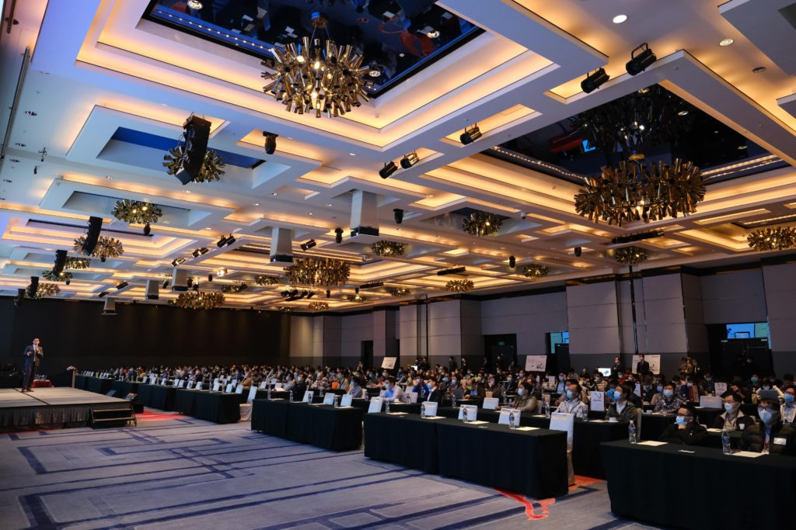

Posted  in [Upcoming Events](https://www.gosemiandbeyond.com/category/upcomingevents/)

# A Flexible Approach to Advantest’s Technical Seminars Yields Success

Advantest’s annual Technical Seminar series in Asia took on many forms in 2020:  hybrid, in-person and virtual. Despite ongoing COVID-19 challenges, Advantest regions took strategic measures to cross-collaborate and organize successful customer events across the globe. While each seminar included multiple topics, all highlighted Advantest’s new [V93000 EXA ScaleTM SoC test system](https://www.advantest.com/products/soc/v93000/exa.html).

**Advantest’s 2020 Taiwan Technical Seminar** took place for the first time as a hybrid event, setting an all-time high attendance record of nearly 300 customers. To ensure a safe environment, COVID-19 precautions were taken such as requiring masks, taking temperatures and arranging seating to maintain social distancing. Participants had the opportunity to attend technical presentations from both in-person and remote presenters and talk with Advantest product experts at interactive technology kiosks as well as participate in games and prize drawings.

**Advantest’s 2020 China Technical Seminars** took place as in-person events in three locations — Shanghai, Beijing and Shenzhen – with nearly 500 customers in attendance. Similar COVID-19 precautions, like wearing masks, were taken to protect participants while allowing them to enjoy an informative event in-person. 

**Advantest’s 2020 Singapore Technical Seminar** went fully virtual with more than 200 attendees. The seminar incorporated an innovative variety of approaches, including live presentations and kiosk sessions with local presenters, pre-recorded presentations with live Q&A, and educational videos of Advantest’s labs in Germany. The event concluded with a virtual lucky draw using an online prize wheel. 

Advantest thanks the many customers who attended and continued to support the annual technical seminars late last year, in all their flexible formats.

**Gallery Images**

**Seminar attendees during general session (Taiwan).**

**Technology kiosk interaction between Advantest staff and attendees (China).**

**Virtual general session room with seminar agenda (Singapore).**

  end .post_content

