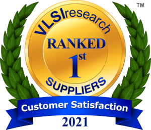

Posted  in [Featured](https://www.gosemiandbeyond.com/category/featured/)

# Advantest Again Named THE BEST Supplier of Chip Making Equipment in VLSIresearch Customer Satisfaction Survey

 

Advantest Corporation has again topped the ratings chart of the 2021 VLSIresearch Customer Satisfaction Survey, capturing the No. 1 spot on this annual survey of global semiconductor companies for the second consecutive year. Advantest has now been named to VLSIresearch’s 10 BEST list for the 33rd consecutive year. The survey ratings are based on direct customer feedback representing 89 percent of the world’s chip producers — Integrated Device Manufacturers (IDMs), Foundry, Fabless, and Outsourced Semiconductor Assembly and Test (OSAT) companies. 

According to VLSIresearch, the world’s leading semiconductor market-research firm, Advantest ranked as THE BEST supplier of test equipment in 2020 and 2021 and topped the 10 BEST list of large suppliers of chip making equipment once again this year. Worldwide participants rated equipment suppliers among 14 categories based on three key factors:  supplier performance, customer service, and product performance. The categories span a set of criteria, from cost of ownership to quality of results, field engineering support, trust, and partnership.  

In the 2021 survey, Advantest achieved customer ratings 9.5/10 and above in categories including *Recommended Supplier,* *Trust in Supplier*, *Technical Leadership, Partnering, *and *Field Engineering Support. *According to VLSIresearch, Advantest continually ranks high among THE BEST Suppliers of Test Equipment and in 2021 was the only automatic test equipment supplier to receive a 5 VLSI Star designation. 

“Advantest’s ability to continually innovate and adapt to changing market dynamics while sustaining successful customer relationships is a testament to its strength as an ATE business partner,” commented G. Dan Hutcheson, CEO of VLSIresearch. “Throughout the industry, Advantest is recognized for its stability, product excellence, and customer service. Even during this tumultuous time, Advantest maintained its *customer-first* attitude and continued to enable customers to move forward with their latest chip designs and products. With its comprehensive product portfolio, broad slate of dedicated customers, and steadfast commitment to innovation, Advantest has deservedly earned the highest ratings from the world’s global manufacturers,” Hutcheson continued.

“We are honored to be recognized once again by our global customers as the industry’s top-ranked supplier of test equipment, and pleased that even in these challenging times we are able to maintain our commitment to supporting them,” said Yoshiaki Yoshida, president and CEO of Advantest Corporation. “We remain dedicated to expanding our test and measurement solutions throughout the value chain and hope to continue to earn the trust of the world’s leading chipmakers.” 

Since 1988 the VLSIresearch annual *Customer Satisfaction Survey *is the only publicly available survey tool for customers to provide feedback for suppliers of semiconductor equipment and subsystems.

Advantest, a global provider of test solutions for SoC, logic and memory semiconductors, has long been the industry’s only ATE provider to design and manufacture its own fully integrated suite of test-cell solutions – comprised of testers, handlers, device interfaces, and software – assuring the industry’s highest levels of integrity and compatibility.

  end .post_content

