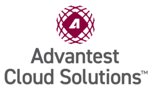

Posted  in [Featured Products](https://www.gosemiandbeyond.com/category/featuredproducts/)

# Advantest Cloud Solutions

#### An Open Solutions Ecosystem for an Integrated Semiconductor Supply Chain

Today’s semiconductor manufacturers face continual market pressures to design and produce increasingly intricate and complex ICs.

The traditionally used manual approaches for achieving and maintaining high yields are both time-consuming and expensive. As the complexity of chips increases, these traditional methods are becoming cost-prohibitive and less and less suitable for managing the data explosion in semiconductor manufacturing. At the same time, semiconductor manufacturers struggle to realize value from the data they collect.

To master this challenge, being able to integrate all data sources across the entire IC manufacturing supply chain is the most essential strategy. When combined with advanced analytics and machine learning capabilities, future-proof, real-time automated production control is in reach.

The Advantest Cloud Solutions™(ACS) ecosystem helps customers accomplish intelligent data-driven workflows. The ACS ecosystem is a family of cloud-based products and technologies based on a single scalable data platform that allows customers to develop or procure market-leading solutions from Advantest and its partners. Automatically turning insights into automated production-control actions in real-time based on machine learning algorithms becomes possible in an easy to use and accessible way across the entire Advantest equipment portfolio.

This new ACS ecosystem enables customers to boost quality, yield, and operational efficiencies, and to accelerate product development and new product introductions for years to come.

**Customer-driven products and services for integrated workflows**

By building scalable products and offering complementary services aligned with customer needs, we ensure a thorough product-market fit. 

The ACS products and services enable customers to get more value out of their supply chain with focused workflow solutions for each stage of the IC design and manufacturing process, including:

- machine learning powered post-silicon-validation
- dynamic parametric test
- high-performance edge compute
- cloud-based test-program development and debug
- test equipment fleet monitoring
- predictive maintenance and OEE management.

With test equipment and solution-driven ACS roadmaps closely integrated, Advantest is one of the only vendors capable of delivering a fully integrated test solution ecosystem. 

**Best-in-class technology infrastructure for an end-to-end integrated supply chain**

Advantest’s ACS Technology Platform, which powers all ACS Products & Services, is built upon PDF Solutions’ big data analytics platform, Exensio®.  

The unique partnership between PDF Solutions Inc., a leading provider of advanced data analytics solutions, and Advantest Corporation, the world’s leading semiconductor test equipment supplier, enables a superior integration of the PDF Solutions Exensio® platform with Advantest test equipment. 

The ACS Technology Platform is a highly secure and extendable platform consisting of a cloud-based data lake combined with powerful big data analytics to achieve unrivalled computing power, whenever and wherever needed. Customers can now “correlate anything to anything” across all IC test and equipment data throughout all stages of the IC development and manufacturing process to search for signatures that could not previously be seen or identified, all built in and verified to work with Advantest equipment. With these capabilities, new levels of actionable insights can be turned into long-lasting competitive advantages. 

  end .post_content

