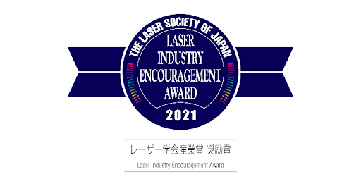

Posted  in [Featured](https://www.gosemiandbeyond.com/category/featured/)

# Advantest’s Hadatomo™ Z Photoacoustic Microscope Wins Laser Industry Encouragement Award

Advantest’s Hadatomo™ Z photoacoustic microscope received a Laser Industry Encouragement Award at the 13th Industry Awards sponsored by the Laser Society of Japan.

The Laser Society of Japan Industry Awards recognize “excellent achievements contributing to the development of the domestic laser-related industry in the practical application, and the dissemination of laser-related products and technologies,” according to the Society. Among several award categories, Encouragement Awards are given to products with notable potential for future market development.

Advantest’s Hadatomo™ Z simultaneously images the oxygen saturation of blood vessels with dual-wavelength photoacoustic technology, and dermal structure including skin texture, pores, and sebaceous glands with ultrasound. Accurately imaging vascular mechanisms up to a depth of 3 mm in the dermis makes it possible to observe vasodilation and blood circulation stimulation in near-real time. An optional dual-wavelength laser that can distinguish between melanin and blood vessels is also available. Currently, the product’s main applications are cosmetology and dermatological research, but its selection for the Encouragement Award underlines its future potential as a medical device. At the present time, the product is a scientific instrument, not an approved medical device.

This award reinforces Advantest’s commitment to developing the company’s photoacoustic technology further, so that the Hadatomo™ Z can contribute to the treatment and prevention of skin diseases.

The 13th Industry Awards of The Laser Society of Japan for fiscal year 2021

[https://www.lsj.or.jp/en/the-13th-industry-award-on-the-laser-society-of-japan-in-fy-2021/](https://www.lsj.or.jp/en/the-13th-industry-award-on-the-laser-society-of-japan-in-fy-2021/)

 

 

  end .post_content

