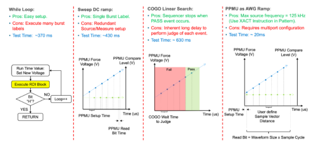
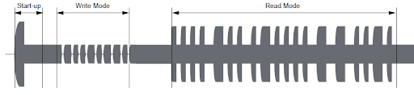
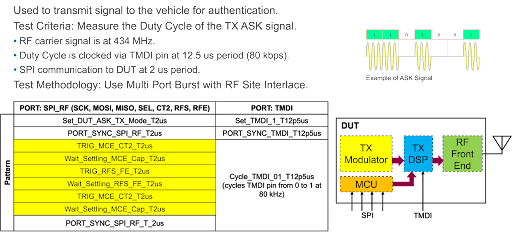
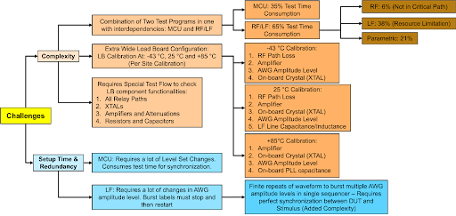

Posted  in [Top Stories](https://www.gosemiandbeyond.com/category/topstories/)

# Automotive Keyless Entry SoC Test Methodologies and Techniques

*By Philip Brock, Applications Engineer & Consulting Manager, Louis Benton, Jr., Applications Engineer & Consulting Director, Advantest, and Jonvyn Wongso, Technical Staff Test Engineer, Microchip*

*Note: This article excerpts content from the Virtual VOICE 2021 Best Paper, voted on by conference attendees. Jonvyn Wongso, Daniel Marstein & Krishna Vangapalli from Microchip Technology co-authored the original paper, and their research and development efforts were invaluable to this project.*

Passive Entry Passive Start (PEPS) technology has become standard in the automotive market for keyless operation. A secure wireless communication system, PEPS enables to lock and unlock the vehicle, start and stop the vehicle without physically using the key. Electronic functionality embedded in the key fob to interact with the vehicle (see Figure 1) includes passive start and stop, passive lock, remote keyless entry, immobilizer, key fob wake-up, and key fob localization. These functionalities are controlled by the primary modules embedded within the fob itself. The immobilizer provides access to start the vehicle when the key fob’s battery level is low by placing the fob at the start button and pressing it.

*Figure 1: This diagram illustrates how components within the key fob correspond to functionality in the car itself.*

The PEPS-to-vehicle ecosystem requires several key modules to function that includes a low-frequency (LF) transmitter, an immobilizer, a Radio Frequency (RF) transmitter (key fob) and transceiver (vehicle side), as well as a microcontroller (MCU). Each module in the key fob poses specific testing challenges and restrictions, necessitating a test plan and flow optimized for the testing of the key fob’s circuit, as shown in Figure 2. 

*Figure 2: The key fob architecture depicts the main components within the key fob and a representation of how each component is tested on the Advantest V93000 test system.*

The coverage percentages at the upper right in Figure 2 represent the overall test flow’s test time. Approximately two-thirds of the test coverage is dedicated to the LF structure (analog) and the MCU (digital), with another 19 percent focused on power management and parametric tests. The remaining 6 percent of the test coverage involves testing of the RF module with transmission functionality at sub 1 GHz band with no RF reception capability.

The combination of test requirements to accommodate all the different technologies housed within the PEPS key fob makes it an ideal device for demonstrating the versatility of the Advantest V93000 SoC test platform, including the AVI64 and PS1600 pin cards. A test solution is designed with comprehensive methodologies to test every module in the key fob. The balance of this article summarizes the key aspects of the test approach.

**PEPS test methodology elements**

*Digital*

Digital testing utilizes two standard methods to communicate to the IC:

- Serial programming interface (SPI) – Standard communication protocol is used to test all non-MCU (non-digital) structures via direct access to the RAM. However, due to the slow communication speed compared to HVSP protocol, the programming time to the EEPROM is approximately 10ms per byte.
- High-voltage serial programming (HVSP) – Used for FLASH and MCU core test with fast access to the EEPROM, this proprietary protocol is much faster than SPI, with a FLASH and EEPROM programming time of 3 to 4ms per page (each page is 16 bytes long).

One key digital test that has to be performed is to measure the time to program a page to the FLASH (16 bytes). The page program completion time varies between devices. The typical test method to measure and detect the end of the programming time is by implementing a match loop counter opcode in the pattern vector as the device asserts a state of a pin to high when the programming event has completed. However, the implementation of this method prohibits the use of the PS1600’s Time Measurement Unit (TMU) function on the same channel pin in parallel to measure the page program time accurately.

The test methodology developed involved the use of the Rapid Development Interface (RDI) API, a code structure that wraps Advantest’s standard application programming interfaces (APIs). The API is based on object-oriented programming that encapsulates firmware commands, enabling seamless execution of multiple commands. This creates a competitive advantage by dramatically streamlining the software development, and with the V93000’s multiport capability, it enables higher timing resolution that can be achieved on a specific pin or pin group. The use of the comparator functionality allows to strobe for a level change in the signal for a fixed amount of time.

*Power Management*

The Brownout detection circuit in the PEPS is a challenge to test to achieve optimized test time. In a typical test method, a voltage sweep is conducted from high to low to detect the brownout state threshold, followed by a voltage sweep from low to high to search for the recovery threshold level. An experiment was conducted with the implementation of four different test methodologies to determine the most optimized method to test the Brownout Detection circuit, summarized in Figure 3. In summary, the implementation of the Per Pin Parametric Measurement Unit (PPMU) as the Arbitrary Waveform Generator (AWG) yielded the fastest test time with minimal test instrument latency dependencies.

*Figure 3: Investigation of four different brownout detection methodologies – PPMU as AWG methodology consumes a fraction of the test time in comparison with the other three options*

*Low Frequency Test*

The Receiver Signal Strength Indicator (RSSI) circuit in the key fob indicates the proximity and location of the key fob with respect to the vehicle. The 3D LF pins are transponders with signal transmission and detection  at a frequency of 125 kHz with detection amplitude levels as low as 1.0 mV peak differential. The LF test requires a complex on-board circuitry in order to source AWG amplitude levels from 1 mV up to 8 V peak. Due to the real estate demand from the load board to implement these circuits with amplitude ranges, the extra-large size load board is used, extending out on both sides of the tester’s field. The RSSI value may only be read out after the completion of conversion of the LF signal level from a specific register in the device. In addition, there is a register that may be continuously read to check for status of the RSSI conversion.

Therefore, the proper test methodology for this test is to implement the Condition Go-No-Go (COGO) API from RDI to continuously check for the status of the conversion. This method corresponds to the device’s application. However, due to the inherent long latency to judge each event using COGO (described in Figure 3), a one-time fixed time delay was implemented prior to the readout of the RSSI conversion.

The other primary LF test involved the transponder, which is used for the immobilizer. The key fob that is placed at the start button of the vehicle will be energized by the vehicle’s coil that is located around the start button to enable communication between the key fob and the vehicle. This test requires both the AWG and Digitizer (DGT) instruments to source and capture the modulated waveform on the LF pins.

The communication between the key fob and the vehicle compromises of three stages as shown in Figure 4 – startup (energizes key fob), write mode (vehicle transmit authenticated message to key fob) and read mode (key fob responses with another authenticated message). The post processing of both the sourced and received waveform uses custom Digital Signal Processing (DSP) functions along with built-in V93000’s DSP APIs. 

*Figure 4: Transponder communication between key fob and vehicle on LF pins on key fob.*

*RF Test*

The Amplitude Shift Keying (ASK) modulation is used to transmit RF authenticated signal from the key fob to the vehicle. It is critical to test the duty cycle of the modulated signal that has a period of 12.5 us, toggled by an external pin when set in test mode. The device itself operates at a 2 us period. Therefore, multiport has to be implemented for the sequencer to drive two groups of ports at different periods. This test methodology also includes RF site interlacing technique, taking advantage of the V93000’s eight-site parallel test capability with 2 RF FE24 cards. Figure 5 illustrates the test criteria and methodology employed. Post-processing involves the capture of complex waveform, conversion of the waveform to rms in order to create the burst envelopes, performing moving average to filter out noise and searching for all falling and rising edges to calculate the duty cycle. 

*Figure 5: The transmit ASK duty cycle test methodology is summarized here.*

**Software/hardware techniques**

The LF testing requires sharing of the AWG and Digitizer instruments (MCE 4 source and 4 measure units) across 8 sites, thus increasing test time and reduces multisite efficiency. The implementation of SEMI_PARALLEL block in the test method enables execution of a single test cycle, hence maximizing multisite efficiency. Sequencers connected to AWG and DGT are placed in the SEMI_PARALLEL block as shown in Figure 6. Method 1 is the most common implementation. However, the setup pattern will be executed more than once on the same site. In contrary, method 2 is the least efficient but may be an option if the setup pattern may only be executed once to each site to avoid change of the state of the device.     

*Figure 6: Shown here are the two most common SEMI_PARALLEL block test flow methods for shared resources.*

Another test method technique implemented as part of the test solution includes the use of both RDI and MAPI APIs to resolve per site device failure on a specific mode or event as shown in Figure 8. RDI is used for the initial generation and execution of the pattern. MAPI APIs are subsequently used to re-execute the RDI generated pattern to specific failed sites. This method allows the recovery of the device(s) within the test method to save test time and not applying stimulus and retesting already passed sites.

*Figure 7: The combination of RDI and MAPI usage enables device per site failures to be resolved.*

On the hardware side, the use of relay driver circuit (SN74LS04DR followed by MDC3105LT1G) enables the drive of eight relays simultaneously such as G3VM-41QR10TR05 only by using a single utility pin. This technique enables the implementation of many circuit paths on the load board but omits the need of a PMUX card in the tester. Subsequently, the test load board design requires calibration of every signal path and circuit for each test site. There is an on-board EEPROM that stores the calibration offset and losses. Due to the limitation of memory space in the EEPROM, every calibration value is compressed using IEEE754 floating point standard. Depending on the accuracy requirement, this method enables greater than 50-percent compression rating of a decimal value. 

In summary, there are many challenges in both hardware and software development to create a test solution for optimized test time and efficiency, as summarized in Figure 8.

*Figure 8: Summary and challenges of PEPS key fob test solution.*

Since this device is targeted for automotive application, it has to be tested at cold, room and hot temperature ranges. Temperature variations affects the performance of the circuitry on the load board and has to be calibrated for each temperature range. The MCU core has to be tested at multiple different voltage level that requires synchronization of the pattern sequencer for each level change. In addition, testing the LF circuit requires extensive changes in the AWG’s amplitude level that requires additional setup and execution time that may increase test time and lower efficiency. 

  end .post_content

