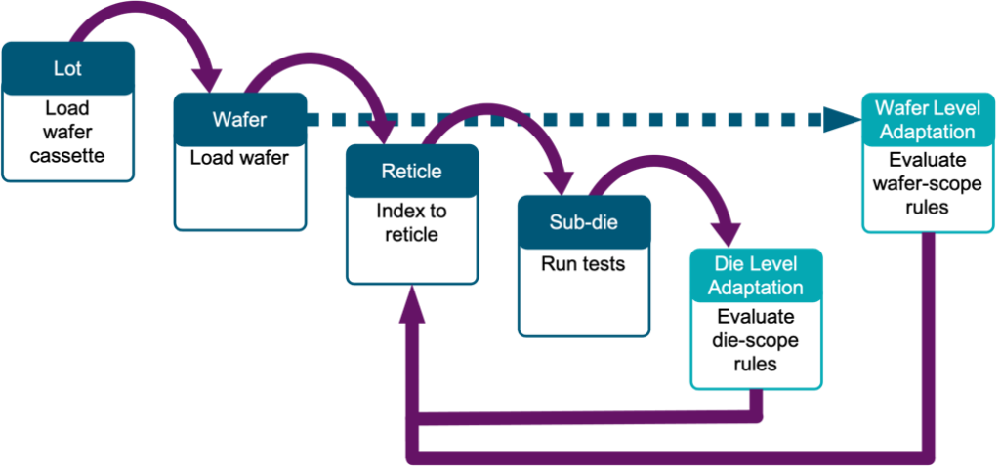
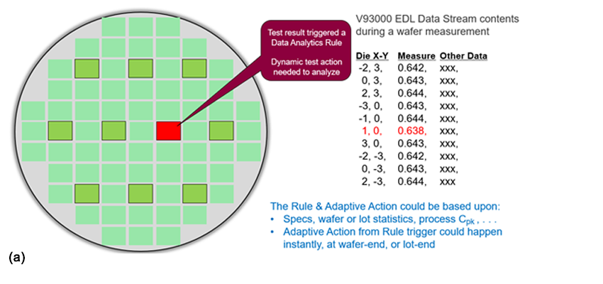
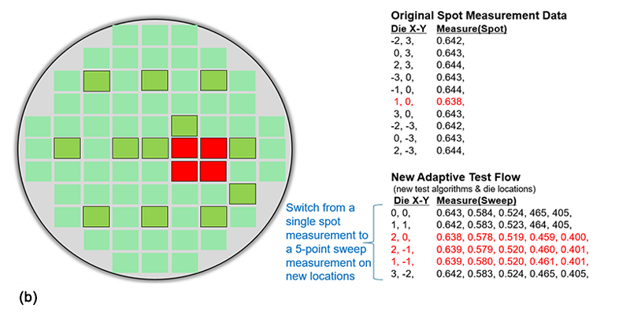
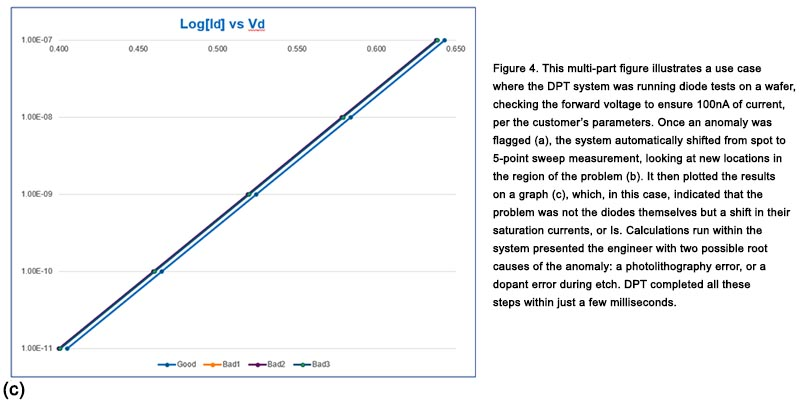

Posted  in [Top Stories](https://www.gosemiandbeyond.com/category/topstories/)

# Driving Toward Predictive Analytics with Dynamic Parametric Test

*By Alan Hart, Senior Director, Applied Research, Technology & Venture, Advantest America, Inc.*

The foundation of parametric test within semiconductor manufacturing is its usefulness in determining that wafers have been fabricated properly. Foundries use parametric test results to help verify that wafers can be delivered to a customer. For IDMs, the test determines whether the wafers can be sent on for sorting. Usually inserted into the semiconductor manufacturing flow during wafer fabrication at both the pre- and post-metal phases (as shown in Figure 1), parametric test has traditionally been used to check both transistor fabrication and metal layer interconnection, providing inputs to statistical process control (SPC) tools.

*Figure 1. In the manufacturing flow, parametric test is typically inserted pre- and post-metallization, as indicated in blue above.*

Measured data generated from the parametric tests is assessed and entered into a database, generating a report for an engineer to review. If an anomaly is highlighted, the engineer then orders the lot to be called back for retesting. This process typically takes a day or two, adding to the length and cost of the manufacturing cycle.

Dynamic parametric test (DPT), on the other hand, removes this review/retest loop by triggering immediate action upon measurement of an anomalous data point, based on the user’s predetermined parameters. This action takes place instantaneously, while the wafer is still on the tester – no reprogramming is required. Essentially, DPT elaborates on SPC techniques to establish these triggers, automating a process that, previously, would have required human intervention.

**DPT drivers**

The primary driver for implementing DPT techniques is the increasingly tight limitations created by shrinking process nodes. Today, 7nm and 5nm devices are in development (and the first 2nm process was recently announced). This translates to fabrication of leading-edge chips that comprise billions of transistors, whose features are separated by just a handful of silicon molecules. Testing billions of transistors individually is impractical, making parametric test vital for capturing statistics that reveal how the process went and help predict how well the circuit will perform. As devices get smaller and smaller, it becomes increasingly challenging to capture enough statistics to yield meaningful results, thus a greater volume of parametric tests are being applied in the assessment of wafer process quality.

DPT accelerates time-to-problem-solving, and hence, time-to-market, by enabling the parametric test system to instantly initiate data exploration based on customer-defined programming. By affording a deeper understanding of parametric deviations, it allows the user to program detailed characterizations for key devices, and to execute custom test flows based on real-time statistics or other user-defined criteria. As noted earlier, it adds automation to the engineering function – in essence, creating virtual engineering staff that can immediately analyze and debug unexpected results, or optimize test flow for tester utilization.

**Advantest’s approach to DPT**

Traditional parametric test looks at historical data to see what happened (descriptive analytics). Today, the process is evolving to capture additional data, allowing us to understand why it happened (diagnostic analytics). Going forward, the data will be correlated with future test results, enabling us to predict what will happen (predictive analytics). Predictive analytics, a key objective of Industry 4.0, enables corrective actions earlier in the manufacturing flow, as well as faster extraction of potential root-causes of deviations. Thus, by beginning to connect all the manufacturing steps shown in Figure 1, we can help wafer fabs and foundries begin to reap downstream benefits.

The goal is to be able to understand not only how well the circuit will yield at functional test, but also to predict its reliability when in use in its final application. For example, having one’s mobile phone fail is frustrating, but if it fails when you’re in your car and you need the GPS, or an emergency situation arises and you can’t call for help, the result could be disastrous.

Advantest’s Dynamic Parametric Test (DPT) software is a data-analytics enhancement to the V93000 SMU8 parametric test system, built on PDF Exensio® software from PDF Solutions. Together, Advantest and PDF Solutions have built a focused solution for parametric test that programs human decisions and actions into the tester to add real-time intelligence into the parametric test cell. Users implement DPT to immediately apply modified testing, both test algorithms and die map topology, allowing them to gain greater insight into the causes of unexpected results and to improve the efficiency of the test cell.

Figure 2 illustrates how the two systems work together. The DPT solution includes modifications to both the V93000 SMU8 system software and the Exensio data analytics platform. The solution is integrated into the V93000 SMU8 and into the Exensio server that manages the rules engine. Using customer-created rules, the software evaluates the incoming data from the tester, determines any necessary modifications to the test flow and/or test algorithms, and communicates them back to the tester, which then executes the new recipe. All of this happens instantly, in real time.

*Figure 2. The Advantest V93000 Dynamic Parametric Test (DPT) system powered by PDF Exensio® DPT. The V93000 measures data and, via the event data log (EDL) stream, sends it to the Exensio software, which evaluates the data and immediately transmits any adaptive actions back to the test system to run the revised recipe.*

No pre-programmed instructions are included in the DPT solution. The customer defines rules and models based on their own historical data and manufacturing requirements, which the system uses to look for anomalies and automatically trigger appropriate actions as the tests are run. The system identifies three basic types of triggers:

- A value that deviates from historical results;
- A statistical computation based on historical results from wafers/lots/time; or
- Statistical trends based on historical results from wafers/lots/time.

The rules that define these triggers and their parameters are set up through a simple user interface, using test algorithms already available in the customer’s test library, and are applied either at the end of the die location test or the end of the wafer test (see Figure 3).

*Figure 3. The DPT solution can apply the rules engine at the end of a die-location test or at the end of a wafer test. New data in the modified test flow is automatically collected, without requiring wafer reloading or engineering review.*

**Real-world example**

The ways in which the system can be deployed are limited only by customer needs. As an example, Figure 4 shows a use case involving diode test, checking the forward voltage (Vd) necessary for a 100nA of current to flow through the diode. The spot measurements are distributed across the wafer, as a representative sample provides a good indication of how the entire wafer behaves. When a bad data point is discovered, the system might automatically switch from a spot measurement to a sweep measurement, adding more die locations, to determine whether the cause is a device point defect or a general fabrication problem.

In Figure 4a, the DPT run flagged an outlier device that returned an out-of-spec result. As Figure 4b illustrates, this then automatically triggered a deeper, five-point sweep measurement around the location of the faulty diode, which revealed further outliers in that region. Figure 4c condenses the sweep results, plotting the sweeps to determine what caused the two parallel lines to appear. In this case, the slope shows normal diode behavior, with no device leakage. The problem is thus determined to be a problem with the bad diodes’ saturation current (Is).

The system’s further calculations reveal that Is is only modified by p-n junction area (via photolithography) or by dopant density in the anode or cathode. Knowing the potential contributors of the saturation current are physical area and impurity concentration leads to two different potential root-causes. The engineer can then look at the topological pattern, which, in this case, suggests that the problem was in either a photolithographic or etch step, likely from a single multi-die reticle exposure. Thus, in less than a second of automatic additional testing, DPT has provided the engineer with an augmented data set for quick problem resolution.

The system can detect virtually any type of problem created during the manufacturing process, including back-end probe testing. On most parametric test floors, continuity test failures due to failing probe contact are not uncommon. When a continuity test fails, DPT performs further tests to determine if the problem is actually a defective die location or a probe needle that needs to be cleaned or repaired.

Once DPT validates that previously good die are now failing, it automatically performs a wafer probe card clean/polish step. It then can explore a wider topological region, automatically adding die locations to determine where the continuity problem occurred. If the error was caused by a dirty probe needle, which is often the case, retesting the last failed die along with additional die nearby will confirm that the problem was fixed. Again, DPT saves time and money by cleaning probes at just the right time, prolonging their use, and preventing a pause in the fabrication process.

**The future: intelligent DPT**

As mentioned earlier, the ultimate goal of DPT is to utilize machine learning to make the process measurement results truly predictive, allowing parametric test to estimate wafers’ functional test yield as many days or weeks before they reach that step. With this type of forecast in hand, chipmakers could potentially alter the subsequent test plans and correct process deviations much sooner.

Looking again the manufacturing flow diagram, we see that, with the V93000-Exensio DPT solution, data becomes more valuable at each downstream step. As Figure 5 shows, the parametric test dataset can now be used to forecast functional test yield, days or weeks ahead of the wafers reaching functional probe test, accelerating reaction time to process anomalies.

*Figure 5. Using DPT techniques feeds forward upstream manufacturing process data to optimize downstream testing.*

The DPT solution is part of a broader manufacturing tool set that will provide greater value from data already being collecting or can automatically add to the dataset. In future versions, interconnecting data from wafer fab through package test will provide insights using other tools in the Advantest Cloud Solutions portfolio to accelerate manufacturing response time.

To learn more about the Advantest V93000/SMU8 + PDF Exensio Dynamic Parametric Test solution, plan to attend the 2021 International Virtual VOICE Developer Conference, June 21-23. For more information and to register, visit [https://voice.advantest.com/](https://voice.advantest.com/)

  end .post_content

