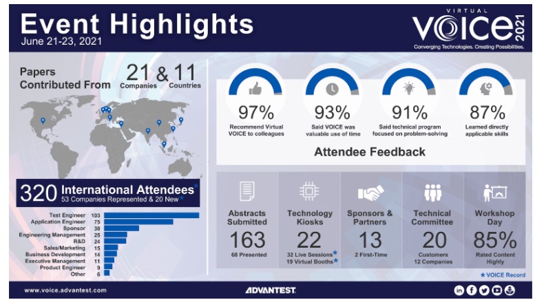

Posted  in [Upcoming Events](https://www.gosemiandbeyond.com/category/upcomingevents/)

# First-Ever Virtual VOICE 2021 Developer Conference Receives Record-High Global Attendance

After being cancelled in 2020 due to the COVID-19 pandemic, Advantest held its 15th annual VOICE 2021 Developer Conference as an all-virtual event on June 21-23. The 3-day event attracted a record-setting 320 international attendees, with over half representing Advantest customers and partners. The 2021 conference drew participants from 53 unique companies hailing from 11 countries, including 20 new companies that had not previously experienced Advantest’s Developer Conference.

Yoshiaki Yoshida, CEO of Advantest Corporation, and Doug Lefever, CEO of Advantest America Inc., kicked off the conference by welcoming event attendees. This year, the Virtual VOICE program included 68 technical presentations from 21 companies covering eight topical tracks, and 22 technology kiosks highlighting Advantest’s latest test innovations.  The event incorporated 32 live sessions, giving speakers and attendees the opportunity to interact and exchange valuable information on best practices, test challenges, applications and solutions.

Additionally, Virtual VOICE featured a 13-company strong Partners’ Expo headlined by Alliance ATE and ISE Labs, two dynamic keynote speakers, and a featured industry talk on the semiconductor market by G. Dan Hutcheson of [VLSIresearch Inc.](https://www.vlsiresearch.com/) VOICE concluded with an award ceremony and custom music video performance by classically trained violinist Gabi S. Holzwarth. 

**Best Papers and Best Kiosk Award**

Through an online poll, attendees voted to select the top two technical presentations and the best technology kiosk. 

**Best Paper Award: **

- “HSIO Loopback: The Challenges and Obstacles of Testing 112 Gbps” / Dave Armstrong – Advantest, Don Thompson – R&D Altanova
- “Automotive Keyless Entry System-on-Chip Test Methodologies and Techniques” / Jonvyn Wongso, Krishna Vangapalli, and Daniel Marstein – Microchip Technology, Philip Brock and Louis Benton – Advantest

**Best Kiosk Award:**

- “EXA Scale Infrastructure and Utility Card” / Helmut Schmid and David Butkiewicus – Advantest

**Visionary Award:**

- Derek Lee – NVIDIA

The annual VOICE Developer Conference is made possible by the extensive organizational work of a Steering Committee, comprised of volunteer representatives from Advantest and its worldwide customer base and the support of event partners and [sponsors](https://voice.advantest.com/sponsors/). 

Check out the Virtual VOICE event highlights video [here](https://www.linkedin.com/feed/update/urn:li:activity:6815349601504112640) on LinkedIn.

We look forward to hosting VOICE 2022 as an in-person event in Scottsdale, AZ, USA on May 17-18, 2022. Watch the VOICE website for more details: [https://voice.advantest.com/](https://voice.advantest.com/)

  end .post_content

