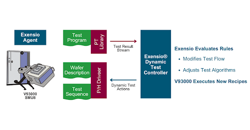
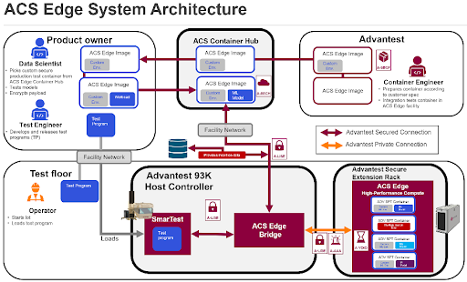

Posted  in [Q&A](https://www.gosemiandbeyond.com/category/qa/)

# Q&A Advantest Cloud Solutions Ecosystem

**Q&A Interview with Keith Schaub**

**By GO SEMI & Beyond staff**

*Earlier this year, our Q&A feature took a high-level look at Advantest’s cloud strategy and its role in helping to drive Advantest’s Grand Design. For this issue, we spoke once again with Keith Schaub, Vice President of Technology and Strategy, to drill down a bit more into the specifics of the Advantest Cloud Solutions (ACS) ecosystem.  *

** Q. First off, please explain what ACS is.**

A. ACS is an open ecosystem created to help customers accomplish intelligent data-driven workflows. Architected to seamlessly connect and interoperate with customers’ existing data platforms, ACS comprises a family of cloud-based products and technologies based on a single scalable data platform. Conceptually, it’s similar to other cloud-powered service offerings you may be familiar with, but with a specific focus on enabling secure testing in the cloud. To this end, a key aspect of our efforts in this regard is education: customers need to *know* that their data and IP are protected when fed into ACS products.

** Q. What products fall under the ACS umbrella?**

 A. We have deployed three production solutions in the ACS ecosystem thus far: the ACS Test Engineering Cloud (TE-Cloud™); ACS Dynamic Parametric Test (DPT™); and ACS Edge. Each of these solutions has a specific and complementary function that users can access and control via ACS in the cloud.

** Q. Can you offer a brief description of each solution, and how they work together?**

 A.  ACS TE-Cloud is our test engineering solution platform that features a complete test development environment with an integrated set of software tools for developing V93000 test programs. TE-Cloud is a Platform-as-a-Service (PaaS) solution hosted in the cloud, which customers can access on demand anytime and from any location. Once logged in, they can remotely access V93000 testers without having to make a capital investment in physical test equipment. This makes TE-Cloud highly valuable for small startups, giving them easy remote access to tester resources at Advantest’s labs and those of our partners.

ACS DPT focuses on DC parametric test, also known as WAT or e-Test, typically performed in-line during wafer fabrication and at end-of-line when wafers are shipping from fab to wafer sort. DPT runs on all V93000 SMU8 parametric test systems, giving users greater control of the test flow as a function of the Process Control Monitoring (PCM) data. The product was jointly developed between Advantest and PDF Solutions and is built on their PDF Exensio® data analytics platform. Users across multiple geographies are implementing ACS DPT to apply test algorithms and die map topology, allowing them to gain greater insight into the causes of any unexpected results. The customer can use DPT to respond instantly to any issues, saving tester and engineering time, and to improve test cell efficiency by adjusting rules criteria and delivering downstream instructions to wafer sort.

 

ACS Edge is a high-performance, highly secure compute and analytics solution that lets users offload demanding workloads from the ATE host controller yet execute them much more quickly. The product connects to a user’s test equipment via a private, high-speed encrypted link to enable ultrafast decision-making during test execution. The user can develop compute-intensive applications that operate in near-real time on data generated by tests in the test program.

Data security is vital when dealing with testing at the edge. The applications are wrapped in a Docker container to simplify global distribution and management, while hardening them against compute environment changes. When it’s time to load the program, applications are pulled securely onto ACS Edge from the Container Hub, encrypted data is sent to ACS Edge and processed by the machine learning application, and the results are returned to the test program. All data and analytics IP are protected within a Zero Trust environment.

**Q: You cite data protection, and you mentioned earlier educating customers about the security of their data. What does this entail?**

A: It’s important for our customers to understand that Advantest uses Zero Trust principles to protect their data. The Zero Trust network security model is based on the principle of maintaining strict access controls over data and not trusting anyone by default, even those already inside the network perimeter. It requires strict identity verification for every person and device trying to access resources on a private network. It’s important to customers that we have these safeguards in place.

** Q: What is the bottom-line impact for customers utilizing Advantest Cloud Solutions?**

 A: The ACS open ecosystem helps customers get more value out of their supply chain with focused workflow solutions for each stage of the IC design and manufacturing process. By implementing our ACS products and services, customers can boost their quality, yield, and operational efficiencies. Moreover, they can speed their product development efforts and thus introduce future products to market more quickly.

  end .post_content

