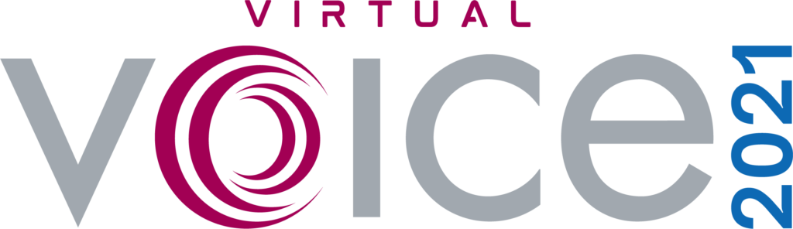

Posted  in [Q&A](https://www.gosemiandbeyond.com/category/qa/)

# Q&A Interview with Don Blair

 

**By GO SEMI & Beyond staff**

*This year marks the 15**th** anniversary of VOICE, the annual Advantest Developer Conference. Held in past years as two separate in-person events in the U.S. and Asia, VOICE was cancelled in 2020 due to the Covid-19 pandemic. This year, International VOICE will be a single, unified event, held virtually from June 21-23. Don Blair, business development manager for Advantest, brings 30 years of test industry experience to his advisory role on the VOICE 2021 committee. We sat down with him to talk about the upcoming event, its evolution, and what attendees should make sure not to miss. *

**Q. What are the key benefits of attending VOICE?**

A. VOICE was created by and for test engineers, who develop programs for our various tester platforms. The key value it provides is that it gives them practical solutions they can immediately implement to help them do their jobs better and more efficiently. That’s what has kept many engineers coming back every year while continuing to attract new attendees. We deliver sessions on the latest technologies with practical, hands-on solutions that engineers can immediately implement in their jobs.

**Q. How has the event evolved over the past 15 years?**

A. In the beginning, we struggled a bit with establishing value for the VOICE brand. We were focused on giving great technical papers, but they didn’t necessarily help solve a customer problem or provide content that attendees or customers could take back to their jobs. We began focusing on making sure the papers were relevant and applicable to customer challenges, and we formed a technical committee of 50 or so members that review the papers and determine which ones are accepted, geared toward meeting customer needs. It’s akin to making the shift from pure R&D to solution-focused development and production.

**Q. What do you anticipate will be the hottest topics at this year’s VOICE?**

A. Key topics to be covered by a wide range of papers include 5G (the most popular topic at VOICE for the past few years), parametric test, factory automation and what we refer to as the Age of Convergence, i.e., the convergence of cloud technology, rising computing speed and massive memory requirements. This has created demand for exascale-performance digital ICs, driving the need for our new test platform specifically targeting this technology: the V93000 EXA Scale™ family of SoC test systems. This prevalent trend informs the theme for VOICE 2021: “Converging Technologies. Creating Possibilities.”

On the factory automation front, we’re doing a paper this year with our customer ST Microelectronics regarding [our jointly developed automated test cell](https://www.globenewswire.com/news-release/2020/11/30/2136594/0/en/STMicroelectronics-and-Advantest-Collaborate-on-Advanced-Automated-Test-Cell-for-IC-Testing.html). Using the technology, ST has created a 100% lights-out factory automation environment – network run, no human intervention required – at its facility in Malaysia. 

With respect to parametric test, our other recent launch is our Dynamic Parametric Test (DPT) solution – a data-analytics-focused software enhancement to the Advantest V93000 SMU8 parametric test system, built on PDF Exensio® software from PDF Solutions. Demand for DPT is on the rise, as well, to aid in speeding automation and decision-making on the factory floor. *[NOTE: For more on Advantest DPT, please click *[here](https://www.gosemiandbeyond.com/driving-toward-predictive-analytics-with-dynamic-parametric-test/)*.]*

**Q. In addition to the high-value papers presented, VOICE is known for its dynamic keynotes. Who is on tap to speak this year?**

A. We have some great speakers lined up for 2021. On Tuesday, June 22, the keynote will be given by Dr. Kate Darling, an expert in social robotics. In her role as a research specialist for MIT Media Lab, she investigates social robotics and conducts experimental studies on human-robot interaction.

On Wednesday, June 23, our keynoter will be Fredi Lajvardi, VP of STEM initiatives at Si Se Puede Foundation, which is located in Chandler, Arizona, and provides a range of services and educational opportunities for under-served populations. Fred is a passionate advocate of STEM programs and will be talking about his experience helping a group of disadvantaged high school students become a champion robotics team.

Our third speaker is Dan Hutcheson, CEO of VLSIresearch, Inc. Well known throughout the semiconductor industry, Dan will deliver a pre-recorded address [available through the end of August] titled “The New Post-COVID, Post-Global Era: Semiconductor Industry Macro Trends.” His talk will touch on critical IC markets, such as 5G, IoT and AI, to name a few.

**Q. What are some other highlights that attendees can look forward to this year?**

A. In addition to the 70 presentations organized across eight topical tracks, we’ll be offering a Technology Kiosk Showcase featuring the latest test solutions through live presentations and virtual booths, and a virtual Partners’ Expo highlighting innovative semiconductor test solutions. One advantage of the virtual event is that you won’t have to miss sessions of interest in different tracks that are being held concurrently. Since all the sessions will be recorded, you can attend some live and view others later on demand.

In addition to the three-day VOICE conference, we’ll be offering a Workshop Day on Thursday, June 24. This event requires separate [registration](https://www.eventbrite.com/e/workshop-day-2021-registration-registration-144036524121) and will offer a deep dive into several key topics, which include 5G/mmWave, ACS Edge Computing and High Performance Computation device testing. The sessions will provide not only information on the latest semiconductor testing techniques and methodology, but also hands-on experience via web-hosted virtual machines. This will give engineers a unique opportunity to learn live in a virtual classroom setting, and they’ll be able to access all the materials for three months after the workshop.

**Q. Anything else our readers should know?**

A. Our sponsors have been invaluable in helping us develop the 2021 International VOICE conference. In particular, I’d like to acknowledge our two Headline Sponsors: AllianceATE Consulting Group is an OEM partner for Advantest with its Velocity CAE software and Applications Services; and ISE Labs ASE Group is the industry’s largest semiconductor engineering service provider. We have longstanding relationships with these firms, which, like all of our valued sponsors, will have booths at the virtual expo that attendees can visit and learn more about their test-related offerings.

We realize the last 18 months have been challenging – to say the least – for our industry and the world. We’re encouraged to see things beginning to return to pre-pandemic normal, and we look forward to holding in-person conferences again in years to come.

For 2021, we’re excited to have put together a robust virtual program that maintains the high quality of content and presenters that engineers have come to expect from VOICE. We look forward to “seeing” you there and to receiving your feedback and suggestions so that we can continue to raise the bar on this premier test event.

 

  end .post_content

