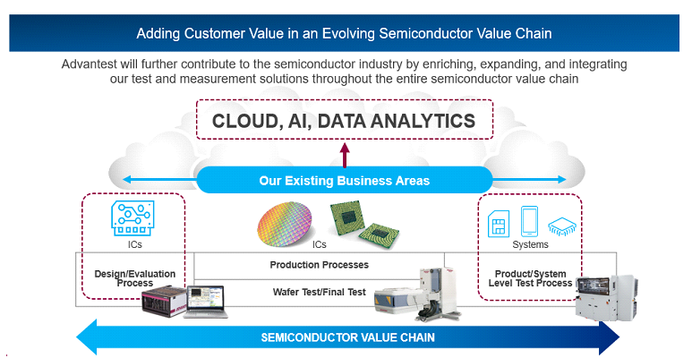
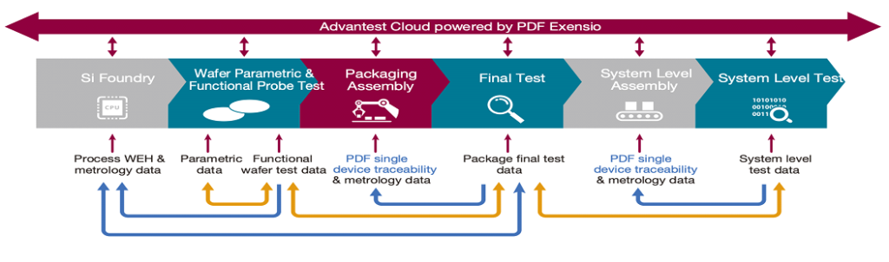

Posted  in [Q&A](https://www.gosemiandbeyond.com/category/qa/), [Top Stories](https://www.gosemiandbeyond.com/category/topstories/)

# Q&A Interview with Keith Schaub and Benjamin Lobmueller

By GO SEMI & Beyond staff

*Advantest’s Grand Design sets goals for how the company will grow its business and markets over the next decade by integrating its solutions throughout the semiconductor value chain. Its cloud strategy is a vital aspect of this vision. To learn more, we talked with Keith Schaub, Vice President of Technology and Strategy, Advantest America, and Benjamin Lobmueller, New Business Development Manager, Advantest Europe. Their comments are aggregated below.*

**Q. What is the primary objective of your cloud strategy?**

**A.** If you look at the semiconductor value chain [Figure 1], our core business, including our IC testers, handlers, and production processes, is in the middle. On the left-hand side, we’re mainly partnering with the EDA companies, and our focus is on design validation and verification. And on the right-hand side, we’re moving into system-level testing – this includes our acquisitions of Astronics’ System Level Test business (now ATS) and Essai, which added test sockets to our offerings. We’ve been working on these go-left and go-right strategies, as we call them, for several years. Now that those pieces are in place, we are focusing on our go-up strategy.

*Figure 1. The cloud, AI and data analytics are the next steps in fulfilling the Advantest Grand Design.*

For the most part, the data obtained from these processes and test cells is siloed. Customers use the data for their statistical techniques and yield improvements individually per process step, but none of it’s tied together cohesively. Our cloud strategy is to take all of these various process steps and use the cloud, AI and data analytics to connect them across the entire chain. Once you apply analytics and machine learning, you can predict the performance of future test insertions, to predict yields, outliers, even grades of performance, for instance. But this only works reliably if you have a system that spans the entire value chain.

These predictions then let you optimize what you’re going to do at a particular insertion based on information from the entire supply chain. If you know to expect good performance, you may need a less rigorous test. If performance is more marginal, rather than scrapping a device, perhaps you could perform additional testing that would allow it to become a tier-two device that would be viable to sell into a different market.

So, by tying all of these things together and applying AI and data analytics capabilities across the entire value chain, our customers and partners can optimize their insertions, whether for yield, quality, or cost. The systems can start to learn and improve over time. In a nutshell, that’s what this cloud approach is all about for us.

**Q. How does this help make the customer’s job easier?**

**A.** The hard part of what we’re trying to solve with this infrastructure is all the work you have to put in to get to the point where you can actually do analytics. Before you can analyze your data, many things have to happen, and what we’re doing with our cloud solutions is removing that burden from our customers.

For instance, if you have multiple insertions, you might have one process step in your supply chain in Taiwan and another one in Korea, while you are headquartered in Silicon Valley. How do you bridge that gap and bring together data from all those places? That’s where Advantest Cloud Solutions come in. We take away the tedious task of getting all your data in place so that you are better able to take advantage of real-time analytics, AI and machine learning techniques.

**Q. What are some challenges of this approach?**

**A.** Creating the infrastructure and getting all of these systems and customers to agree involves much cooperation. Everyone brings a separate piece to the table, and reaching consensus on the value can be challenging. So, while there are technical challenges, the business challenges are equal and sometimes even more significant.

We’re also taking away the difficulties from the information security side. Everyone has their security concerns – customers, OSATs, and us, of course – and those concerns need to be addressed. Advantest Cloud infrastructure is laying in all the necessary security nodes and layers, so that everything is protected appropriately.

**Q. How do the new offerings fit into this strategy?**

**A.** In December, as part of what we’re calling our Advantest Cloud Solutions [ACS] ecosystem, we announced Advantest Cloud powered by PDF Exensio, a data- and analytics-focused platform that we’re co-developing with PDF Solutions, as well as the ACS Dynamic Parametric Test powered by PDF Exensio.

This partnership came about when we decided to look at the best-in-class infrastructure pieces already available. In the process, we determined PDF Solutions to be the ideal partner. Their infrastructure is already in place with a large customer base. They have proven analytics tools that many customers use for decades, especially in the business’s foundry-side. With this partnership, they can continue to use those tools and expand to the industry’s test-side, and we can tie it in deeply to our infrastructure.

Our ACS products provide feedback on a wide range of processes, from semiconductor design validation to manufacturing, chip test, and system-level test – across all the different products and systems. This allows customers to get more value out of their supply chain, equipment, and test data, and get to yield faster. We can now give the customer a fully integrated infrastructure with analytics out of the box.

**Q. How does all this work together to integrate the supply chain?**

**A.** We’ve encapsulated that in Figure 2, which shows how the process steps work together with the Advantest Cloud as our corporate umbrella. It’s easy to say that we can just tie all these systems together, but these systems are not with one customer. They’re supplied by different customers of ours, working together for other customers of ours, in different geographies, and using different systems in many cases. For example, what format do you use to share the data? How do you protect the data as it moves from Customer A to Customer B? This illustration highlights what will be capable once all of this is in place.

*Figure 2. Advantest Cloud Solutions deliver cross-supply-chain feed-forward/feedback capability.*

It’s crucial to feed data forward in some cases, i.e., take data from a previous insertion to push it forward in the process and use that data in some intelligent way at a later stage. But it’s equally important to be able to have the data feed backward to improve your process. Say you find some problem at system-level test – it is invaluable to correlate back the possible causes so that you can predict the problem before it occurs in the future. Figure 2 is a graphical representation of different ways to feed data forward and backwards and what you would need to do that. The DEX network, which comes from PDF, has already solved many of the technological security challenges and includes measures to secure the data appropriately.

**Q. Briefly, how does the ACS Dynamic Parametric Test product work?**

**A.** The idea with ACS Dynamic Parametric Test powered by PDF Exensio is that we are essentially replicating product-engineering capability on the tester near real-time. What does that mean? What happens today is that a batch of wafers comes into a fab. They go onto a parametric tester. If there’s a problem, it’s typically assessed sometime later by an expert product engineer. This process carries a time cost – if something happens on a Thursday or Friday, it sits there over the weekend, and three or four days are lost. Meanwhile, the tester is booked for another job next week, so you have to deal with retesting everything and gathering the data.

The solution is ACS DPT, which utilizes the data analytics platform of PDF Exensio and uses a real-time rules engine to make decisions on the fly, while tests are conducted. So, when something starts to go awry with the measurements, the rules engine kicks in and flags it as a potential problem, taking extra data on all the nearest surrounding die. Once the test engineer looks at the situation, he or she has all of these additional bits of information to debug it. A much more intelligent decision can be made, much faster, and it can save millions of dollars when you consider multiple testers and multiple wafer lots.

**Q. What else are you doing in the cloud?**

**A.** We want to touch on a couple more things. The first is ACS Test Engineering Cloud, or ACS TE-Cloud, a service we’ve had for a while that we’ve now rolled up under our Advantest Cloud Solutions. It’s cloud-based test engineering that allows engineers to have an on-demand test program development environment. This capability is a game-changer, of course, for large companies, during a pandemic. Engineers can just keep working with the high performance they need, wherever they are. But it’s particularly beneficial for smaller players – new players in the market, for example, or startups or other ventures that need these tester services and don’t have a fleet of workstations to jump on. TE-Cloud gives them the environment to get the job done without investing millions of dollars in infrastructure that they may not need all the time.

With this service, we have flexible subscriptions available on demand. It’s very popular with our customers in China. They get remote access to our testers, we take care of all the hassles of infrastructure, and they don’t have to worry about calibration or maintenance. Again, many of these are tiny startups that can’t afford to buy a million-dollar machine just to get started. This way, they can get access to the test capability they need on demand.

The second thing we want to mention is Advantest Dojo, which we officially launched last summer. Dojo is our e-learning training environment in the cloud. Customers can get access to all training materials, videos and consulting, for different testers and services. It’s all being put under one umbrella to look and feel the same across geographies and the customer base. Customers pay a per-use fee to access this material, which application engineers within Advantest are continually updating to ensure the latest and greatest information is available.

Finally, there is another new product, the ACS Edge high-performance computing system. There’s some confusion over cloud and edge, and why you need one versus the other. You do need both of them, and they have different use cases and value propositions.

What the Edge means for us is that it’s right there at the test cell. The tester business model is that people pay by the second, so they want chips to go through as fast as possible. To make a prediction, you need to send data somewhere and get back an answer, as quickly as possible, about whether the part is good, bad or marginal. We optimize this with ACS Edge. It sits right next to the tester and plugs into the tester itself – the data streams directly over to it, and you get the lowest-latency HPC that you can get. You’re taking a supercomputer and plugging it into the tester so that you can make inferences with virtually no delay. You can think of it as bringing a data center to the test floor, or turning the test floor into a data center.

With ACS, we’re bringing both edge and cloud to the customer so that they can think up new use cases that employ data analytics and machine learning in both ultra-real time and post-insertion to get the predictive and high performance compute capabilities they need, most effectively, with the least impact on test cost.

  end .post_content

