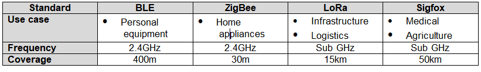
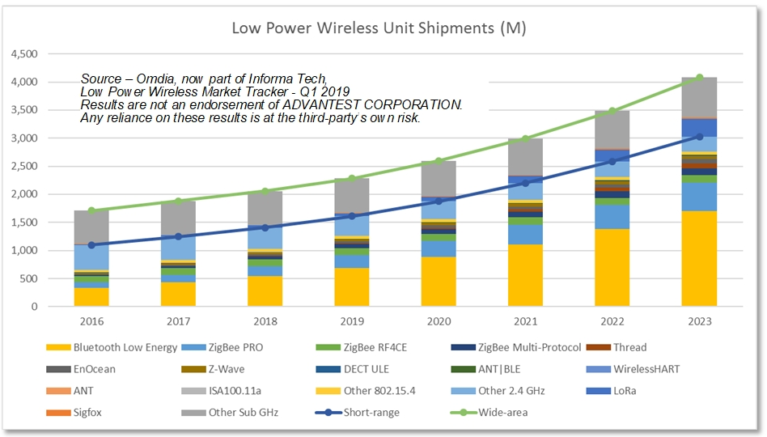
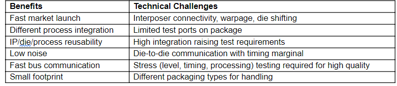
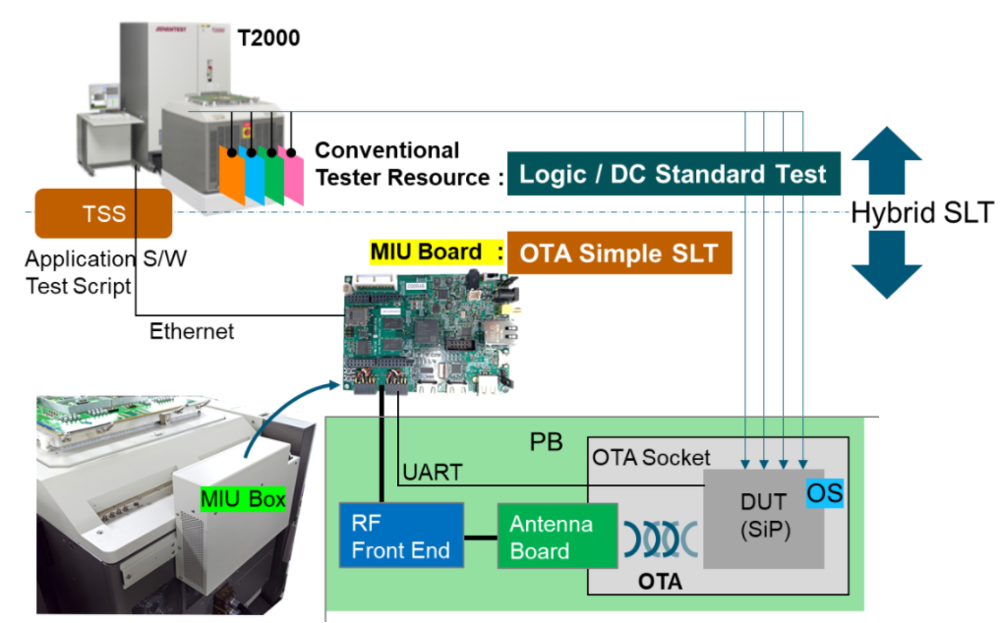
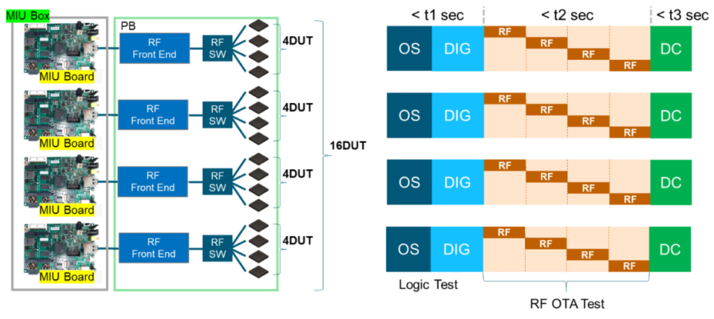

Posted  in [Top Stories](https://www.gosemiandbeyond.com/category/topstories/)

# T2000 with Multiple Interface Unit Supports RF SiP OTA Test

*By Koji Miyauchi, T2000 Business Unit Solution Department, Advantest Corp.*

**Introduction**

In recent years, the proliferation of the IoT has focused attention on low-power-wireless applications. IoT modules incorporating functions such as Bluetooth Low Energy (BLE) transceivers, MCUs, and power-management circuitry are becoming system-in-package (SiP) and even one-chip devices. Such devices increase the demand for a mass-production test environment that can measure them in a short time. To meet this demand, we at Advantest have focused on combining conventional ATE test and system-level test (SLT). Specifically, we have developed a hybrid SLT system that combines ATE test in the form of a T2000 system with SLT implemented using a multiple-interface-unit (MIU) box attached to the T2000. Advantest customers are using such systems today. In this article, we describe the hybrid SLT using a BLE SiP module as an example.

**IoT and low-power wireless**

The IoT represents a rapidly growing market for which high-speed wireless connections suitable for various usage systems are indispensable. The arrival of digital transportation is accelerating this trend. In addition to high speed, low power is crucial for IoT wireless communications, leading to the adoption of low-power wireless standards such as BLE and ZigBee for short-range communication and LoRa and Sigfox for long-range communication (Table 1).

*Table 1. Low-Power Wireless Standards and Features*

As shown in Figure 1, the ratio of BLE usage is high compared with usage of other communications standards for low-power wireless applications, and the average annual growth rate of BLE is 24.5%. IoT modules that can implement these standards can take various forms, from module-level devices that combine discrete components to SiP and single-chip devices. Due to the increasing demand for higher functionality, power saving, and miniaturization in recent years, IoT module functions increasingly will be integrated into one device. With the current acceleration of the IoT, the ratio of such SiPs and single chips to modules with discrete components is increasing, thereby driving an increasing demand for a production test environment that can quickly measure a large number of highly integrated devices at once . In addition, IoT modules built with SiP devices or single chips enable a wide variety of products optimized for each application.

*Figure 1. BLE finds significant use in low-power wireless applications.*

**Technical challenges for SiP**

An IoT module is a composite device that packages processing, power-supply, wired-communications, and wireless-communications functions. To test such a composite device, the tester must have the conventional capabilities required for testing multiple devices such as an MPU, a transceiver IC, and a PMIC. At the same time, a trend in the semiconductor manufacturing process is emerging that drives an increase in the ratio of SLT to conventional final test. Currently, there is a demand for system upgrades that incorporate the trimming process using conventional ATE, rather than system upgrades that combine actual end-application-level machines such as motherboards with measuring instruments. As shown in Table 2, the SiP presents technical challenges as well as benefits. The increasing demand for SiPs and the technical issues caused by their introduction are the reasons why the ATE environment is required instead of an upgraded SLT system using jigs such as motherboards.

*Table 2. SiP Benefits and Technical Challenges for Testing*

 

**Asynchronous testing with ATE**

One of two methods can help to solve the technical issues of IoT module SiPs, depending on the production volume:

1. A high-productivity measurement environment using multiple simultaneous-measurement SLT systems.
2. A hybrid environment that realizes SLT with conventional ATE test.

Here, we focus on the second: a hybrid environment that realizes SLT with a conventional ATE tester. This method is particularly suitable for high-mix production.

In conventional device tests, ATE takes the initiative in controlling the DUT to perform tests efficiently. However, SLT provides test in actual application-level use case, in which the application runs on the OS inside the CPU of the DUT.　In this application environment, with processing timing unique to the DUT, test operations are performed in accordance with the internal clock in the DUT’s CPU, so the output timing is uncertain. In other words, asynchronous testing becomes an issue when performing SLT on an ATE system. The testing must be performed mainly by DUT, since ATE is not good at test operations that are out of sync with itself.

To solve the problems related to asynchronous testing and SiP technical challenges, Advantest has developed hybrid SLT, which is a combination of SLT using an MIU box and ATE test. The MIU box is a unit that performs the SLT of IoT modules using tester resources and a processor that can operate asynchronously (Figure 2). The MIU box is controlled by the T2000 via Ethernet. Asynchronous test is realized while interlocking with the tester OS by letting the MIU execute the test script for SLT using the TSS (T2000 System Software) application software that has been used conventionally in the T2000.

*Figure 2. The Hybrid SLT solution combines a T2000 tester and MIU box.*

 

**Implementation example of 16 parallel tests by OTA**

Figure 3 shows an example of the testing of 16 BLE-equipped IoT modules using the T2000 MIU solution. Four DUTs can be measured for each MIU board. In addition, the MIU box is equipped with four MIU boards and can measure 16 devices. Moreover, because BLE has 40 channels, simultaneous measurement can be performed while avoiding channel interference. A performance board (PB) or load board with a shield function prevents radio-wave interference with a dedicated socket for OTA and the adjacent tester. Before and after the RF OTA test, digital tests and DC tests using conventional tester resources are performed.

*Figure 3. This hybrid SLT example shows the testing of 16 BLE-equipped IoT modules.*

The mass-production test steps in hybrid SLT (excluding the conventional chip-test items) are as follows; these tests are conducted asynchronously between the DUTs using OTA:

- Tx power. The DUT uses the received signal-strength indicator (RSSI) function of the RF front end to measure power while continuously transmitting Tx signals with direct test mode (DTM). [Is this correct: DTM stands for “direct test mode”?]
- RSSI. As with the Tx power measurement, the DUT receives the Tx signal from the RF front end with DTM, and the RSSI value is read out with the MIU.
- Packet error rate (PER). This test reads the PER while the DUT and RF front end communicate in the actual usage environment.
- Data transfer. After performing the advertising scan, this step connects the DUT and RF front end, sends and receives data at the application layer, compares the data with the expected value, and makes a judgment.

A test system can employ three types of OTA test methods—radio wave, electrostatic induction, and electromagnetic induction—depending on the application requirements. For this example, we have adopted electrostatic induction and have developed a socket and antenna board to implement this method. The Figure 4 block diagram shows the connection from the MIU box to the DUT as well as a photo of the MIU box and test head. Figure 5 shows results from the BLE PER test case.

*Figure 4. The block diagram (left) shows the DUT-to-MIU box connection, while the photo (right) shows the MIU box and test head.*

*Figure 5. OTA test of the RF front end to DUT connection (left) yields the BLE PER test results Shmoo Plot (right).*

**Conclusion**

Hybrid SLT is ideal for testing the ever increasing number of IoT modules. Since the traditional SLT communicates in an actual application-level use case, the overhead of test time tends to increase. However, the hybrid SLT can realize the concurrent conventional-ATE test and SLT, thereby shortening the total test time. Hybrid SLT can support wireless communication standards other than BLE, so customers can take advantage of Advantest’s wide range of the SLT solutions.

  end .post_content

