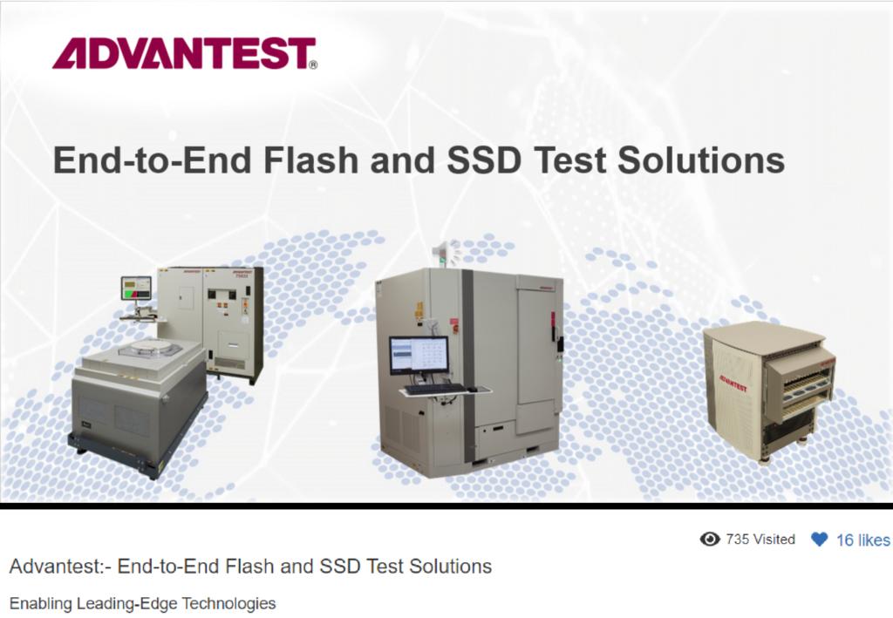

Posted  in [Upcoming Events](https://www.gosemiandbeyond.com/category/upcomingevents/)

# Virtual Flash Memory Summit 2020 Affords Advantest Opportunity to Share New Flash and SSD Test Solutions

*By Jess Nguyen*

Like most industry conferences last year, Flash Memory Summit 2020 went virtual for the first time on November 10-12, 2020, giving Advantest the opportunity to demonstrate its support of the storage and memory test industry. Advantest’s product showcase theme, **End-to-End Flash and SSD Test Solutions***, *was reinforced by its virtual exhibit featuring cutting-edge MPT3000 and T5800 series memory testers. 

Advantest experts strategically leveraged digital collateral such as product videos, panels, and images to exhibit the latest product information to more than 3,000 conference attendees. With nearly all industry events going virtual this year, continuously learning how to adapt to an on-screen conference environment provided Advantest with imperative insight on how to effectively engage with strategic customers and prospective customers online.

As the world continues to navigate the uncertainty of COVID-19, Advantest is determined to continue fostering its valuable relationships with its customers, partners, and employees. Advantest hopes to see you at next year’s Flash Memory Summit, currently scheduled for August 3-5, 2021 in Santa Clara, California.

  end .post_content

