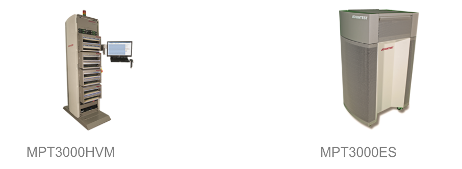

Posted  in [Featured Products](https://www.gosemiandbeyond.com/category/featuredproducts/)

# Advantest Enables PCIe Gen 5 NVMe & CXL Device Testing on Proven MPT3000 SSD Test Systems

Advantest announced that its MPT3000 solid-state drive (SSD) test systems are the industry’s first with the ability to test PCI Express fifth-generation (PCIe Gen 5) devices, including those utilizing the new Compute Express Link™ (CXL™) interconnect standard. To help drive product introduction, qualification, and volume production demands associated with PCIe Gen 5 NVMe & CXL devices, several leading memory device makers have purchased multiple MPT3000 products, including [MPT3000ES](https://www.advantest.com/products/ssd/mpt3000es.html) engineering systems, [MPT3000HVM](https://www.advantest.com/products/ssd/mpt3000hvm.html) high-volume manufacturing testers and device interface boards.

PCIe Gen 5 enables high-speed data transmission—essential for data centers, artificial intelligence (AI), and 5G applications. CXL is an open industry standard memory interconnect that builds on the physical and electrical interfaces of PCI Gen 5 to provide high-performance connections across memory types. 

Advantest designed its flexible MPT3000 systems to meet testing needs for enterprise and client SSDs, helping shorten customers’ time-to-market. In addition to CXL test, key MPT3000 capabilities include testing up to 32 Gbps, increased sideband and high-speed support, and improved temperature management for high-wattage drives.

“We are committed to driving memory and storage test innovation by developing the first systems and boards that will enable testing for both PCIe Gen 5 CXL and NVMe SSDs,” said Indira Joshi, vice president, SSD Test Division, Advantest America. “By expanding our proven MPT3000 system’s capabilities to address PCIe Gen 5 CXL, we are well positioned also to expand our relationships with important customers in the memory market.”

  end .post_content

