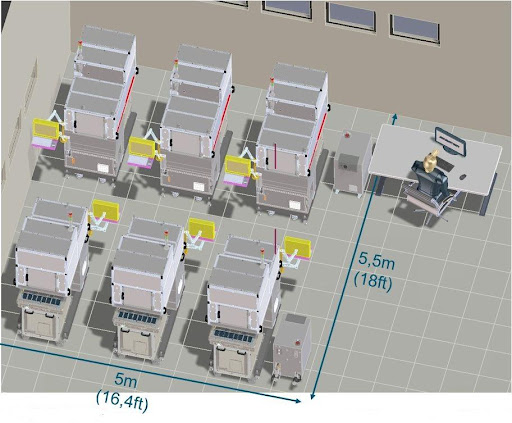
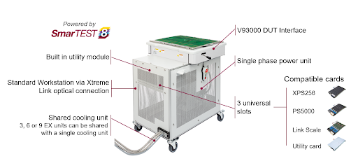

Posted  in [Top Stories](https://www.gosemiandbeyond.com/category/topstories/)

# Engineering Test Station Facilitates Post-Silicon Validation

*By Adir Zonta, Advantest*

The semiconductor market is evolving, with devices becoming more complex as chip designers add cores and pursue 2.5D and 3D integration strategies. This complexity presents challenges extending from design and simulation through system-level test (SLT), where a device is exercised in mission mode, booting up an operating system and running end-user code, for example.

These challenges arise from the exploding volumes of test data that must be acquired and analyzed throughout the design and test process. In addition, chipmakers are increasing the number of new product introductions (NPIs) per year as they diversify their product portfolios.

The exploding data volumes and proliferating NPIs in turn are combining to increase the need for flexible test processes and equipment, and they are straining engineering teams and their facilities. 

Worst case, a company could be faced with building a new engineering facility, either next door to an existing one or in a remote location. 

Ideally, a company would find a way to increase its capacity without expanding its engineering facilities. The arrival of first silicon presents a particular pressure point, when companies must deploy teams of engineers to perform device bring-up, pattern generation, and characterization.  

**Engineering test station**

Advantest is addressing the needs of such customers by augmenting its V93000 EXA Scale SoC Test System lineup, which targets advanced digital ICs up to the exascale performance class while lowering cost of test and shortening time to market.

Advantest’s latest offering in the family is the V93000 EXA Scale EX Test Station—a state-of-the-art engineering platform for complex device bring-up that supports structural and functional test.

To enable a fourfold increase in tester capacity within the same engineering lab footprint, the EX Test Station fits under Advantest’s single-site M4171 automated handler, which brings automated device loading, unloading, and binning into the laboratory environment.

The handler features integrated active thermal control (ATC) over a -45 to +125°C range. ATC supports fast data collection and can improve temperature cycle testing throughput by 40% compared to manual thermal-control approaches. The handler also can include a camera to facilitate remote work and 24/7 availability. The total test-cell footprint measures 0.56 m by 0.82 m, allowing six test cells to fit comfortably within a 5-m by 5.5-m laboratory space (Figure 1).

*Figure 1. Typical engineering layout of EX Test Stations with M4127 handlers.*

To further save space, three, six, or nine EX units can share a single cooling unit. Furthermore, the tester, handler, and thermal-control unit form a highly automated combination to conveniently and quickly gather the high-volume data needed for today’s successful silicon bring-up activities without continual intervention by engineers. Recent experience with remote work has demonstrated its feasibility for test-engineering applications. Rather than having a complete team of engineers on site, a single operator can be available to provide hands-on assistance to address any issues observed by the engineers working remotely.

The EX Test Station employs Advantest’s Xtreme Link technology, designed specifically to provide high-speed optical data connections, embedded computing power, and card-to-card communications for ATE.

Although not intended for use in high-volume manufacturing (HVM), the EX Test Station does have full throughput capability and is therefore suitable for testing initial engineering batches efficiently. In addition, it helps to ensure seamless flow between the engineering and HVM environments. To ensure a smooth transition to Advantest’s V93000 production-test system with perfect correlation, the EX Test Station includes a V93000-compatible DUT board and uses V93000 SmarTest 8 software as well as V93000 instruments (Figure 2).

*Figure 2. The EX Test Station with V93000 DUT interface and three universal slots.*

Specifically, the EX Test Station accommodates up to three EXA Scale cards, including Advantest’s XPS256 Extended Power Supply (XPS) device power supply (DPS) card, which delivers 256 channels of power at current ratings in the thousands of amperes at voltages below 1 V.

In addition, the EX Test Station accepts the Pin Scale 5000 digital card, which achieves 5-Gb/s speeds and is designed to address the explosion of scan data volumes inherent in large digital designs.

The EX Test Station also works with members of Advantest’s Link Scale™ digital-channel-card family for the V93000, which enable software-based functional testing of advanced semiconductors. Link Scale cards also support USB/PCI Express (PCIe) scan testing and address testing challenges that these high-speed interfaces present. During test, the Link Scale cards communicate with the DUT through the USB or PCIe interfaces running in full protocol mode. This approach tests a device in its normal mode of operation using firmware and drivers similar to those in the target application—thereby adding System-Like-Test™ capabilities to V93000 EXA Scale systems, including the EX test station. System-Like-Test enables tests that might otherwise be applied at SLT to shift left to an ATE system.

The Link Scale cards also enable the reuse of pre-silicon functional tests by leveraging the Portable Test and Stimulus Standard (PSS), which is supported by major electronic design automation (EDA) tools and which significantly improves test quality and reduces time to market.

Finally, the EX Test Station accommodates a utility card and includes a module with 64 utility lines and a 5-V utility supply. (An external utility power supply is optional.)

The cost-optimized EX Test Station with engineering cart, integrated power supply, peripherals, and shared cooler helps control facility costs through its 4x improvement in engineering floor capacity and by reducing power requirements—it operates on single-phase, 200- to 230-V, 30-A power.

**Conclusion**

The drastic increase in test-data volume coupled with a proliferation of NPIs is spurring on an increasing demand for investment in engineering. Advantest’s EXA Scale EX Test Station represents a cost-effective optimized solution that performs structural and functional test to support the bring up, debugging, and characterization of complex digital devices. Combined with the M4171 handler, it forms a highly automated engineering test cell with remote-access capabilities. The complete test cell offers a fourfold increase in engineering-lab capacity without any increase in footprint while minimizing engineering costs and cutting time to market.

  end .post_content

