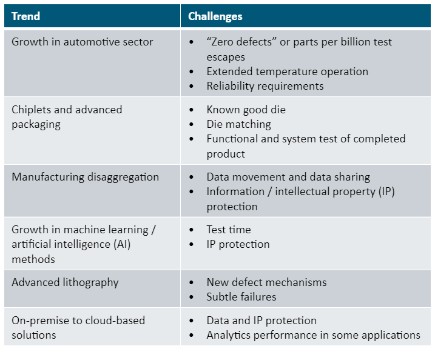
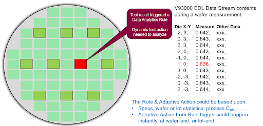

Posted  in [Top Stories](https://www.gosemiandbeyond.com/category/topstories/)

# Harnessing the Power of Data in Semiconductor Test

*This article is a condensed version of an article published in the Winter 2021 issue of MEPTEC Report. Adapted with permission. Read the original article at* [https://issuu.com/mepcom/docs/meptec_report_winter_2021?fr=sNTRhZDE1OTk3NzE](https://issuu.com/mepcom/docs/meptec_report_winter_2021?fr=sNTRhZDE1OTk3NzE)

*By Ken Butler, Strategic Business Creation Manager, Advantest America*

Every day, new methods are being developed to harvest, cleanse, integrate, and analyze data sources and extract from them useful, actionable intelligence to aid decision-making and other processes. This is true for a variety of industries, including semiconductor design, manufacturing, and test.

Moore’s Law (Figure 1) may be slowing with respect to traditional scaling of transistor critical dimensions. But as engineers continually develop ingenious ways to pack more functionality into a single product, e.g., 3D fabrication, multi-chip packaging, stacked die, and buried power rails (to name a few), the density of components in products is also increasing rapidly. Further driving this growth is an unprecedented increase in semiconductor demand, fueled by heightened online retailing, work-from-home scenarios, and transportation electrification.  

*Figure 1. Illustration of Moore’s Law from 1970 to 2020.*

One metric for tracking the overall semiconductor output is the number of transistors fabricated per year. VLSI Research [now part of TechInsights] has estimated that quantity for each decade since the inception of Moore’s Law, as shown in Figure 2, and estimates total output for 2021 was approximately 1.6×1021 (1.6 billion trillion) transistors!

*Figure 2. Estimated number of transistors sold annually**.*

By even a highly conservative estimate, the test data resulting from this hard-to-imagine number of devices would be greater than 40 terabits per second! All that data must be analyzed – not only to determine which components are good and bad, but also for many other “bits” of intelligence: passing but “suspect” components, whether or not the product containing the components meets its datasheet and reliability requirements, whether or not the manufacturing and testing processes and equipment remain healthy and under control, and a host of other critical information.

Moreover, this estimate only addresses data generated by the test function and doesn’t include design, fab and test equipment, sensor, inspection, and calibration and maintenance data. So, we must deal with an ocean of data to streamline and optimize our production processes. It is a prime example of what Jack Morton from Bell Labs called the tyranny of numbers way back in 1958 [1].

Table 1 lists additional industry trends and associated test challenges that are changing today’s semiconductor test solution landscape.

*Table 1. Industry trends and semiconductor test challenges.*

Two facets of test significantly influenced by these trends are product quality and test cost.  New and subtle defect mechanisms, combined with the push toward ever higher levels of quality, increase the amount and complexity of testing and screening that must be performed to ensure low parts per billion test escape rates. All this testing, in turn, consumes more test time, thus increasing the cost of test. Semiconductor suppliers are looking largely to data analytics to solve these problems and keep the cost of test at reasonable levels without any compromise in outgoing quality or reliability. Let’s look at some examples of solutions Advantest is pursuing.

**Dynamic parametric test**

One of the earliest test steps performed on semiconductor devices is parametric test, also known as e-test or wafer acceptance test (WAT), which is performed during and following wafer manufacturing. The structures being tested can be individual transistors, resistors, and other components that are fabricated in the scribe lines, which are the small spaces between each die on a wafer, as illustrated in Figure 3 [2].  While these structures fill most of the scribe lines on the wafer, testing is typically limited to a few sites spread across the wafer surface.

*Figure 3. Parametric testing involves structures fabricated in the wafer scribe lines between the die.*

The test measurements provide valuable data used to monitor the health of the manufacturing process.  When anomalies are detected, typically the material flow is stopped so fab engineers can determine the cause of the problem. That often involves retesting material, collecting additional information, and performing additional manual analyses – all of which is disruptive and potentially costly to fab operations.

Dynamic parametric test (DPT) was created to automate and speed resolution of these types of excursions. Using DPT on an Advantest V93000/SMU8 parametric tester with PDF Solutions Exensio® software, a set of user-definable rules is established and checked during parametric testing. When the rules detect an issue, actions are immediately triggered to accelerate root-cause identification.

This process is illustrated in Figures 4 and 5. In this example, a diode measurement is being performed.  An out-of-specification measurement is detected, which triggers a DPT rule, and the test flow quickly adapts to a sweep of additional diode measurements across additional e-test sites on the wafer.  This real-time update collects the additional data necessary to diagnose the cause of the issue without requiring a stoppage of material flow and the reloading and retesting of aberrant wafers, thus saving both time and cost.  In the example cited here, the resulting root cause was quickly narrowed to a reticle or etch issue.

*Figure 4. DPT detects out-of-spec diode parametric test.*

*Figure 5. DPT adaptively adjusts parametric test execution to collect additional data.*

**Production test edge computing**

Downstream from parametric test is production testing. Wafer probe or wafer sort testing is performed while devices are still on the wafer. After good die have been singulated and packaged, they are subjected to final or package test. Other optional steps include system-level test, where die are subjected to a longer test that more closely resembles actual in-system operation, and burn-in, where the devices are tested, up to several hours, at elevated voltage and/or temperature to accelerate early life failures and measure product reliability.

Historically, production tests are a “one size fits all” proposition – for a given product, the same suite of tests is applied to every die. What’s desired, however, is to use data emerging from the test process itself to modify test content and execution so that each die sees the “right” tests. This process, which enables optimized deployment of test resources, is called adaptive test.

One form of adaptive test is executed as a post-test operation, e.g., wafer sort data is analyzed after the fact, and downstream final test operations are adjusted based on that analysis. However, semiconductor suppliers are also pursuing real-time adaptive test processes during production, in which test flow and content are altered during test execution, with low millisecond latencies. Several examples published in recent years describe scenarios that would work well when deployed as real-time adaptive test applications, including adaptive limit setting during search routines, predictive device trim, classifiers and device clustering, and burn-in optimization via at-risk device identification. [3] – [12]

Advantest developed ACS Edge to address this need for very fast, low-latency and highly secure analytics during production test. A high-performance compute platform with a dedicated, secure communication channel to the tester, ACS Edge wraps analytics in Docker containers to ensure reliable execution regardless of the compute environment’s configuration. All information related to the analytics and the data being analyzed is encrypted to prohibit unauthorized access that could compromise sensitive proprietary information.

**Conclusion**

As semiconductor product data sources become larger and more diverse, IC developers and manufacturers are challenged more than ever to deliver devices on time with highest quality and at the lowest possible cost. They are looking to advanced data analytics to extract intelligence needed to adjust manufacturing and test flows to adapt to an ever-changing environment. Test plays a pivotal role because it directly interfaces with each device to extract and analyze the data needed to monitor and control product quality and performance. DPT and test edge computing are just two approaches being deployed into production to address these challenges – we can expect to see more new solutions as innovation in manufacturing and test data analytics continues.

 

**References**

[1] 
Various, “Tyranny of numbers,” 2021. [Online]. Available: https://en.wikipedia.org/wiki/Tyranny_of_numbers. [Accessed 22 Oct. 2021].

[2] 
M. Bhushan and M. Ketchen, “Electrical Tests and Characterization in Manufacturing,” in *CMOS Test and Evaluation*, New York, NY, Springer, 2015. 

[3] 
D. Neethirajan, X. C. K. Subramani, K. Schaub, I. Leventhal and Y. Makris, “Machine learning-based noise classification and decomposition in RF transceivers,” in *IEEE VLSI Test Symposium*, Monterey, CA, 2019. 

[4] 
C. Xanthopoulos, D. Neethirajan, S. Boddikurapati, A. Nahar and Y. Makris, “Wafer-level adaptive Vmin calibration seed forecasting,” in *Design, Automation and Test in Europe*, Grenoble, France, 2019. 

[5] 
M. Eiki, K. Schaub, I. Leventhal and B. Buras, “In test flow neural network inference on the V93000 SmarTest test cell controller,” in *IEEE International Test Conference*, Washington, DC, 2019. 

[6] 
V. Niranjan, D. Neethirajan, C. Xanthopoulos, E. De La Rosa, C. Alleyne, S. Mier and Y. Makris, “Trim time reduction in analog/RF ICs based on inter-trim correlation,” in *IEEE VLSI Test Symposium*, Virtual, 2021. 

[7] 
T. Y.-T. Kuo, W.-C. Lin, E. J.-W. Fang and S. S.-Y. Hsueh, “Minimum operating voltage preiction in production test using accumulative learning,” in *IEEE International Test Conference*, Virtual, 2021. 

[8] 
M. Shintani, M. Inoue, T. Nakamura, M. Kajiyama and M. Eiki, “Wafer-level variation modeling for multi-site RF IC testing via hierarchical Gaussian process,” in *IEEE International Test Conference*, Virtual, 2021. 

[9] 
M. Liu and K. Chakrabarty, “Adaptive methods for machine learning-based testing of integrated circuits and boards,” in *IEEE International Test Conference*, Virtual, 2021. 

[10] 
S. Traynor, C. He, K. Klein and Y. Yu, “Adaptive high voltage stress methodology to enable automotive quality on finFET technologies,” in *IEEE International Test Conference*, Virtual, 2021. 

[11] 
C. Nigh, G. Bhargava and R. Blanton, “AAA – Automated, on-ATE AI debug of scan chain failures,” in *IEEE International Test Conference*, Virtual, 2021. 

[12] 
C. He, P. Grosch, O. Anilturk, J. Witowski, C. Ford, R. Kalyan, J. Robinson, D. Price, J. Rathert and B. Saville, “Defect-directed stress testing using I-PAT inline defect inspection results,” in *IEEE International Test Conference*, Virtual, 2021. 

  end .post_content

