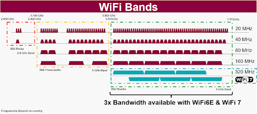
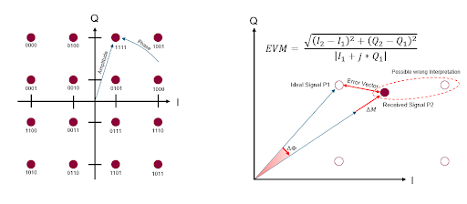

Posted  in [Top Stories](https://www.gosemiandbeyond.com/category/topstories/)

# Wave Scale RF8: Ready for Wi-Fi 7

*By Jan Ermert, Product Marketing, Advantest Europe*

Since Advantest launched the Wave Scale family of test cards for the V93000 system-on-chip (SoC) test platform five years ago, we have continually added new products and capabilities to the line, allowing us to address new, emerging test demands. The Wave Scale RF8 card addresses the test challenges associated with the forthcoming Wi-Fi 7 standard by providing the bandwidth needed in an industry-proven instrument. Wi-Fi 7 covers the (so far, for Wi-Fi) unused frequency range between 6 GHz and 7.125 GHz, using up to 4096-QAM modulation schemes and up to 320MHz channel bandwidth (see Figure 1).

*Figure 1. Wi-Fi band ranges are shown here, including the 3x increase in bandwidth enabled by advanced Wi-Fi. *

Figure 2 shows the Wi-Fi standard roadmap. With anticipated Wi-Fi 7 certification just two years away, customers need to plan their testing strategy now, integrating Wi-Fi 7 ready technology so that it is already in place when they are ready to begin rolling out Wi-Fi 7-certified products.

*Figure 2. Current Wi-Fi 7 standardization, certification and commercialization timelines. [Source: “IEEE 802.11be: Wi-Fi 7 Strikes Back,” IEEE Communications Magazine, Volume 59, Issue 4, April 2021] *

**Wi-Fi 7 application drivers**

Wi-Fi 7 is optimized to ensure the highest possible throughput and the lowest latency. This comes in handy not only for entertainment apps but also for enterprise users and for virtual reality (VR) and augmented reality (AR) implementations. To this end, Wi-Fi 7 includes improvement for the different layers of the Open Systems Interconnect (OSI) model. Specifically, we’re looking at the physical layer, which determines how the data is transmitted and organized. It also defines how we deal with all aspects of an RF interface with regard to sharing a finite amount of spectrum between many access points and end points.

Many of these aspects will be addressed by new capabilities within Wi-Fi 7 releases 1 and 2. One of the key features being improved on is the introduction of even wider channel bandwidths in the relatively new 6GHz band. Release 1 proposes 320MHz and smaller channel bandwidths with up to 4096 QAM modulation – a major challenge for measurement equipment that is addressed by our Wave Scale RF8 solution.

The tradeoff for the impending bandwidth improvement in Wi-Fi 7 is that some range or signal reach may be sacrificed. During the transmission of a Wi-Fi 7 data package, it is necessary to convert the bits and bytes within the lowest part of the OSI model, the physical layer, into a phase- and amplitude-modulated analog signal at high frequencies, which can then be transmitted over the air. For the receiver to be able to extract the digital information from the received analog signal, the noise created by the signal chain must not be interfering with the signal. A typical measurement that tests for this interference is EVM, which checks the error vector, or delta between the signal as it should be and the signal as it was received (see Figure 3). 

Within the modulation the bits are encoded by shifting a carrier frequency both in phase and amplitude in discrete steps. This is typically plotted as a grid with each point on the grid representing one possible modulation state. Each point also represents a symbol, a pattern of bits that is unique to this one spot. The amount of grid points determines how many bits can be transmitted with one symbol. With a 4096 QAM, as used in Wi-Fi 7, each symbol carries 12 bits.

The denser this grid becomes, the faster the bit transfer for the same bandwidth, or spectral efficiency of the modulation scheme. This, however, has the huge disadvantage, that any noise added to the signal might lead to misinterpretation of the received symbol. The denser the grid pattern, the higher the sensitivity for noise. For a 4096 QAM, the expectations regarding a receiver are set very high, which, in turn, means the same for the measurement equipment measuring the receiver. For Advantest, this means that in order to provide a margin that guarantees the test results to be reliable, our test equipment needs to be multiple decibels better in EVM measurements than the DUT, and we’re well prepared to meet this challenge.

*Figure 3. Example of a 16 QAM modulation scheme (l), EVM explanation, and calculation (r)*

**The Wave Scale solution**

Wave Scale RF8 can perform both highly parallel multisite and in-site parallel test, testing both the send and receive channels in a fraction of the time required using a traditional test flow. It can also perform high multisite testing using native ATE resources, all within the V93000 test head. The card offers multiple benefits for Wi-Fi 7 test – in addition to support for 320MHz 4096 QAM, these include best-in-class EVM performance, wide operating frequency (10MHz to 8GHz), and scalability for in-site parallelism, among others (Figure 4).

*Figure 4. Wave Scale RF 8 delivers unmatched parallelism with best-in-class EVM performance for Wi-Fi 7 testing.*

Due to Wave Scale RF’s flexible architecture, high-performance/ultra-low-noise signals are provided by a Precision Source card when needed. This provides for a better driver signal, further improving the EVM for Wi-Fi 7. Wave Scale RF8 features a source combiner that couples two of its four independent synthesizers, doubling the 160 MHz bandwidth to achieve 320 MHz on the stimulation side and thus enabling the card to perform Wi-Fi 7 testing (Figure 5).

*Figure 5. Each of the card’s RF subsystems functions as an independent instrument for highly parallel processing, enabling all ports to achieve 320MHz.*** **

Implementing this solution requires no additional accessories, nor any additional components on the load board or special test head cabling. This means that for existing Wi-Fi 6/6E configurations, there is no change necessary if the load board components support the frequencies and bandwidths for Wi-Fi 7. Wave Scale RF8, together with the SmarTest8 ATE software, provides best in-class Wi-Fi 6E testing today and is ready to accommodate your Wi-Fi 7 DUTs as they are developed and readied for production. 

As the technical ATE leader in Wi-Fi test, Advantest is committed to continually staying ahead of the technology curve. We have a track record of developing elegant, easily integrated solutions that anticipate customers’ needs for Wi-Fi testing capabilities. By building a rock-solid platform with a dedicated RF instrument card that offers high performance and flexibility, we are already supporting future standards and will be ready for Wi-Fi 7 when you are! 

  end .post_content

