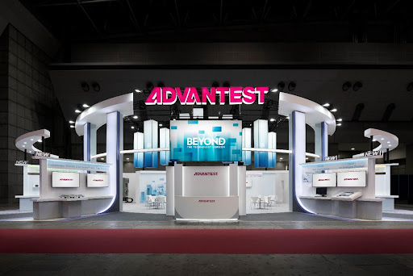

Posted  in [Upcoming Events](https://www.gosemiandbeyond.com/category/upcomingevents/)

# Advantest Successfully Showcases its Latest IC Test Solutions at SEMICON Japan 2022

Advantest participated in SEMICON Japan 2022 on December 14-16 at the Tokyo Big Sight in Tokyo, Japan. 

SEMI began the event on December 14 with an opening ceremony featuring speeches from industry leaders, including one from Advantest’s Senior Executive Officer, Kimiya Sakamoto. As in previous years, Advantest participated as a gold-level sponsor, expressing its dedication to the industry and the advancement of semiconductor technology.

Advantest’s booth highlighted various new products, including the inteXcell, the E5620 DR-SEM, the XPS128+HV, the LCD HP, and CREA’s power semiconductor test solutions. This year’s impressive display of innovative technology drew an exceptional crowd of over 2,100 visitors. Customers and partners, as well as numerous investors, analysts, and members of the press visited the booth to see Advantest’s latest leading-edge technology. Advantest also took the opportunity to showcase its ESG initiatives.

Beyond the booth display, Advantest participated in many other aspects of this year’s tradeshow. For example, ACS Business Development Director of Advantest America, Shinji Hioki, presented “Data Analytics in the Chiplet Era” during the STS Test Session. Advantest also sponsored SEMI’s new initiative, Advanced Packaging and Chiplet Summit (APCS), as well as the gala networking dinner, the Smart Mobility Pavilion, and the Mirai College Pavilion.

Advantest appreciates all of those who participated in this year’s event, and we look forward to SEMICON Japan 2023.

  end .post_content

