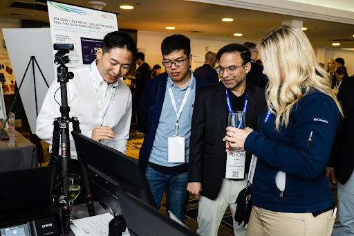

Posted  in [Upcoming Events](https://www.gosemiandbeyond.com/category/upcomingevents/)

# Advantest VOICE 2023 Sees Record Attendance for 15th Anniversary of In-Person User Conference

Advantest concluded its VOICE 2023 user conference at the Santa Clara Marriott in Santa Clara, California, with a record-high turnout of nearly 400 attendees – a 25% increase from 2022 – the majority of whom were Advantest customers and industry partners. This year’s event, held on May 8-10, marked the 15th anniversary of the in-person VOICE conference, attracting participants representing more than 50 companies from around the globe. Over two days, a total of 71 papers were presented across nine technical tracks, of which 40% were written or co-authored by Advantest’s customers and industry partners. In commemoration of the 15th anniversary, past VOICE chairpersons were invited on stage at the opening of the General Session to celebrate all the conference has accomplished to date.

VOICE 2023 received over 140 abstract submissions from 25 companies across 10 countries. The technical tracks for this year’s event covered a range of topics important to the ATE industry, such as 5G/millimeter wave, AI/ML, high-performance computing, parametric test, data innovation and analytics, cloud technologies, and device/system-level test, to name a few.

In addition to technical sessions, VOICE 2023 offered a Partner’s Expo where Advantest’s industry partners met with attendees to showcase their latest products and services. This year’s keynote line-up featured such notable speakers as Dex Hunter-Torricke, head of global communications and marketing, Deepmind; Dr. Gaurav Gupta, VP analyst, emerging technologies and trends, Gartner; Claudionor Coelho, chief AI officer and senior VP of engineering, Advantest; and Michael Campbell, VP of engineering at Qualcomm Technologies.

Through the VOICE mobile app, attendees voted to select the best technical presentations and best technology kiosk.

**Best Paper:**

- “How To Use OpenOCD with Link Scale to Reduce Time-to-Market Using Designs Native Tooling,” by Stephen Peck of Marvell Technology and Gaurang Desai of Advantest.
- “Test Time and Cost Reduction Using Intelligent Prediction from MI Models,” by Lisa Taubensee, Raphaël Latty, Bruno Galy, Matthias Sauer and Klaus-Peter Behrens of Advantest Europe.

**Best Kiosk Award:**

- “ACS Edge + ACS Nexus + ACS Unified Server Real-Time Data Infrastructure,” by Ken Butler of Advantest.

This year’s Visionary Award was presented to Corey Liu, manager of the Test Methodology Group at NVIDIA. Recipients of the Visionary Award are honored for their significant and sustained contributions to VOICE over time. Liu has supported VOICE by serving on the technical committee for two years and consistently contributing papers to the technical program for the past eight years. 

VOICE is made possible by the work of a dedicated steering committee made up of volunteer representatives from Advantest and its customers and the support of event [sponsors](https://voice.advantest.com/sponsors/). 

We look forward to hosting VOICE 2024 on June 3-5 at the Hilton La Jolla Torrey Pines in San Diego, California. For the latest updates, please visit our website: [https://voice.advantest.com/](https://voice.advantest.com/)

 

 

  end .post_content

