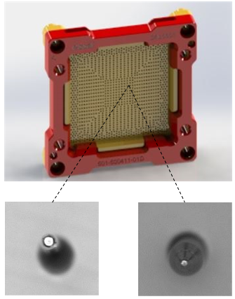
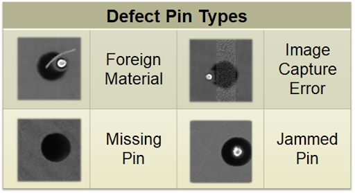
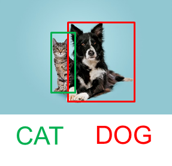
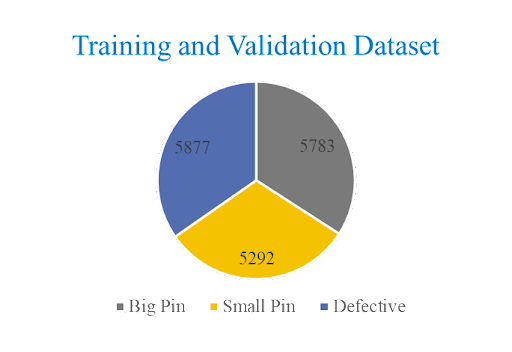
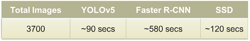

Posted  in [Top Stories](https://www.gosemiandbeyond.com/category/topstories/)

# Comparison of State-of-the-Art Models for Socket Pin Defect Detection

*This article is adapted from a *[presentation](https://www.testconx.org/premium/testconx2023-tuesday/)* at TestConX, March 5-8, 2023, Mesa, AZ, by Vijayakumar Thangamariappan, Nidhi Agrawal, Jason Kim, Constantinos Xanthopoulos, Ira Leventhal, and Ken Butler, Advantest America Inc., and Joe Xiao, Essai, Advantest Group.*

*By Vijayakumar Thangamariappan, R&D Engineer, Expert, Advantest America Inc.*

Test sockets have a key role to play in the semiconductor test industry. A socket serves as the critical interface between a tester and device under test (DUT). Although seemingly simple in concept, a socket can have thousands of pins, depending on the number of I/O connections to the target device. A typical socket size might be 150mm x 200mm x 25mm, and protruding pin height may be about 50 to 250 micron (Figure 1). Manufacturers may produce thousands of sockets per month or more, and each pin of each socket must be inspected so that pin defects do not impact semiconductor production test and cause expensive downtime.

*Figure 1. A socket (top) may include thousands of pins, shown back (bottom left) and front (bottom right).*

During socket assembly, several problems can arise. Too much pressure may be applied, one or more holes may be skipped, a pin meant for one hole may be inserted in another, or foreign material may contaminate a pin location. Figure 2 shows several defect types, including apparent pin defects caused by image capture errors.

*Figure 2. Pins can exhibit several defects, some of which may be artifacts of the imaging system.*

Traditionally, an inspection engineer has used a microscope to identify pin defects. But even for a highly trained engineer, the process is highly subjective, time-consuming and error-prone. The manual approach makes it particularly difficult to identify mixed-pin issues, which occur when a pin meant for one hole is inserted into another, and wrong pin issues, which occur when a pin meant for one socket type is inserted into another (Figure 3).

*Figure 3. Manual inspection makes identifying mixed-pin (left) and wrong-pin (right) issues difficult.*

In addition, manual inspection is difficult to scale for high-volume manufacturing. In general, it can lead to test escapes, reducing customer satisfaction, functionality, reliability, efficiency and productivity. A single pin failure can lead to system application failure or damage to the DUT, and a defect found at a customer site would require tester downtime to troubleshoot. Once the defective pin is identified, the socket assembly will require rework and retest, negatively impacting production throughput and imposing shipping delays.

**Automating the inspection process**

Consequently, it becomes desirable to automate the inspection process by applying artificial intelligence and machine learning. The first step involves considering concepts such as object classification and object detection. Object classification returns the class of an object, such as “cat” (Figure 4, left). Object classification provides no localization information regarding the position of the object—it merely indicates whether an object of a particular class, such as “cat,” is or is not present. In contrast, object detection identifies the classes of objects in an image (for example, “dog” and “cat” in Figure 4, right) and surrounds them with bounding boxes (green and red rectangles in Figure 4, right) to indicate their locations.

*Figure 4. Object classification can identify the class of an object in an image (left), while object detection identifies object classes and locates them within bounding boxes (right).*

For socket pin-defect inspection, object detection is the preferred approach. For object classification, limited interpretability (that is, distinguishing the class of “good pins” from the class of “defective pins”) makes identifying corrective actions difficult, and background variability (such as socket surface patterns) greatly affects results. In contrast, object detection can help identify and locate different object types, with background variability ignored.

Having decided on object detection, we evaluated three object-detection algorithms:

- YOLO (You Only Look Once) employs a one-step process that performs classification and established bounding boxes at the same time.
- Faster R-CNN (Faster Regions with Convolutional Neural Networks) employs a two-step process providing, first, a region proposal, and second, object detection within the proposed region.
- SSD (Single Shot Detector) employs a one-step process that divides an image into a grid to locate objects within the image.

Training these algorithms requires many images for every class of object of interest. Because the pin defect rate in a manufacturing line is low and some defect types are rare, it is difficult to select a balanced dataset. Our approach was to group all defective pins under a single class named “defective.” We then defined two additional classes, “big pin” and “small pin,” to train a single three-class model. Each pin image has a size of 792 by 792 pixels. 

Figure 5 shows our training and validation dataset on the left and the number of defect types that make up our “defective” class on the right.

 

*Figure 5. The defective class in the training dataset (left) includes jammed pin, missing pin, foreign material (FM), bent pin, image capture error (ICE) and wrong pin defects (right).*

We next employed the semiautomated bounding box preparation process outlined in Figure 6.

*Figure 6. Bounding box preparation requires a five-step process.*

The steps are as follows:

1. Apply Gaussian blur
2. Find a mean value and reset all pixel values to white if the pixel values are greater than the mean
3. Do a binary invert
4. Find max area contours
5. Draw the bounding box

Figure 7 outlines the confusion matrix of possible outcomes. False positives imply test escapes, while false negatives require more time to evaluate bad images.

*Figure 7. In this confusion matrix, false positives imply test escapes and false negatives require more time to investigate.*

To evaluate algorithm performance, we focused on time and accuracy as key metrics. Speed is crucial because the model will be deployed in a post-assembly socket manufacturing line. In addition, high-volume manufacturing generates a large amount of input data, so a model that can predict an object class quickly is necessary. Accuracy is necessary to minimize false negatives and prevent test escapes.

To measure the inference time of all three models, we deployed them on Amazon EC2 instances, which are commonly used to host machine-learning models used in image classification and object detection. We chose instance type g4dn.16xlarge, which has an NVIDIA Tesla T4 16-GB GPU. Table 1 shows the results.

*Table 1. Model Inference Time*

The Faster R-CNN algorithm required the longest processing time, as expected, because it has a two-layer network architecture. YOLO and SSD have single-layer architectures and had shorter inference times, with YOLO outperforming the other two.

Our results show that YOLO also outperformed the other two algorithms in terms of accuracy.  Accuracy metrics primarily focus on false positive (test escape) and false negative (need review) results. YOLO misclassified only five good pins as bad pins (false negative). The low false negative count drastically simplified the post prediction review process. The following list summarizes our observations regarding the test escapes:

 

1. Test escapes: All models performed well in identifying jammed pin, bent pin, and wrong pin defects. YOLO correctly identified all missing pin defects, while Faster R-CNN and SSD had eleven and two misclassifications, respectively. Both R-CNN and SSD had test escapes.
2. Conditional test escapes: YOLO outperformed the other two models in identifying foreign material and image capture error classes. YOLO’s 10 false positives are from seven foreign-material (FM) defects and three image-capturing errors (ICEs).

FMs that clog the whole pin region are the real problem. Compared to other models, YOLO’s seven FM misclassifications resulted from either a tiny FM particle in the pin region or FM that did not affect pin hole region. We recommended additional cleaning procedures before inspection to avoid this issue. 
An ICE is an issue caused by the image-capture equipment. ICEs do not represent actual pin defects but do result in noise being added to the image.  In YOLO’s three misclassified image-capturing errors, pin regions are clearly visible, and the issue occurs outside the pinhole region. We took additional measures to avoid these randomly generated ICE issues. Table 2 summarizes our overall results.

 

*Table 2. Model comparison with metrics*

**Advantest ACS Edge solution**

As mentioned, we performed our model evaluations in an Amazon AWS cloud environment. To achieve faster prediction speeds in an actual manufacturing facility, you can forego the cloud-service hosting and instead use Advantest ACS EdgeTM.  It is a highly secure edge compute and analytics solution which can host computationally intensive workloads adjacent to the test equipment. The Advantest ACS Edge solution provides consistent and reliably low latencies compared to datacenter-hosted alternatives.

*Figure 8. ACS Edge** can host models with low latency.*

**Conclusion**

The primary goal of socket pin-defect detection is to reduce the need for manual inspection while maintaining zero test escapes. We compared three different object-detection algorithms to find the best combination of accuracy and processing speed. The YOLO model was able to learn pin-type features quickly, achieving higher accuracy with fewer iterations compared with the other models.

  end .post_content

