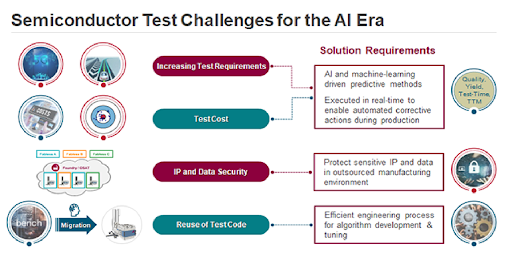
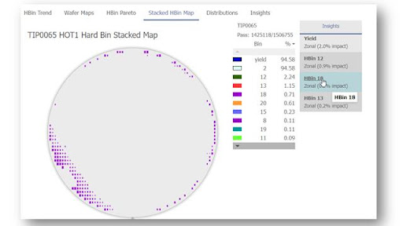
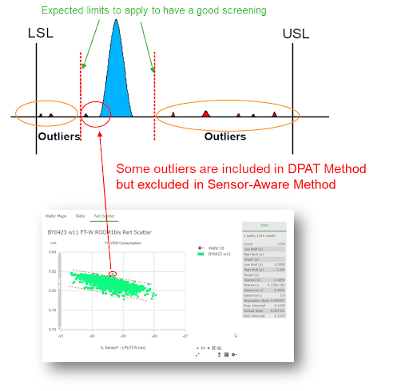

Posted  in [Top Stories](https://www.gosemiandbeyond.com/category/topstories/)

# Deploying Cutting-Edge Adaptive Test Analytics Apps: Innovation Based on a Closed-Loop Real-Time Edge Analytics and Control Process Flow into the Test Cell

*By Ken Butler, Senior Director of Business Development, Advantest, & Guy Cortez, Senior Staff Product Manager, Synopsys*

Semiconductor test challenges abound in this era of AI. As such, semiconductor test engineering is increasingly moving towards fully adaptive test where each device receives the “right” test content to assess its correctness. Advantest and Synopsys have partnered to provide new cutting-edge real-time adaptive test applications at the test cell based on complete closed-loop analytics and control process flow. Our solution leverages a high-performance, highly secure real-time data infrastructure combined with advanced analytics derived from a comprehensive silicon lifecycle management (SLM) platform. For example, when test measurement data is combined with on-die sensor readings using a very fast and secure computing platform, the solution provides an in-situ adaptive test with milliseconds latencies.

*Figure 1. Semiconductor test challenges for the AI era*

First, let’s review the Advantest ACS portion of the solution. The Advantest ACS Real-Time Data Infrastructure (RTDI) is a platform that provides low latency and highly secure data access and system control for test operations (Figure 2). It consists of the following components:

- ACS Container Hub™, a web registry for the management and distribution of open container initiative-compliant AI/ML and statistical workloads.
- ACS Unified Server™, a multi-purpose, reliable and scalable platform that serves as a gateway and local mirror for containerized applications.
- ACS Edge™, a high-performance and highly secure computing solution for the execution of complex analytical workloads for real-time applications in production test.
- ACS Nexus™, the communications backbone for ACS RTDI which allows for streaming access to test and test cell data as well as real-time control of tester operations.

*Figure 2. ACS Real-Time Data Infrastructure*

Two example use cases to which adaptive test flow can be applied are:

1. Reduce test time – Save cost and improve throughput by eliminating some tests that appear useless (no parts failing).
2. Reduce DPPM – Improve quality control by adding additional tests for some “risky” parts.

Our first use case focuses on this second method of improving quality. Figure 3 below is an image of a stacked wafer map that highlights specific zonal regions on the wafer that have an excessive number of failures, shown in purple. A typical stacked wafer map consists of 25 wafers or one lot’s worth. The remaining good die in this region are suspect due to the amount of failures on this part of the wafer. The larger and darker the purple identifier per x, y coordinate is, the more prominent failures there happen to be at that x, y coordinate across all wafers analyzed.

An application is available to identify which packaged die from select x, y coordinates are considered risky based on a specific failure threshold set by the product engineer. Additional test(s) will later be applied to those parts labeled as risky during final test (a form of ZPAT at final test), thereby improving the overall quality of the chip but with minimal impact on total test time.

*Figure 3. Wafer stack map*

A second application is adaptive limit setting, i.e., the adjustment of test limits during test program execution. The method shown here utilizing sensor data provides higher accuracy in limit management compared to existing methods such as dynamic part average testing (DPAT), because sensors embedded in the chip provide additional key information that enables the monitoring of the chip’s operational metrics such as power and performance. This example highlights the use of sensor data that characterizes the process and environment information to enable more accurate limits on speed/power consumption during testing, thus resulting in lower DPPM and higher quality.

Figure 4 below shows a comparison of the two adaptive test limit approaches. First, the DPAT method shown is a standard univariate approach based on the die population results for a given test. Next, the sensor-aware method incorporates a bivariate correlation between the data measured from sensors and the results of a specific VDD consumption test. The second method can identify at-risk die that would be missed by conventional DPAT analysis.

*Figure 4. Traditional univariate DPAT vs. sensor aware bivariate method*

**Conclusion:** In this article, we describe a real-time, highly secure data infrastructure plus a pair of complex, high-value analytical applications that consume both test response and on-die sensor data to produce inferences for true adaptive test decision-making with low milliseconds latencies. The analytics and associated applications are available as part of an open solutions ecosystem, which allows users to either develop their own solutions or procure and deploy them from Synopsys or other providers. The result is the democratization of machine learning driven applications, making them available to everyone in the semiconductor test community.

**Related Links:**

[The Advantest ACS Solution Store](https://acs.advantest.com/s/store)

[Advantest ACS](https://www.advantest.com/acs/overview/)

[Advantest Talks Semi Podcast](https://advantesttalkssemi.buzzsprout.com/)

  end .post_content

