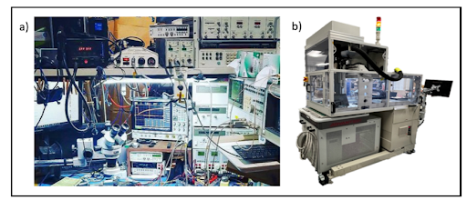

Posted  in [Top Stories](https://www.gosemiandbeyond.com/category/topstories/)

# Device Validation: The Ultimate Test Frontier

*This article is a condensed version of an article that appeared in the November/December 2022 issue of *Chip Scale Review*. Adapted with permission. Read the original article at *[https://chipscalereview.com/wp-content/uploads/flipbook/30/book.html](https://chipscalereview.com/wp-content/uploads/flipbook/30/book.html)*, p. 26.*

*By Dave Armstrong, Principal Test Strategist, Advantest America*

In the early days of space exploration, spacecraft were manned by small teams of astronauts, most of whom were experienced test pilots who intimately understood their vehicles and the interaction between all the variables controlling the craft. Similarly, early integrated circuits (ICs) were created by small teams of engineers, who often designed, laid out, and even developed tests for their devices. Notably, the tests were most often functional, and the test interfaces were often analog. Over the years, ICs have become much more complicated, and team size and group effort have grown exponentially. Today, the fundamental limitation to continued industry growth is no longer gate length, but team size and strength.

Contending with unconstrained growth to test data volume, as well as effort, requires a vision for taming this growth in the not-too-distant future. That vision must focus on intelligent applications, first-silicon “bring-up,” post-silicon validation (PSV) test, and production test. The challenge, paraphrasing *Star Trek, *is to boldly go where no test solution has gone before.

This article describes four different validation and test methods and how their values and focus have shifted over time, then discusses the limited growth of tools and methodologies in functional testing and PSV. Going forward, by leveraging such established best practices as standard interfaces, automation, and scalability, we will be able to streamline first silicon bring-up.

**Method 1: Device validation/characterization**

Early device testing and functional validation typically involved five elements:

1. Instruments connected to primary device inputs and outputs;
2. Instruments to program the device into its various modes of operation and environmental extremes;
3. Wires to interconnect instruments, the device under test (DUT), and a test-system controller;
4. An intelligent operator who controlled the setup to pinpoint problems and determine optional operations; and
5. A test controller program typically coded in some proprietary test scripts.

Over the years, the increasing complexity of devices and relentless time to market (TTM) pressure resulted in a need for multiple setups enabling concurrent engineering. Note that experts will still need their functional test setups when called upon again to help with yield investigations and field returns.

**Method 2: Functional test at ATE**

The first automatic test equipment (ATE) tests were all functional. Some argue that the most valuable ATE-based tests are still functional. These tests on the ATE use a few well-understood instruments interconnected through a tightly controlled device under test (DUT) interface to confirm to the extent possible the proper operation of the device in mission mode. Functional tests on ATE are typically analog, measuring parameters such as Vmin and Fmax over temperature extremes. What ATE functional test cannot do is run tests that require attached memory, peripherals, or both. This lack of full-functional test coverage has driven the recent rise in the use of system-level test (SLT), discussed in Method 4.

**Method 3: Structural test**

As ICs became more digital, scan chains provided a standard way to access the innards of the DUT, and automatic test pattern generators (ATPGs) addressed the tedious pattern-generation challenges. The use of ATPGs was highly successful over the years because it:

- Was automatic;
- Provided a testability baseline that defined a minimum acceptable quality level;
- Leveraged a consistent DUT interface that then drove consistent instrument interfaces;
- Worked well in a distributed engineering environment; and
- Allowed test costs to scale slower than Moore’s Law, thanks to enhancements such as pattern compression and homogeneous-core pattern sharing.

As device complexities grew, so did the test data volume needed to traverse the logic and confirm proper logic cell operation. The *International Technology Roadmap for Semiconductors (ITRS)*, which tracked this ever-increasing data volume, showed years ago that the structural test generation effort was growing even faster than Moore’s Law. As the levels of logic grow deeper and deeper, it takes more and more vectors to gain the controllability and observability necessary to effectively test the part.

One significant limitation of structural testing, which necessitated the growth of SLT and the continued utilization of functional validation efforts, was the ever-growing list of fault types for structural testing to target. Moreover, the trend toward More-than-Moore multi-die integrations brings together multiple devices and exacerbates the testing challenges.

**Method** **4:** **System-level** **test**

For years, SLT has provided value by checking that a device can operate in its end-application mode (for example, that it can boot an operating system and run representative end-user applications). Because its tests occur later in the flow, it catches more problems at the edge of the various cores and/or devices (that is, interface faults). A clean consistent setup that supports the device while maintaining the visibility needed to catch faults is key to a visible SLT hardware setup. For devices with on-die processors, recent efforts have graduated beyond running power-up routines to running automatically generated code sequences, which both utilize and confirm the ability of the embedded processor to sequence through tests while performing their duties.

**Test moving into the 21****st**** century**

Device validation/characterization, functional test at ATE, structural test, and SLT will continue to find use in the 21st century. But just as *Star* *Trek* had the next generation, so, too, must test. The next generation of test clearly needs to be smarter and leaner. Moving forward, the role of data and artificial intelligence (AI)-driven smart tools (Figure 1, in purple) will become more pronounced, allowing tests to be streamlined and risks reduced.

Another significant change is the prospect of using data from other sources (Figure 1, in light blue), both to focus the tests on areas of concern and to adjust the test margins to reduce the risk of shipping a bad part—all while minimizing the cost of test. ATE’s instruments and capabilities can contribute in the ways shown below; the newest are in italics.

1. Expanded wafer testing (first view of new wafers)
Known-good-die (KGD) test (at-speed and at-temperature testing at the wafer or singulated-die level)
Enhanced first-silicon testing (device validation, driver development, and checkout)
Final test (at-speed and at-temperature testing after packaging)
System-like test™ (Advantest’s term for focused system testing on ATE)
Post-silicon validation (including parameter/register value optimization)
RMA testing (i.e., testing of field returns)

*Figure 1. Multiple tools, including PSV and ATE, are used for device checkout.*

**Pre-silicon** **validation **

Prior to the arrival of first silicon, design verification involves running test cases in a simulator or emulator at great length. The incredible growth in device complexity has greatly increased the effort and time it takes to verify a design before its tape-out. To increase engineering productivity, test development must be supported by standardized methodologies and tools. The latest standard enabling system-level modeling and test design is the Portable Test and Stimulus Standard (PSS), developed by Accelera. PSS is supported by major electronic design automation tools and significantly increases test quality and shortens time to market (TTM) through improved productivity in design verification.

The need for the Industry to “shift left” has been explored in other works [1,2]. Just as some test content must shift to wafer-level testing, so, too, the preferred path to improve TTM and reduce the likelihood of a re-spin is to shift wafer test content further to the left and expand validation efforts prior to first-silicon arrival. That said, pre-silicon validation has limitations, e.g., abstract, higher-level models (such as virtual prototypes) may not provide an accurate estimate of the power consumption or Fmax for given code snippets. Optimizing the test content and value of each step in the process is a key challenge in the 21st century.

**First-silicon bring-up**

While there is real value in running scan-based structural tests, unfortunately, history has shown that these tests are not nearly enough to confirm that a device is truly functional. Leveraging today’s multi-week assembly cycles, significant value can be achieved by running some mission-mode functional tests at wafer probe. By migrating functional test content to the wafer level, companies have saved multiple weeks of TTM during their device turn-on phase [3]. One approach toward migrating test content to an earlier test step is to use Advantest’s Link Scale™ digital channel cards for the V93000 platform (Figure 2). LinkScale cards enable software-based functional testing using USB or PCIe, in addition to scan testing of advanced semiconductors, and address testing challenges that require these interfaces to run in full protocol mode, adding system-like test capabilities to the V93000.

*Figure 2. Continuous validation and testing add TTM value.*

LinkScale has proven its value in first-silicon situations by providing a straightforward path for R&D engineers to quickly perform traditional functional test verification steps after the arrival of first silicon. Early verification moves forward the clock for confirming truly good devices, but also speeds identifying problems and workarounds should they be needed. Perhaps the most important value of this approach is in the resource requirements. The new solution provides a quick and easy path enabling R&D engineers to gain full access to their design, highlighting subtleties that were difficult or impossible to discern using pre-silicon validation techniques. Furthermore, engineers can explore operational corner cases whose impact was never fully communicated or understood—all within days of first silicon arrival!

**Post-silicon validation (PSV) **

Because of the limitations of pre-silicon validation, the design engineer is often called upon to tune power and high-frequency performance soon after first silicon arrives. This tuning requires an effective flow to bring up a comprehensive set of PSV tests that support flexible parameterization. Without comprehensive PSV that identifies marginalities, an end product may behave erroneously under certain environmental conditions and loading. The industry experiences this in many ways—one example is “silent data corruption” in data centers when devices deliver wrong results under particular circumstances. 

Advantest’s EXA Scale EX Test Station simplifies or can replace yesteryear’s bench setup. It provides for a clean and consistent workspace that also happens to be identical to the setup used in production testing on the V93000 ATE. The test station supports both functional and structural test content execution, allowing the PSV engineer to move seamlessly between the two domains to confirm the root cause of incorrect behavior. The addition of structural test capabilities to the bench environment enables the test engineer to step into or over problematic sections of the test to enhance visibility and control.

Another new capability in the PSV effort is software-driven functional test, in which software test sequences provide input to the functional test-generation effort (Figure 3). The EX Test Station, together with creative software tools, allows broad ranges of register settings to be explored automatically to pinpoint the best possible operating condition with less human effort.

*Figure 3. Software-derived tests enable LinkScale to check that real-world code works on real-world hardware.*

**Production** **test**

Nearly all test content needs to move to the wafer test step if we are to have any chance of achieving KGD. We have entered a space where we have too many tests and not enough time to run all of them. Manufacturers today typically cull about 10-50% of their available pattern sets at wafer probe because of vector-memory and/or test time limitations. The question moving forward is how to choose which patterns to run at each test insertion point. Today, this is an art left to the senior test strategists; moving forward, this art will benefit from AI-driven tools and broad-based data sharing.

The big opportunity for growth in this space is with the addition of data-driven test selection techniques that allow both the structural and functional test selection process to proceed more intelligently. To proceed, actions to consider include:

- Pulling in and using vision inspection data to decide which corner of the die to test first;
- Using in-line parametric test data to anticipate power extremes and appropriately adjust limits up front; and
- Using the results for the first few wafers to direct which tests should be executed subsequently.

**Summary**

As we move into 21st-century test, things will become much more focused and dynamic. There is little doubt that data will be king. There is no doubt that test over HSIO interfaces will become critical to test time reductions. And perhaps most important, the role of big data in determining the value and limitations of each device being tested will be solidified.

The EXA™ Scale EX Test Station (Figure 4) replaces multiple instruments and tangles of wire with a streamlined integrated system and provides for a clean and consistent workspace. A consistent interface achieves consistent results.

*Figure 4. The old way of validating designs (a) is superseded by the Advantest EXA**™** Scale EX Test Station (b), shown docked to the M4171 remotely controlled high-powered handler*

Given that the role of data in the future will continue to expand and grow, it’s quite prophetic that *Star* *Trek:* *The* *Next* *Generation* had a robot named Data who gave voice to the challenge we face: “It is the struggle itself which is most important. We must strive to be more than we are. It does not matter that we will never meet our ultimate goal. The effort yields its own rewards [4].”

**References**

1. D. Armstrong, “Shift left,” MEPTEC Known-Good Die Workshop, Sept. 25, 2022, https://www.youtube.com/ watch?v=YObxvk5sqSQ&t=241s
2. D. Armstrong, “Heterogeneous integration prompts test content to ‘shift left,’” Chip Scale Review, Feb. 2021, p. 7. https://chipscalereview.com/wp-content/uploads/flipbook/1/book.html
3. B. Tully and M. Kozma, “Advantest’s new Link Scale card for SCAN, functional, mission mode SLT and validation testing,” VOICE 2022
4. “69 Best Data Quotes from Star Trek TNG and the Star Trek Movies,” Soda and Telepaths, April 26, 2021. https://sodaandtelepaths.com/69-data-quotes-from-star-trek-tng/

 

  end .post_content

