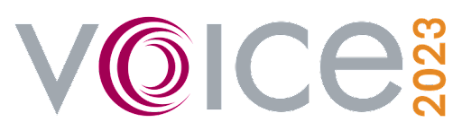

Posted  in [Q&A](https://www.gosemiandbeyond.com/category/qa/)

# Interview with VOICE 2023 Chairpersons

**By GO SEMI & Beyond staff**

*Advantest’s VOICE 2023 Developer Conference will take place May 9-10 at the Santa Clara (California) Marriott. To learn what VOICE 2023 holds in store for attendees, we interviewed this year’s chairpersons: Linda Haenel, VOICE 2023 technical chair, application consultant, Performance Digital Center of Expertise, Advantest Europe; and Matt Borto, VOICE 2023 general chair, senior manager, test engineering, Analog Devices. *

**Q. VOICE 2023 will be taking place in Santa Clara. How will the shift from Arizona to Silicon Valley impact the event?**

A. We are celebrating the 15th anniversary of VOICE’s in-person event this year. With Santa Clara as the location, we are bringing VOICE back to its point of origin. The first VOICE event was hosted in 2006 at the same hotel.

VOICE is managed by a steering committee of volunteer representatives from Advantest and its customers located in the heart of Silicon Valley. This allows for easier participation by local semiconductor test engineers. Holding our 2023 event in the epicenter of semiconductor device innovation has special meaning. Advantest’s U.S. headquarters, which is close to the conference site, will host Workshop Day, providing customers with an excellent learning environment. We will also take advantage of holding VOICE in Silicon Valley to commemorate the 15th anniversary with special celebrations. 

**Q. The theme for this year, “Beyond the Technology Horizon,” is extended from 2022. Can you talk about why you chose to retain this theme and how it ties to Advantest’s larger corporate goals and messaging?**

A. The theme illustrates VOICE’s mission and ties in perfectly with the Advantest Way. We are committed to adding customer value in an evolving semiconductor value chain. To accomplish this, we need to think about the challenges of tomorrow, today. VOICE is essential for customers and Advantest to stay connected and discuss *what *is beyond the technology horizon and *how* we can continue to enable leading-edge technology.

**Q.** **What are some of the hot trends and topics for 2023?**

A. This year, we accepted more than 80 papers, and the presentations will be distributed across nine tracks. We will continue last year’s newly introduced, highly successful track, High-Performance Digital (HPD). This track features the most papers this year, along with Test Methodologies and Hot Topics.

Device complexity, massive data generation and transfer, massive scan, power consumption, thermal management, and probe tip protection are the main challenges in the age of exascale computing. We will see the latest innovations of the V93000 EXA Scale platform and strategies to address these challenges. 

Another unique topic at VOICE 2023 is the V93000 WSMM solution. Since 5G millimeter-wave applications are becoming more and more popular in the mobile industry, we can expect presentations about the related test challenges and solutions, for example, over-the-air testing.

 The semiconductor industry’s continued progress in lowering geometries and enabling more integration requires greater test innovation to achieve high-quality test as efficiently as possible. Papers addressing this subject will be presented.

Another important topic to the industry and our attendees is the potential of artificial intelligence and machine learning for adaptive testing.

**Q. What do you anticipate will be some “don’t-miss” aspects of the event?**

A. There will be many! First is the Welcome Reception Monday evening, where you can network with your industry peers, accompanied by the Technology Kiosk Showcase. The kiosks are a favorite part of VOICE – you get to see the latest test hardware and software and directly interact with Advantest engineers about the products. Attendees can be inspired by the latest Advantest innovations, providing a great learning opportunity in a relaxed atmosphere.

On Tuesday and Wednesday, we can look forward to inspiring keynote speeches and panel discussions, as well as the Partners’ Expo. This popular aspect of the event features booths where experts from Advantest technology partners will be available to discuss their latest products and solutions. The Tuesday evening event will be held at Levi’s Stadium, featuring a tour of the 49ers Museum.

We will close VOICE 2023 Wednesday afternoon with the Award Ceremony celebrating the best papers and honorable mentions. Also presented at the ceremony will be the 2023 Visionary Award. Endowed in 2020, the annual award recognizes an Advantest customer who has made significant, sustained contributions to VOICE over time. 

**Q. Who will be delivering the always-dynamic keynote addresses?**

A. While we are still finalizing our slate of keynote presenters, we have confirmed our speaker for Tuesday, May 9: Dex Hunter-Torricke, the former head of communications at SpaceX, head of executive communications at Facebook, and executive at Google. He has not only been Mark Zuckerberg’s personal speechwriter but has also worked alongside Elon Musk, Larry Page, Eric Schmidt, and former UN Secretary-General Ban Ki-moon. So, we can look forward to a high-profile keynote speaker who will share anecdotes from his time with the industry’s biggest brands to illustrate the impact of future technology on business.

One final note: We would like to take a moment to express our appreciation to all of our VOICE 2023 sponsors—in particular, our headline sponsors, ISE Labs ASE Group and Alliance ATE Consulting Group. The full list of sponsors can be found **here.**

To learn more about keynotes, papers and other details related to VOICE 2023, be sure to keep checking the **VOICE website**. And don’t forget to click **here** to reserve your spot!

  end .post_content

