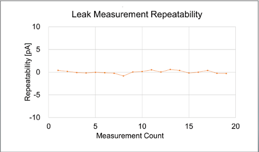

Posted  in [Top Stories](https://www.gosemiandbeyond.com/category/topstories/)

# MMAF Option Enables Picoampere Measurements

*By Yoshiyuki Aoki, T2000 R&D Hardware Manager, and Tsunetaka Akutagawa, SoC Marketing Manager, Advantest Corp.*

Demand for low-current devices is increasing, as many new sensors are being created for medical, automotive, industrial, and other applications. Chief among the heightened production and test requirements for these low-current devices is the need to achieve picoampere (pA)-class measurements. Sensors’ functionality and efficacy, especially in medical and other highly sensitive applications, can be radically impacted by leakage current and drift characteristics. Thus, measuring very low current and detecting current leakage on the order of a few pA is becoming an important capability for general-purpose testers. 

However, conventional mass-production testers cannot easily measure pA and require a dedicated machine to do so. To this end, Advantest developed its Micro Micro-Ammeter-Frontend (MMAF) module option to connect to the MMXHE module for its T2000 SoC tester (Figure 1). Created for testing ICs in power trains, controls and sensors in electric and hybrid vehicles, the MMXHE (multifunction mixed high voltage) mixed-signal module provides 64 output channels to enable massively parallel, high-performance testing.

*Figure 1. The current flowing through the sensor device is measured on the T2000 using the MMAF/MMXHE solution. It delivers high accuracy from the difference between the current value at the time of device measurement and the current value at the time of device open.** *

The MMAF module measures pA-class microcurrents by increasing the current measurement sensitivity of key voltage source current measurement (VSIM) functions that MMXHE enables by a factor of 1000. This enables measurement of optical sensors and MEMS sensors, calculation of reverse leakage current of diodes, and so on.

*Figure 2. Shown here is a mother test board with multiple MMAF installed.*

Combining the two modules (MMXHE and MMAF) expands the T2000’s test coverage, enabling the system to deliver current measurements down to the pA level. The addition of multiple MMAFs makes it possible to measure a large number of devices simultaneously. With the MMAF module option, pA measurement can be performed at low cost without adding any modules to the existing tester configuration. In addition, because the module is small, it can be mounted on a performance board (Figure 2), so it can be easily adapted *regardless* of tester configuration.

In addition to its compact size/footprint and ease of multi-channelization, the combined MMAF/MMXHE module solution offers multiple benefits:

- Wide source voltage range: 2V range / 7V range
- Varied current measurement options: 3nA range / 30nA range / 80nA range
- Low noise
- Good measurement repeatability (Figure 3)

 

*Figure 3. Using the MMAF pA measurement module, the T2000 can perform highly repeatable current leak measurements.*

The new MMAF module option for the MMXHE joins a robust set of module options for the T2000 designed to address a variety of specialized testing requirements. These include multiple digital modules, device power supplies, a multipurpose parametric measurement unit (PMU), analog/RF modules (including arbitrary waveform generator/digitizers), additional multifunction modules for automotive and power-management ICs, and image capture modules for testing CMOS image sensors. Advantest continues to expand the capabilities of its T2000 tester to ensure its ability to accommodate a broad range of testing needs while ensuring full compatibility and ease of installation and helping to keep the overall cost of test as low as possible.

  end .post_content

