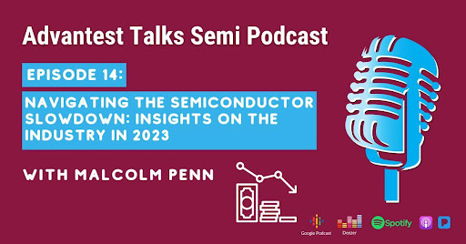

Posted  in [Featured](https://www.gosemiandbeyond.com/category/featured/)

# Navigating the Semiconductor Slowdown: Insights on the Industry in 2023

Get the inside scoop on the slowdown in the semiconductor industry and what to expect in 2023 with our distinguished guest, Malcolm Penn, CEO of Future Horizons, and one of the most experienced experts in the semiconductor industry.

In this episode of *Advantest Talks Semi*, we dive into the forecasted contraction of the semiconductor industry, the impact of Covid-19 and the shift toward electric vehicles. We talk about the forecast for the memory market and the investments being made in the name of national security. 

We will answer the question of why the memory market will give an indication of the overall market’s recovery—a market whose decline is expected to be double-digit. Questions about Europe and China will be answered as you listen in. 

Tune in to our latest episode of *Advantest Talks Semi* to stay ahead of the game in the ever-evolving world of semiconductors.

[https://advantesttalkssemi.buzzsprout.com/1607350/12131178-navigating-the-semiconductor-slowdown-insights-on-the-industry-in-2023](https://advantesttalkssemi.buzzsprout.com/1607350/12131178-navigating-the-semiconductor-slowdown-insights-on-the-industry-in-2023)

 

  end .post_content

