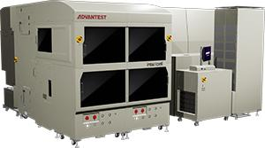

Posted  in [Featured Products](https://www.gosemiandbeyond.com/category/featuredproducts/)

# New inteXcell Series Offers High-Performance, Economical Test Cells for Advanced Memory ICs

Advantest has launched [inteXcell](https://www.advantest.com/products/memory/intexcell.html), a new line of minimal-footprint test cells designed to address demanding final-test requirements presented by the increasing bit densities, lower power consumption and faster interface speeds of future memory devices. This new final test cell infrastructure integrates a T5835 memory tester optimized for use in high-productivity test cells and is designed to adopt future memory solutions. With inteXcell, ICs can be tested on the same platform from initial engineering through mass production.

inteXcell is the first ever fully integrated and unified test solution to combine broad test coverage with high-throughput handling in a highly flexible system architecture. Early units can test up to 1,536 devices in parallel with high speed and high accuracy.

The new test cells have a compact structure that enables up to 384 simultaneous measurements per cell and uses only one-third of the floor space occupied by conventional test systems. Since each cell uses independent asynchronous testing, inteXcell can be configured anywhere from one to four testers, enabling high equipment utilization and streamlined cell-based maintenance.

  end .post_content

