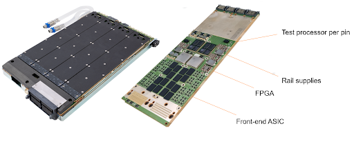
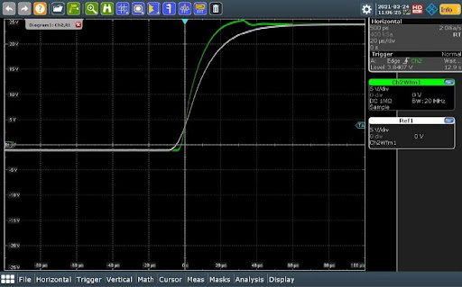

Posted  in [Top Stories](https://www.gosemiandbeyond.com/category/topstories/)

# New Power-Supply Card Targets High-Voltage PMIC Test

*By Toni Dirscherl, Business Lead, Power/Analog/Control, Advantest Europe*

The electronics industry is seeing a move toward higher voltages and currents to deliver sufficient supply and charging power in products ranging from handheld cellphones and tablets to workstations. This trend is evidenced in examples such as the many USB power-delivery (PD) profiles with ratings ranging from 10W (5V at 2A for USB PD 3.0 profile 1) up to 100W (5V at 2A, 12V at 5A, and 20V at 5A up to the 100W limit for profile 5). In addition to higher power levels, today’s consumer products are exhibiting an increasing number of voltage domains, and they require power-management integrated circuits (PMICs) to manage the various voltage levels required for battery charging and other functionalities. The PMICs, in turn, present test challenges that ATE systems tailored for mostly digital devices cannot address due to missing high-voltage sources.

**Universal VI instrument**

To meet these challenges with a cost-efficient test system, Advantest has added a new card to its Extended Power Supply (XPS) Series for the V93000 EXA Scale™ SoC test platform. The new DC Scale XPS128+HV universal voltage-current (VI) instrument combines a high channel count (128 channels per card) with per-channel voltage and current ranges of up to 24V and up to 1A, creating a test solution that efficiently addresses the test requirements for high-voltage devices such as PMICs. The complete card consists of four 32-channel sub-modules with a test-processor-per-pin architecture (Figure 1).

*Figure 1. XPS128+HV assembly (left) and 32-channel sub-module (right).*

The XPS128+HV provides full channel compatibility with the low-voltage 256-channel XPS256 card successfully introduced to the market in 2020. The XPS128+HV can cover the same applications in the low-voltage domain as an XPS256, but the XPS128+HV seamlessly extends a system configuration to cover additional high-voltage needs, enabling efficient, highly parallel test of power-management devices with enhanced capability for high-voltage applications.

Figure 2 shows the operating IV characteristics of both cards. The region outlined in green represents the XPS256, which operates from -2.5V to +7V at currents up to 1A per channel. All three regions represent the XPS128+HV card. In addition to the green area of the XPS256, the XPS128+HV can operate from -10V to +15V at 250mA (dark blue outline) and from -1V to +24V at 150mA (light-blue outline).

*Figure 2. XPS128+HV operating regions.*

As shown in Figure 3, the XPS128+HV switches seamlessly between the -2.5V to +7V, -1V to +24V, and -10V to +15V ranges.

*Figure 3. XPS128+HV seamlessly switching between ranges.*

**Signal quality and accuracy**

To ensure signal quality and high accuracy, both water-cooled XPS cards include Advantest’s new Xtreme RegulationTM digital control loop, which can flexibly adapt to changing load conditions. Xtreme Regulation also supports programmable voltage and current slew rate and bandwidth settings (Figure 4) to provide an optimum solution for capacitive, resistive, or inductive loads. The programmable slew-rate function avoids excessive currents and noise during voltage ramps, eliminating current spikes during the initial charge of a capacitor and eliminating voltage noise from stray inductance.

*Figure 4. Illustration of the XPS128+HV adjustable bandwidth capability on a 24-V channel.*

The cards also include arbitrary-waveform-generation (AWG) and digitizer functions with a 2MS/s sample rate and 18-bit resolution for simultaneous voltage and current sampling. The AWG capability enables generation of current ramps on individual or ganged channels to perform threshold searches and other test methodologies.

**Voltage and current modes**

The core of the XPS256 and XPS128+HV is a digitally regulated VI source that can seamlessly change operating modes from a force-voltage mode to a force- or sink-current mode—often a requirement for testing power-management components such as low-dropout (LDO) or DC/DC regulators. For example, the seamless mode changes enable the cards to execute the fast test sequences necessary to perform DC/DC and LDO regulation tests and IDDQ current measurements while minimizing test times. 

In addition, the XPS128+HV provides seamless mode switching with no limitations related to transitioning between its high-voltage and low-voltage ranges. The card’s sequencer-controlled range-change capability allows extremely fast, deterministic test times without signal spikes that could harm a device under test (DUT).

The XPS card family delivers an extremely high force and measurement accuracy, often required for precise device trimming and for achieving high yields. Voltage accuracy is better than ±150 µV with a 10-µV resolution, while current accuracy is better than ±50 nA with a 100-pA resolution. 

**Protective features**

The XPS128+HV and XPS256 both offer several protection features. All channels are protected against external exposure of ±80V. The VI source features a patented fast current-clamp capability to protect load-board components, probe-card needles, and DUT sockets in case of a DUT short circuit, limiting inrush currents within less than 2 µs until the programmed clamp value is applied (shown in Figure 5). 

*Figure 5. XPS128+HV current-limit response to simulated DUT short circuit.*

To further provide probe-needle protection, the XPS cards perform simultaneous current and voltage profiling across the entire test flow to identify critical conditions such as power hot spots that could lead to damage. This background profiling occurs at 2MS/s. In addition, inline Vdrop monitoring measures the contact resistance for each channel to facilitate adaptive needle cleaning and to help schedule preventative maintenance. The profiling and monitoring offer sophisticated oscilloscope-like triggering capabilities (pre-trigger, post-trigger, and center-trigger) and impose zero overhead, uploading only on demand or upon a programmable alarm condition. Profiling can be seamlessly enabled and disabled without test-program modifications.

**Multiple-card systems**

The XPS series and other EXA Scale cards can be mixed and matched in a single test system. In a typical application, a V93000 test head might include PS5000 cards for digital I/O test and basic analog and mixed-signal test, a Wave Scale Mixed-Signal High-Speed (WSMX HS) card for noise evaluation and transient analysis, a utility card to supply and control load-board components, an XPS256 card to test low-voltage DC/DC converters and regulators, and an XPS128+HV card to test the high-voltage functionality of USB PD circuits and rapid chargers and to provide high-voltage screening. Both XPS cards allow flexible ganging of channels within each card and across cards without any impact on regulation performance. Ganging enables a combination of multiple channels to provide the current levels needed to test DC/DC converters that require multiple-ampere load currents.

Finally, in addition to PMIC testing, the new XPS128+HV can act as a standard power supply for high-performance-computing and automotive test applications. It can also be used for microcontroller (MCU) test, and it can generate high-voltage pulses for MCU flash programming.

**Conclusion**

Chipmakers increasingly need to perform multisite parallel test of PMICs that feature multiple voltage domains, and they require a power-supply card with a high channel count, combined with flexibility in voltage and current ranges. With its current rating of up to 1A and voltage rating of up to 24V, Advantest’s new DC Scale XPS128+HV instrument will enable chipmakers to configure a cost-efficient, large-pin-count ATE system with many power VI channels that can test high-current as well as high-voltage components while giving them the flexibility to gang multiple channels, meeting high-current needs at all voltage levels. Having already been implemented at several customer sites, the XPS128+HV VI is now available to the global market.

  end .post_content

