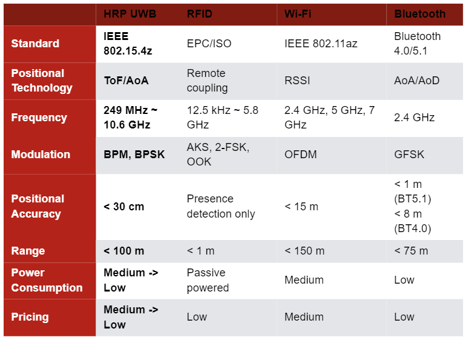
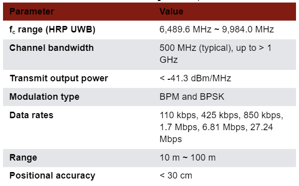
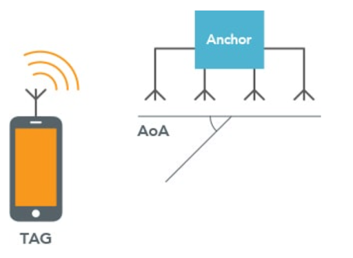

Posted  in [Top Stories](https://www.gosemiandbeyond.com/category/topstories/)

# Scalable Platform Meets the Test Challenges of Ultra-Wideband Chipsets

*This article is adapted from a paper and presentation at SEMICON China, March 2023.*

*By Kevin Yan and Daniel Sun, Advantest (China) Co., Ltd.*

Ultra-wideband (UWB) technology, as defined by IEEE 802.15.4 and 802.15.4z standards, enables short-range, low-power RF location-based services and wireless communication. A variety of devices have reached the market to help implement UWB capability, but these devices present significant test challenges related to the high RF frequencies at which UWB operates, the ultrawide bandwidths of UWB’s multiple channels, and the technology’s complex modulation schemes. An effective test platform requires flexibility and scalability to handle the frequencies and bandwidths involved, as well as the compute power to effectively analyze the test results.

**UWB markets and capabilities**

The UWB market is expanding at a rapid pace. One forecast estimates that UWB unit shipments are growing at a 40% CAGR with the market for UWB chips expected to reach $1.259 billion by 2025.1 UWB serves both business and consumer end markets, with the consumer segment now representing the majority. UWB is hitting the mainstream in the mobile smartphone market, with the automotive and wearables/tags segments also seeing UWB adoption.

Some specific applications that UWB can serve include indoor navigation, item tracking, secure hands-free access, credential sharing, and hands-free payments. In addition, automotive applications are likely to expand, with the Car Connectivity Consortium incorporating UWB into the Digital Key Release 3.0 specification currently under development. 

Compared with other technologies, UWB provides superior positional accuracy. Table 1 compares UWB with RFID, Wi-Fi, and Bluetooth. UWB, which employs time of flight (ToF) and angle of arrival (AoA) technology, achieves a positional accuracy of better than 30 cm, outperforming the others. Bluetooth incorporates AoA and angle of departure (AoD) to provide < 1 m of accuracy (version 5.1). Wi-Fi, which relies only on its Received Signal Strength Indicator (RSSI) functionality for distance estimates, has a limited accuracy of 15 m. RFID can only detect presence, not distance.

*Table 1. Positional accuracy comparison of four wireless technologies*

**UWB basics**

The United States Federal Communications Commission (FCC) and the International Telecommunication Union Radiocommunication Sector (ITU-R) define UWB as a communications technology that transmits and receives a signal whose bandwidth exceeds the lesser of 500 MHz or 20% of the arithmetic center frequency fc. The UWB physical (PHY) layer includes 16 channels in three groupings, as shown in Table 2. The sub-gigahertz band (group 0, shaded yellow) includes one channel at an fc of 499.2 MHz, the gigahertz low band (group 1, shaded blue) includes four channels with fc ranging from approximately 3.5 GHz to 4.5 GHz, and the gigahertz high band (group 2, shaded red) includes 11 channels with fc extending from approximately 6.5 GHz to 10 GHz.

*Table 2. UWB PHY group and channel allocation*                

Most UWB products currently on the market focus on the high band, particularly channels 5 and 9. The UWB PHY layer also comes in low-rate-pulse (LRP) and high-rate-pulse (HRP) repetition-frequency configurations. HRP high-band configurations are becoming the preferred configurations, finding success in industrial applications for location and ranging and for device-to-device communications. Table 3 outlines the IEEE 802.15.4z HRP UWB high-band specifications, including a range up to approximately 100 m and data rates from 110 kbps to 27.4 Mbps. In addition, HRP UWB uses two types of modulation: burst position modulation (BPM) and binary phase-shift keying (BPSK).

*Table 3. IEEE 802.15.4z HRP UWB high-band specifications*

Figure 1 compares the UWB and Bluetooth spectrums. The narrow-band Bluetooth (left) has a 1 MHz bandwidth at 2.4 GHz. In contrast, UWB (right) has a 500 MHz or greater bandwidth at center frequencies (fc) extending up to approximately 10 GHz, as shown in Table 1. Each band’s upper and lower bounds (fH and fL, respectively) exhibit power levels 10 dB less than the maximum power level at fc.

*Figure 1. Bluetooth has a 1-MHz bandwidth at 2.4 GHz, while high-band HRP UWB has a > 500-MHz bandwidth at center frequencies f**c** from approximately 6.5 GHz to 9.5 GHz.*

**Test requirements**

A typical UWB transceiver chipset includes an analog front end containing a receiver (Rx), a transmitter (Tx), and a digital backend that interfaces to an off-chip host processor. It also includes a Tx/Rx switch that connects either the receiver or transmitter to an antenna port. Some versions come with two RF antenna ports to serve phase-difference AoA applications, and some will add even more ports to improve positional accuracy. AoA capability can help pinpoint the specific location of an object as well as its distance, as shown in Figure 2.

*Figure 2. AoA capability can help pinpoint a tag’s angular location as well as distance.*

The receiver includes an RF front end that employs a low-noise amplifier that amplifies the received signal before down-converting it to the baseband. The chipset’s transmitter applies digitally encoded transmit data to an analog pulse generator. The chipset also includes a phase-locked loop (PLL) that provides local oscillator signals for receive and transmit mixers.

Typical UWB production tests involve transmit measurements and pulse-related measurements as specified in the 802.15.4z standard as well as direct receiver measurements, ToF measurements, and AoA measurements. 

Transmit measurements ensure the devices meet all emissions rules established by the FCC or other relevant governmental authorities. The tests involve power spectral density (PSD) measurements in accordance with a transmit-spectrum mask (Figure 3) as well as center-frequency tolerance measurements.

*Figure 3. A power spectrum mask defines limits for PSD measurements.*

Pulse-related measurements ensure the interoperability of UWB devices and are performed using time-domain analysis (Figure 4). Specific tests include baseband impulse response, including measurement of pulse main-lobe width, pulse side-lobe power, and normalized mean square error (NMSE). Additional tests look for chip clock error and chip frequency offset. 

*Figure 4. This compliant pulse example uses time-domain analysis.*

Although not specified in the 802.15.4z standard, direct receiver measurements must be performed to ensure quality parts. A typical receiver test measures the minimum power level at which the device can operate with minimum error. A typical way to perform this test is to send a minimum power stimulus to the device under test and measure the device’s packet error rate (PER).

Finally, ToF and AoA measurements characterize the positioning performance. In high-volume production test, such measurements are often performed using phase shifts between two Rx antenna inputs.

UWB devices present three specific test challenges that traditional ATE systems cannot address. The first relates to the high RF frequencies involved, ranging up to more than 10 GHz—exceeding the typical less-than 6 GHz capability of many traditional ATE RF instruments. Second, UWB devices require wideband measurements extending to 1.35 GHz—well beyond the 200 MHz limits of traditional instruments. Third, UWB devices must be tested using frequency-domain PSD measurements and time-domain impulse-response measurements, a combination that requires test software with complex algorithms and an efficient architecture to handle the huge amounts of data processing required.

**UWB test platform**

The flexible Advantest V93000 platform can be configured with appropriate hardware and software to support the thorough test of UWB devices. The platform’s Wave Scale RF instruments cover the frequency range from 10 MHz to 70 GHz. The V93000 platform can also support the necessary wide bandwidths. For example, the Wave Scale RF18 card supports 5.85 GHz to 18 GHz frequency stimulus and measurements with a 200 MHz bandwidth. Adding the optional Wave Scale Wideband card to the Wave Scale RF18 extends the bandwidth up to 2 GHz. The combination also has built-in event triggering—useful for testing asynchronous UWB chips’ Tx packets. The platform can accommodate 128 RF ports to enable efficient multisite parallel testing.

V93000 SmarTest 8 software contains a UWB demodulation library and can analyze a UWB signal in the time and frequency domains and measure such items as the transmit PSD mask, transmit center-frequency tolerance, baseband impulse response, chip clock rate, and chip carrier alignment. To enable rapid test-data analysis, SmarTest 8 supports hidden uploads of captured waveforms and multi-threaded background processing of previously captured data while simultaneously capturing the next measurement. In addition, standard existing SmarTest 8 features can make receiver and ToF-related measurements. Finally, AoA tests can be performed by signals of different phase to different receiver ports, as shown in Figure 5.

*Figure 5. AoA tests require relative phase measurements between antenna receiver ports in response to applied stimulus from V93000 instruments.*

**Conclusion**

As the UWB market rapidly expands, test platforms are adapting to accommodate the high RF frequencies, wide bandwidths, and complex modulation schemes involved. The Advantest V93000 platform’s hardware and software include the standard and UWB-specific features necessary to test UWB devices.

**Acknowledgments**

We would like to acknowledge and give our warmest thanks to Frank Goh, who supports the UWB V93000 Solution and provided professional guidance to this paper. Frank Goh is a principal consultant at the Center of Expertise Asia from Advantest Singapore.  

**Reference**

 

1. AMENDED Comments of The Ultra Wide Band (UWB) Alliance Before The Federal Communications Commission, July 14, 2020.

  end .post_content

