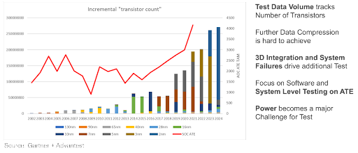
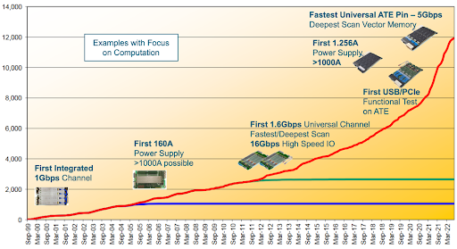

Posted  in [Q&A](https://www.gosemiandbeyond.com/category/qa/)

# Test Needs and Solutions for High-End SoCs

**Q&A Interview with Ralf Stoffels**

**By GO SEMI & BEYOND staff**

*High-performance computing (HPC) is a major driver for the SoC test market, in which Advantest holds a dominant share. Sustaining and extending this leadership requires capitalizing on the company’s already strong portfolio by pursuing new strategies. Our staff spoke with Ralf Stoffels, Advantest Executive Officer and V93000 Division Manager, who expanded on key points from a presentation given to Advantest investors in December 2022.*

**Q. Let’s start with the HPC market. What are some reasons it is such a driving force?**

A. The semiconductor industry is widely projected to become a US$1 trillion market by 2030, with three segments representing 70% of this growth: automotive, wireless communications, and computing and data storage. If you look at the evolution of HPC, each new era has emerged more quickly than the last, and we are now at the point where the demand for processing high volumes of data has propelled us into the age of exascale computing (Figure 1). 

*Figure 1. Each successive era of computing is evolving orders of magnitude more quickly than the one before, with HPC and AI driving the semiconductor industry toward the $1T mark by 2030.*

**Q.What are some of the specific HPC trends, and why are they pushing SoC test forward?**

A. The technical trends for HPC illustrate the growing level of complexity in these applications. Key trends include: the rise of chiplets, which we’re seeing everywhere; new Arm server CPUs; larger packages for smaller nodes, which are being ramped by computing rather than mobile devices; 3D package constructs, from micro bumps to hybrid bonding; heightened power and thermal demands created by power supplies; and massive communication challenges created by very large, high-speed data networks.

Data centers, one of the primary applications for HPC chips, are essential for training and operating AI models, which are being employed for everything from autonomous driving to advanced chatbot assistants. In turn, this requires access to the tens of thousands of graphical processing units (GPUs) needed to analyze high volumes of data in real time.

All of these developments together create massive data requirements that result in new test demands to accommodate this 100x rise in complexity, which is pushing the ATE market toward US$10 billion by the end of the decade, as shown in Figure 2.

*Figure 2. Fast-growing device complexity is driving the market size for ATE. These indicators point to the total available market reaching US$10 billion by 2030.*

**Q. HPC processors have a longer product development cycle than those for, say, smartphones. At what point in this process does test become critical?**

A. During the early phases of product development, semiconductor manufacturers are focused on improving productivity while optimizing techniques essential to functionality. The need for test is particularly high during these early stages. HPC devices are no different in this respect. There are many test needs associated with ramping new nodes, and next-generation devices are always in development. While test is most critical during early development to achieve desired functionality and eliminate bugs, test needs will be consistently distributed across the lifetime of new and emerging devices.

**Q. How has the V93000 contributed to Advantest securing its strong market position in SoC?**

A. We’re addressing these complex demands with the latest offshoot of our flagship V93000 platform, the V93000 EXA Scale. Establishing V93000 as a scalable platform has allowed us to continually expand its range and functionality to accommodate testing devices for a wide range of applications. This flexibility is a core element of the V93000’s long-term success. We were also the first ATE company to establish long-term compatibility with a single test platform – this is crucial for customers migrating to the next generation of test capabilities. In addition, through our market leadership and customer relationships, we understand what lies ahead for the industry so that our R&D efforts continue to stay on top of HPC requirements.

*Figure 3. Advantest has continually developed industry-first HPC-level capabilities for the V93000 SoC test platform.*

Figure 3 illustrates the evolution of our leadership in HPC innovations, highlighting some of our computationally focused developments. One of the more recent of these developments is the XPS256 device power supply (DPS), which scales from milliamps to more than 1000 amps, covering all power requirements in a single DPS card. We are seeing a number of existing V93000 customers make the transition to EXA Scale for the system’s inherent capabilities as well as options such as the XPS256 and the Pin Scale 5000. When configured with these cards, the EXA Scale system is well equipped to meet exascale computing requirements for mobile, AI, HPC and other advanced devices.

**Q. What else should readers know about HPC test requirements and how Advantest is addressing them?**

A. Efforts to continue extending Moore’s Law rest on 3D integration – chiplets, stacked packages, FinFETs, etc. This technology is vital to the future of the industry, and it also generates new and different failure types that we have not seen before, necessitating new test approaches and faster testers. EXA Scale is the only tester that can reach 5Gbps on every pin and also has the deepest ATE memories, allowing it to deal with this advanced complexity. In addition, the XPS256 is fully integrated with the EXA Scale system and digitally controlled, so different channels can all be connected by a digital bus, so they can all be kept synchronized and completely controlled by the computational paths inside the system, with no analog factors. This has never been done before, and it allows us to be faster and much more precise in terms of controlling the voltage as well as protecting the device or the probe card. If something goes wrong, we can switch off immediately.

In addition, customers can execute software and interact with their systems via our Link Scale family of digital channel cards for the V93000 platform, which enables software-based functional testing and USB/PCI Express (PCIe) scan testing of advanced semiconductors. The card essentially behaves like your computer, communicating with the device under test through a standard high-speed serial interface to enable very fast transfer of functional and scan test content. Because the device can be interacted with on the wafer the way they’ll be used later on when they’re singulated and packaged, the user can increase test coverage and throughput simultaneously as well as realize faster time to market. 

As new HPC computing developments arise, Advantest is well-positioned to address concurrent test needs through our V93000 platform and continually expanding portfolio of best-in-class cards and peripherals.

  end .post_content

