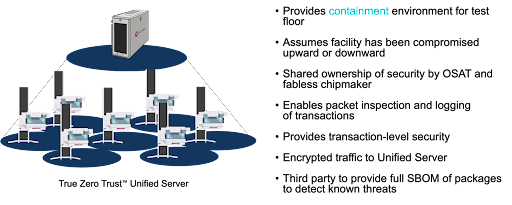

Posted  in [Top Stories](https://www.gosemiandbeyond.com/category/topstories/)

# True Zero Trust Combats IC Manufacturing Security Challenges

*By Michael Chang, ACS VP and General Manager*

The semiconductor manufacturing industry is facing a host of unprecedented technology and security challenges. A common catchphrase these days is that “data is the new oil.” Data is everywhere, in everything we do, and there is both good and bad associated with this trend. Data everywhere creates new security issues that need to be addressed to protect the integrity of your information and your devices. Advantest has done this through a new infrastructure setup that enables a True Zero Trust environment on the fab test floor – in turn, allowing us to truly embrace AI without having to fear security repercussions.

**Addressing core challenges**

Some of the key technology challenges for chipmakers include chip-level scale integration, which requires new types of setup tools and data to be integrated for making measurements; system quality challenges; and achieving chip-scale sensors. Another area of focus is manufacturing 2.5D and 3D chiplets.

A [paper](https://sigops.org/s/conferences/hotos/2021/papers/hotos21-s01-hochschild.pdf) published in 2021 by three Google engineers identified an issue with cores failing early due to fleeting computational errors not detected during manufacturing test, which they call “silent” corrupt execution errors. The paper goes on to propose that researchers and hardware designers and vendors collaborate to develop new measurements and procedures to avoid this problem. The interim solution is to isolate and turn off cores that are failing, but they hint that because of chip-level integration and 2.5D/3D, new approaches are needed to measure and screen out these failing cores automatically.

The other side of this coin is security concerns. Access to systems is limited, and different software cannot be installed on machines. We use firewalls, anti-virus spyware, encryption, password management and other technologies to protect our computers, but they’re not infallible. Experts agree that cyberattacks are inevitable, so there needs to be a means of *using* data to *protect* all the data on our systems. Advantest is doing this through our ACS offerings, which enable real-time data security, as shown in Figure 1: ACS Nexus™ for data access, ACS Edge™ for edge computing, and the ACS Unified Server for True Zero Trust™ Security.

*Figure 1. Advantest’s open solution ecosystem. Data is needed from all sources to mitigate new challenges.*

As Figure 1 illustrates, through our Real-Time Data Infrastructure, we can integrate data sources from across the chip manufacturing supply chain, leveraging that data to continually improve our insights and solutions. We can implement test throughout the product lifecycle, taking real-time action during production. Nothing has to be done away from the test floor; all analyses and actions occur during actual test, maintaining fully secure zero trust protection of the data.

**Security is more than protection**

One way to illustrate the approach that we take to security in semiconductor manufacturing is to look at a seemingly unrelated example: the International Space Station (ISS). Designed to protect against damage from space debris, the outer hull of the ISS is outfitted with Whipple bumpers. These multi-layered shields are placed on the hull with spaces between the layers. The intent is that impact with a layer will slow and, ideally, break apart the projectile, so that by the time it reaches the bottom layer, any potential harm has been prevented. While the bumpers slow the kinetic energy of the debris, something will eventually get through. The second line of defense is the ISS’s containment doors, which ensure any areas where air leaks have been detected can be isolated so that the astronauts are protected. Clearly, this is mission-critical.

The key word: “containment.” It’s not enough to protect – no system is infallible. You also have to contain it so that potential security issues don’t become pervasive and cause a major breach. The challenge when looking at this from the test cell perspective is the test cell is located on the test floor, which is surrounded by all kinds of other equipment that you have no control over. And not just other manufacturing tools. Everyday office products can be vulnerable to hacking – computers, software, printers, routers… even smart appliances in the break room such as IoT-enabled coffee pots. Hackers are increasingly finding ways to get to us through [software update servers](https://thehackernews.com/2019/03/asus-computer-hacking.html), routers, [printers](https://www.forbes.com/sites/leemathews/2020/08/31/800000-printers-vulnerable-28000-hacked/?sh=15342382d8a9), and even bypassing firewalls.

*Figure 2. The ACS-enabled True Zero Trust*™* environment for the test floor is a must to ensure containment.*

The bottom line is that your infrastructure is going to be vulnerable, so you must add a reliable containment structure such that, when there is an attack, you can shut down. This is what our True Zero Trust™ environment is designed to enable. The “zero trust” concept is just what it sounds like – the complete elimination of the assumption of trust from within networks and systems. This means that no default trust is granted to any user or device, either inside or outside an organization’s network. This model grants resource access on a need-to-know basis only, requiring stringent identity verification and contextual information that cannot be known or provided by another source. By preventing unauthorized access to sensitive data, companies mitigate the risks of data breaches and attacks, whether external or internal.

**What does this mean for AI/machine learning?****
**New chip technologies require new measurements, relying on multi-dimensional data. Large language models (LLMs) are creating vast new opportunities in all domains. LLMs are machine learning models that can perform natural-language processing tasks such as generating and classifying text, answering questions, and translating text. LLMs are trained on massive amounts of text data and use deep learning models to process and analyze complex data. This can take several months and result in a pretty hefty power bill.

However, during training, LLMs learn patterns and relationships within a language while aiming to predict the likelihood of the next word based on the words that came before it. We’re talking about a very large number of parameters and petabytes of data. LLMs are used in a variety of fields, including natural language processing, healthcare, and software development.

Currently, LLMs can comprehend and link topics, and they have some understanding of math. But an app like ChatGPT – the most popular and widely used LLM – does not understand new developments as it is not connected to the Internet. LLMs can recognize, summarize, translate, predict, and generate human-like texts and other content based on knowledge from large datasets, and they can perform such natural-language processing tasks as:

- Sentiment analysis
- Text categorization
- Text editing
- Language translation
- Information extraction
- Summarization

Using LLMs to summarize knowledge and feed it into the test cell or test floor can be done in a True Zero Trust environment because there is no danger of the data being manipulated in undesirable ways. With that said, LLMs aren’t self-aware – they don’t know when they make mistakes, so an LLM should be considered a data exoskeleton.

**Conclusion **

Over the next few years, we can anticipate a significant shift in the types of applications being developed, moving away from traditional statistical machine learning and towards more sophisticated autonomous or semi-autonomous agents that can automate testing. In order to effectively safeguard the valuable assets and intellectual property of OSAT and fabless organizations, containment is necessary. The ACS Real-time Data Infrastructure offers a highly secure containment system called True Zero Trust. Through its innovative design, this infrastructure establishes a cutting-edge paradigm that allows for the creation of secure data highways and paves the way for building novel applications with enhanced security.

 

  end .post_content

