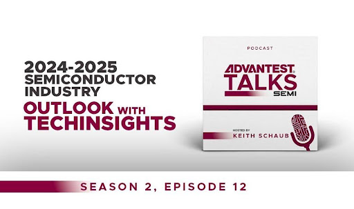

Posted  in [Uncategorized](https://www.gosemiandbeyond.com/category/uncategorized/)

# 2024-2025 Semiconductor Industry Outlook with TechInsights (Podcast Season 2, Episode 12)

Prepare to be illuminated by the insights of Risto Puhakka from TechInsights as he joins us to map out the semiconductor industry’s explosive growth, driven by the thunderous influence of AI. 

During our adventure through CES 2024, we bear witness to AI’s pervasive touch, from robotics and healthcare to the sizzling innovations in micro LED technology. Risto’s expert analysis doesn’t just skim the surface; it plunges into the economic, political, and competitive undercurrents that are redefining the semiconductor landscape.

Venture further into the conversation as we unravel AI’s sprawling web, extending its reach from agriculture to retail, and sculpting the semiconductor market’s future. We dissect the burgeoning world of spatial computing, and the surging demand for data streams, processor aptitude, and memory. 

Gaze into the crystal ball with us as we reflect on 2023’s rollercoaster ride – spotlighting industry bottlenecks and breakthroughs – and cast our predictions for 2024’s market climate. 

It’s not just a tech talk; it’s a strategic analysis of the global shifts, the CHIPS Act’s ripples, and how different nations are vying for supremacy in the AI arena. With Risto’s guidance, we’re decoding the blueprint of tomorrow’s semiconductor industry, where AI reigns supreme.

You can find this episode and more at this link: [https://advantesttalkssemi.buzzsprout.com/1607350/14428141-2024-2025-semiconductor-industry-outlook-with-techinsights](https://advantesttalkssemi.buzzsprout.com/1607350/14428141-2024-2025-semiconductor-industry-outlook-with-techinsights)

  end .post_content

