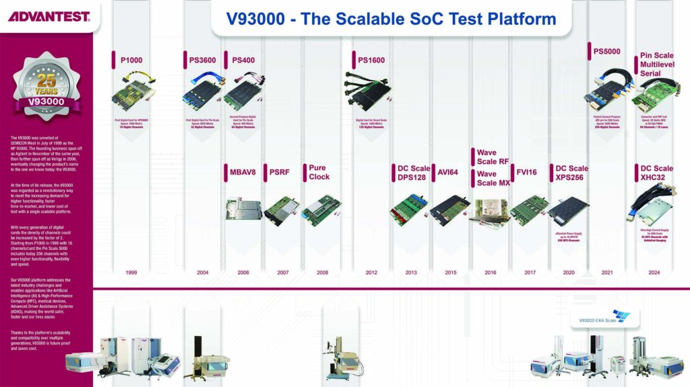

Posted  in [Top Stories](https://www.gosemiandbeyond.com/category/topstories/)

# Advantest Celebrates 25th Anniversary of Industry-Leading V93000 SoC Test Platform

 

Earlier this year, Advantest celebrated the 25th anniversary of its flagship [V93000 system-on-chip (SoC) test platform](https://www.advantest.com/products/soc/v93000.html). The V93000 revolutionized the semiconductor test industry with its single scalable platform approach, enabled by its test processor-per-pin architecture, which has endured over four generations. As a testament to this endurance, the very first V93000 system installed is still in use at the customer site in Italy, alongside several recently purchased fourth-generation V93000 EXA Scale testers.

 Upon its introduction in July 1999, the V93000 “quickly became a true landmark, as most top-end SoC testers after it would copy the system’s architecture for many years to come,” according to the Chip History Center. Since adding the V93000 to its portfolio when Advantest acquired Verigy in 2011, Advantest engineers have continually enhanced and expanded the V93000 scalable platform to offer a wide range of compatible tester configurations – from small-footprint engineering systems to very high-pin-count wafer sort and final test systems for high-volume manufacturing. The V93000 provides the industry’s broadest application coverage, including high-performance computing, artificial intelligence, RF, automotive and industrial, to name a few. The accompanying chart enumerates Advantest’s many advancements to the V93000 test platform over the years.

TechInsights Vice Chair and Senior Fellow G. Dan Hutcheson has long followed Advantest and the trajectory of the V93000 platform. “The V93000’s long life is an icon for the virtuous cycle that can be created when a team of tool designers thinks beyond the challenges of the day to develop an architecture that can evolve to address as-yet-unknown future challenges. In the case of the V93000, its long life has benefited both Advantest and its customers,” Hutcheson observed. Advantest has been named to TechInsights’ annual [10 BEST list](https://www.techinsights.com/blog/10-best-semiconductor-equipment-supplier-rankings-2023) for each of the 36 years that the market intelligence firm’s Customer Satisfaction Survey has been in existence.

“Technology evolves at a lightning pace, so reaching the quarter-century mark is a milestone achievement that underscores the value of our single, scalable platform approach,” said Juergen Serrer, senior executive officer and chief technology officer, Advantest. “Partnering with our customers to stay ahead of technology trends has enabled us to ensure that the V93000 platform stands ready, with state-of-the-art capabilities, to accommodate today’s and tomorrow’s test challenges. We look forward to what the next 25 years have in store.” 

[Click to enlarge](https://www.gosemiandbeyond.com/wp-content/uploads/2024/11/ESE_WEB_TimelineV93000_-compressed.jpg)

  end .post_content

