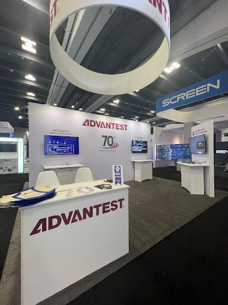

Posted  in [Upcoming Events](https://www.gosemiandbeyond.com/category/upcomingevents/)

# Advantest Completes Another Successful SEMICON West

 

SEMICON West 2024 took place at the Moscone Center in San Francisco, California, on July 9-11, where Advantest once again made a strong presence. This event marks the 25th anniversary of the V93000, as it was unveiled at SEMICON West in 1999.

This year’s SEMICON West hosted 650 exhibiting companies, a 15% increase over last year and saw a 19% increase in attendance from 2023.

Advantest’s booth attracted 242 visitors—an astonishing 50% more than last year—including 12 VIP customers. The booth featured Advantest’s 70th anniversary and corporate theme videos, as well as ACS RTDI, automotive device test solutions, memory platforms, the HA12000 die-level handler, and the V93000 EXA Scale PSML and XHC32 with RDA sockets and boards. Twelve press meetings were conducted, nearly four times the number Advantest usually conducts.

Our customer hospitality event on Wednesday, July 10, proved to be a success as well, attracting almost 250 attendees, 67% of which were customers or non-Advantest guests. We celebrated Advantest’s 70th anniversary and V93000’s 25th anniversary with special cupcakes.  

Advantest had a strong presence at the TestVision Symposium as well, presenting multiple papers and posters:

- Keynote – The Rise of AI-Enhanced Test Engineering: Transforming Challenges into Opportunities by Keith Schaub
- Revolutionizing AI Chip Testing with AI-Driven Solutions by Ira Leventhal
- Chiplet Ecosystem Testability for HVM by Bob Bartlett
- Poster presentations

DPD (Digital Pre-Distortion) for RF Power Amplifier Test by Yichuan Lu
Optimizing ATE Test Cell Operation with IoT and Cloud Technologies by Vincent Chu

In addition, Ken Butler represented Advantest in the panel discussion, “A Foundation for a Data Driven Future: How to Define, Adapt, and Adopt Standards to Enable a More Intelligent Test Flow and Seamless Operations.”

Another success from the event is that Advantest’s HA1200 test handler was named one of three finalists for the “Best of West” award, a prestigious award presented by SEMI and Semiconductor Digest each year to recognize innovative new products that significantly advance electronics manufacturing capability.

SEMICON West 2025 will take place in October in Phoenix, Arizona, as the conference begins its new rotation between Phoenix and San Francisco.

  end .post_content

