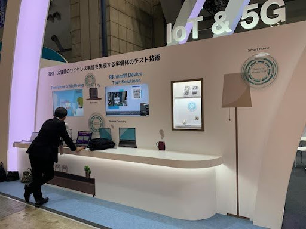

Posted  in [Upcoming Events](https://www.gosemiandbeyond.com/category/upcomingevents/)

# Advantest Concludes Successful SEMICON Japan 2023 with Record Attendance

Advantest displayed its latest products and solutions at SEMICON Japan 2023, held on December 13-15 at the Tokyo Big Sight. As a result of Japan’s efforts to bolster its domestic semiconductor industry, this year’s event saw a significant increase in attendance from 50,000 people last year to 85,000 people this year. Advantest’s booth saw a 50% increase in booth attendance compared to last year, with a steady flow of visitors including customers, government officials, media personnel, and financial experts. 

Unlike previous years, Advantest’s 2023 booth featured an application-centric display, highlighting major applications like High-Performance Computing (HPC), Automotive, and 5G. Our new application-based approach helped us to connect with visitors from diverse backgrounds and showcase the crucial role our test technology plays in developing the world’s most cutting-edge applications. Our display included new products, such as the HA1200, ATC 2.0, Pin Scale Multilevel Serial, and the T5230 memory test system, demonstrating how our extensive product portfolio enables global innovation.

As a gold sponsor, Advantest sponsored various aspects of this year’s event including the APCS (Advanced Packaging and Chiplet Summit), Smart Mobility pavilion, and SuperTHEATER where President Yoshida-san gave a compelling speech on how Advantest is enabling the future with semiconductor testing. Additionally, Senior Director, Test Strategist of SVC Marketing & Business Development Shinji Fujita presented, “Challenges in Testing Advanced Large-Scale SoC Devices” during the SEMI Technology Symposium (STS). 

Thank you to everyone who contributed to the success of SEMICON Japan 2023! We look forward to next year’s event.

Smartphone and OTA sockets were displayed in IoT/5G corner, as well as QR & robotic arm demo

 

HA1200 in AI/HPC corner

 

  end .post_content

