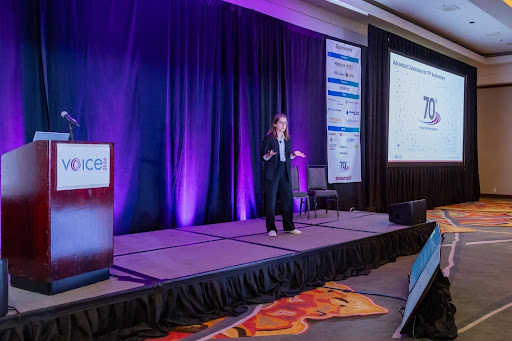
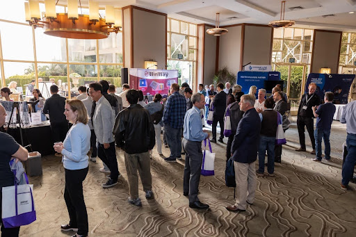

Posted  in [Upcoming Events](https://www.gosemiandbeyond.com/category/upcomingevents/)

# Advantest Draws Record Attendance to VOICE 2024 in San Diego

Advantest concluded a successful VOICE 2024 at the Hilton La Jolla Torrey Pines in San Diego, California. The event was held on June 3-5 and drew a record-high attendance of over 400 attendees, the majority of whom were Advantest customers and industry partners. This year’s VOICE event coincided with Advantest’s 70th anniversary, and the company was pleased to commemorate this milestone with longstanding customers and industry partners.

The VOICE 2024 committee received 225 abstract submissions from 40 global companies across 14 countries. Of those abstracts, 78 papers were presented over the course of the two-day event—the majority of which were written or co-authored by Advantest’s customers. The Artificial Intelligence (AI) track was added to this year’s technical program, in addition to a wide range of topics important to the automatic test equipment (ATE) industry, such as 5G/millimeter wave, high-performance computing, cloud technologies, and system-level test.

This year’s event also featured an exciting lineup of three keynote speakers, including Craig Nishizaki, vice president of the Test Solutions Group at NVIDIA, Marcelo Ackermann, professor of the XUV Optics Group at the University of Twente, and Andrea Lati, director of market research at TechInsights. In addition to keynotes, Advantest’s Kotaro Hasegawa and Michael Braun hosted a Technical Highlights session that featured Advantest’s latest solutions to address emerging test challenges for various applications including microLED and silicon photonics. Attendees also had the opportunity to engage with Advantest R&D engineers during the Technology Kiosk Showcase. Attendees were also provided valuable time to network with others during evening events and scheduled breaks. In addition, a Workshop Day was hosted after the event on Thursday, offering attendees a hands-on learning experience on advanced RF demodulation, Advantest’s new DC Scale XHC32, and SmarTest 8. 

The VOICE Partner’s Expo took place throughout the event, providing Advantest’s partners and sponsors the chance to meet with attendees and exhibit their latest products and offerings. This year’s headline sponsors were Alliance ATE Consulting Group and ISE Labs/ASE Group.

**Best Paper and Best Kiosk Awards**

Attendees used the VOICE mobile app to vote for the Best Paper and Best Kiosk awards. This year’s Best Paper award was awarded Bernhard Moessler from Infineon and Souvik Dey and Jubal Saji from Advantest, for their paper “Enabling Virtual Scope Capability on the V93000.” Advantest’s Brent Bullock also won Best Paper with, “Early Detection of CRES Degradation on High Current Power Planes.” Makoto Eiki of Sony was named as an Honorable Mention for his paper titled “Improving Efficiency and Robustness of Gaussian Process Based Outlier Detection via Ensemble Learning,” as was Jun Zhang, Bowen Yang, and Jiamin Wang of Advantest for their paper, “Boost the Performance of the Test Program Development Through Burst and Concurrency on SmarTest 8.” Keith Schaub and Nadine Schill from Advantest won this year’s Best Kiosk award for their “Advantest Talks Semi” kiosk. 

**Visionary Award**

This year’s Visionary Award was presented to Matt Silverstein, senior manager, audio product & test engineering, Analog Devices. Recipients of the Visionary Award are honored for their significant and sustained contributions to VOICE over time. Silverstein has supported VOICE by serving on the technical committee for twelve years and contributing papers to the technical program for the past three years. 

**VOICE 2025**

VOICE 2025 will be held in Austin, Texas at the AT&T Hotel and Conference Center on May 12-14. For more details, please go to: [https://voice.advantest.com/](https://voice.advantest.com/). 

 

 

  end .post_content

