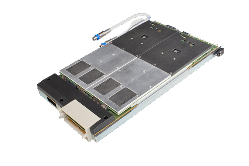

Posted  in [Featured Products](https://www.gosemiandbeyond.com/category/featuredproducts/)

# Advantest Rolls Out Pin Scale Multilevel Serial – Next-Generation High-Speed ATE Instrument

In November, Advantest announced the [Pin Scale Multilevel Serial](https://www.advantest.com/products/soc/v93000/exa.html), its newest high-speed I/O (HSIO) instrument. Designed for use with the V93000 EXA Scale ATE platform, Pin Scale Multilevel Serial is both the first native EXA Scale HSIO instrument and the first fully integrated HSIO ATE instrument to address signaling requirements for advanced communication interfaces.

HSIO interfaces, long prevalent in the computing space, have found their way into consumer interfaces such as HDMI®, DisplayPort™ and USB. In the computing space, PCI Express (PCIe) 5.0 and 6.0 are entering the multi-gigabit data-rate range and being leveraged in embedded single-board computers. Companies testing large digital designs and their interfaces, from microcontrollers and mobile application processors to high-performance computing and artificial intelligence (AI) devices, require HSIO to accommodate these high-density designs. HSIO testing is thus vital for the characterization of these new device designs as well as for early device manufacturing ramp phases. 

Pin Scale Multilevel Serial supports data rates up to 32 gigabits per second (Gbps) and is the first fully integrated ATE instrument that natively supports multilevel signaling (e.g., PAM4), which is rapidly growing in high-speed interfaces. This heightens ease of use as it enables the use of programming schemes typical in digital test, reducing test program development time and cost. As such, it helps to optimize leading-edge technologies and speed time to market by providing additional test coverage for ramping of new chip designs. 

Because Pin Scale Multilevel Serial is fully integrated, it can be easily configured into the EXA Scale platform. Competitive offerings typically require an integration stage to be mounted between the top of the test head and the interface to the device under test (DUT), degrading signal performance and worsening manufacturing integration. 

  end .post_content

