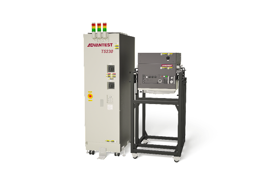
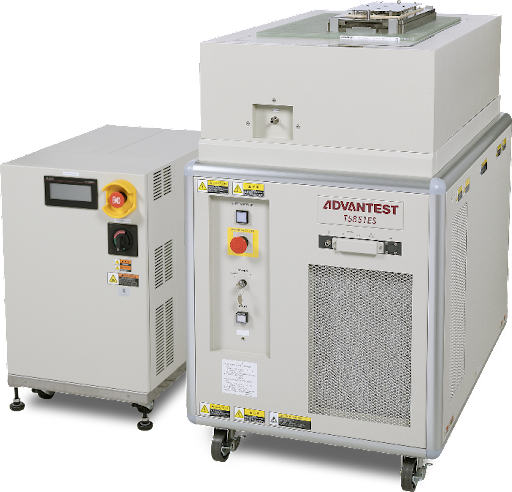
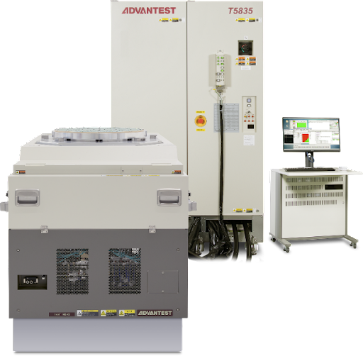

Posted  in [Featured Products](https://www.gosemiandbeyond.com/category/featuredproducts/)

# Advantest Targets NAND Flash/NVM Market with New Group of Memory Test Products

In December, Advantest announced three new additions to its suite of memory test products. The new offerings are designed to target NAND Flash and non-volatile memory (NVM) devices, which face extreme pressure to bring down test costs and cost of ownership on the test floor. The new products include the T5230 memory wafer test solution; the STM32G third-generation protocol NAND system-level test module for the T5851 memory tester; and the T5835 high-speed wafer-sort interface option.

The [T5230](https://www.advantest.com/products/memory/t5230.html) **memory test system** for NAND/NVM devices adopts a combined array architecture to achieve best-in-class cost-of-test performance for wafer test, including wafer-level burn-in (WLBI) and built-in self-test (BIST). The system can perform on-wafer test of 1,024 memory devices per test head in parallel, delivering high productivity and enabling floor space savings of up to 86%. Multiple test cells are connected per system controller in the T5230, allowing independent wafer test of each test cell. The test cells can be stored in a general multi-wafer prober while minimizing the test cell floor space, and the tester can be docked with probers in both linear and multi-stack configurations. For functional tests at a maximum test rate of 125MHz/250Mbps, the T5230 assures high timing accuracy, repeatability, and failure detection capability.

**T5230 Memory Test System**

The [T5851](https://www.advantest.com/products/memory/t5851.html)**-STM32G module** is designed to cover the latest generation of protocol NAND devices, including UFS4.0 and PCIe Gen 5 ball grid array (BGA) packaged devices for high-speed system-level NAND testing at up to 32Gbps. Fully upgradeable and compatible with existing T5851 systems, the new module delivers tester-per-DUT (device under test) performance and is qualified for high-volume manufacturing, qualification, reliability and characterization.

**T5851 Memory Test System and T5851-STM32G**

Created as an option for the proven [T5835](https://www.advantest.com/products/memory/t5835.html) multifunction memory test system, the new **high-speed wafer-sort interface **enables high-speed NAND Flash/NVM wafer probing (up to 5.4Gbps) with 4,096 full I/O channels. Raw NAND die inside solid-state drives (SSDs) require increasingly higher-speed functionality, necessitating evaluation and test of die performance at the wafer level, not just in package-level final test. The solution delivers high-speed probe interface with wafer-level evaluation of memory core test functionalities during engineering production, contributing to the T5835’s overall value by delivering wider test coverage.

**T5835 Memory Test System**

 

  end .post_content

