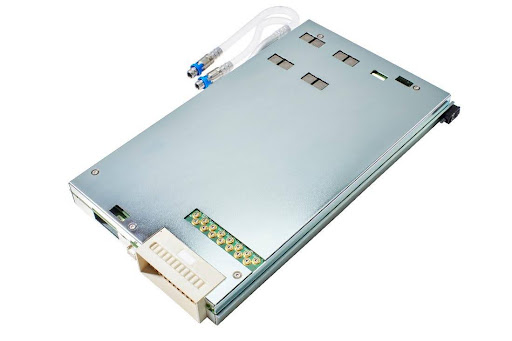

Posted  in [Featured Products](https://www.gosemiandbeyond.com/category/featuredproducts/)

# Advantest Unveils New Ultra-High-Current Power Supply for V93000 EXA Scale SoC Test System

In May, Advantest announced the newest addition to its portfolio of power supplies for the V93000 EXA Scale SoC test platform. The DC Scale XHC32 power supply offers 32 channels with an unprecedented single-instrument total current of up to 640A, enabling the card to efficiently address the rapidly rising power requirements for artificial intelligence (AI) accelerators, high-performance computing (HPC) chips, graphical processing units (GPUs), and other high-current devices like network switches and high-end application processors.

Very high current requirements of 1000A or more at core voltages below 1V require an ATE system with precise power-delivery capabilities. The DC Scale XHC32 further extends the V93000 EXA Scale platform, covering all high-power requirements with a single card to enable unlimited and flexible ganging of channels, fast load step and clamp response, and extended profiling capabilities.

The DC Scale XHC32 provides full application compatibility with the existing DC Scale UHC4T card, enabling a seamless transition to the new generation of high-power supplies while reusing the existing device-under-test (DUT) boards efficiently. By making use of the patented new contact protection, the DC Scale XHC32 reduces cost of test (CoT) by eliminating the risk of damaging probe cards and test sockets. This new feature will not only allow customers to test high-current AI and HPC applications safely, but it will also protect their overall investment in test equipment. The new high-density power supply enables customers to optimize their investment by using smaller test head infrastructures or to increase multisite testing and reduce the overall CoT.

  end .post_content

