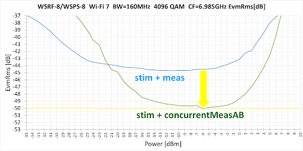

Posted  in [Top Stories](https://www.gosemiandbeyond.com/category/topstories/)

# Concurrent Measurement on Wave Scale RF8 Enables Wi-Fi 7 EVM Test Improvements

*By Joerg-Walter Mohr, Product Definition Expert, Advantest Corp.*

The November 2022 issue of *GO SEMI & Beyond* included an [article](https://www.gosemiandbeyond.com/wave-scale-rf8-ready-for-wi-fi-7/) detailing how Advantest has evolved our Wave Scale family of test cards for the V93000 test platform by readying Wave Scale RF8 to address the test challenges associated with the forthcoming Wi-Fi 7 standard. This article provides further details on how to augment the Wave Scale RF8 solution by putting an additional splitter on the load board. With this splitter, two RF measurement systems can be used concurrently/simultaneously to improve the EVM measurement of one DUT RF signal.

The Wi-Fi 7 standard covers the now less congested frequency range between 6 GHz and 7.125 GHz, which was opened as an extension to Wi-Fi 6 and called Wi-Fi 6E. Wi-Fi 7 utilizes this wide 6 GHz Band with channel bandwidth up to 320 MHz and going up to 4096 Quadrature Amplitude Modulation (QAM) schemes.

The Wave Scale RF8 solution addresses the test challenges associated with Wi-Fi 7 by providing the frequency range and the bandwidth needed in an industry-proven instrument (Figure 1). 

*Figure 1.  Wave Scale RF8 enables measurements that fully address the frequency and bandwidth expansions associated with the Wi-Fi 7 standard.*

The Error Vector Magnitude (EVM) of the modulated/demodulated symbols is an important figure of merit to describe the signal fidelity. EVM is measured either in % or in dB, where dB is used for smaller values for better readability. Wi-Fi 7 standard allows device transmitters to reach an EVM of -38 dB at most. Thus, devices will have better specs and production test equipment must be able to check those, e.g. -41 dB must be checked, which means test measurement unit should provide at least an EVM test capability of -44 dB if the device has a 3dB margin. Of course, for characterization purposes it is desired to have a test measurement unit with an EVM better than -50 dB.

 

*Figure 2.  Wave Scale RF8 concurrently measures with two RF subsystems **one DUT Tx signal by adding a splitter on the load board.*

Wave Scale RF8 EVM measurement performance can be improved by putting an additional splitter on the load board to enable the use of two RF subsystems simultaneously, as shown in Figure 2. By evaluating for each demodulated symbol the EVM, which is commonly detected by both RF subsystems, and neglecting the individual contributions to EVM of each RF subsystem, -50 dB EVM measurement capability is enabled for Wi-Fi 7 160 MHz 4096 QAM as shown in Figure 3.

*Figure 3.  EVM concurrentMeasAB test -50 dB for highest carrier frequency of Wi-Fi 7 160 MHz. Result with and without splitter for 160 MHz plus common error.*

The reduced dynamic range due to the loss via the splitter can be compensated for by averaging in cases where the focus of the test is the detection of impairments caused by non-linearities. With averaging even for Wi-Fi 7 320MHz -50 dB EVM test capability can be achieved as shown in Figure 4.

*Figure 4.  EVM concurrentMeasAB +* *averaging test -50 dB for different frequency of Wi-Fi 7 320 MHz.*

**Summary**

Using the high parallelism of the Wave Scale RF8 together with advanced test method addresses higher test requirements of the new standards like Wi-Fi 7 in the sub 8GHz frequency range. This might even be true for some upcoming FR3 applications in 5G/6G bands.

  end .post_content

