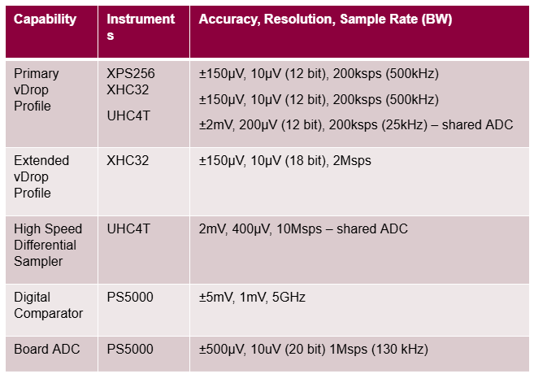
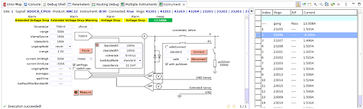
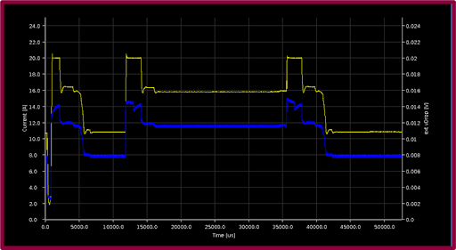
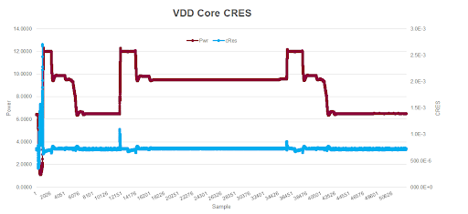

Posted  in [Top Stories](https://www.gosemiandbeyond.com/category/topstories/)

# Early Detection of C-RES Degradation on High-Current Power Planes

By Brent Bullock, Advantest America Inc.

Probe-card or device contactor damage can be dramatic and catastrophic, with yield dropping drastically very quickly. What is not dramatic is the hypothesized slow probe needle or contactor degradation process that might precede catastrophic failure. Such degradation is difficult to detect in the early stages, when probe cards, die, and packages continue to yield normally. A key goal is to detect this degradation as soon as possible to avoid catastrophic damage without incurring yield loss or unnecessary equipment downtime. A related goal is to determine the root-cause scenarios that cause damage to probe needles or contactors.

**Measuring contact resistance**

One possibility for detecting the onset of probe or contactor degradation is to measure contact resistance (C-RES). This measurement can be accomplished by taking equipment offline, which also allows visual inspection of probe tips. This approach, however, thwarts the goal of minimizing downtime, and it provides limited insight into the root causes of failures—for example, it cannot determine what test sequences were running when a failure occurred. 

Low-current C-RES measurements are valuable, given uniform planarity with clean probe needles. For example, uniform C-RES changes will correlate between I/O pins and large VDD power planes, regardless of pin type (Figure 1, top). However, C-RES can be nonuniform because of particles, needle warpages, device contact defects, or other anomalies affecting a few pins. Unfortunately, low-current measurements cannot detect subtle changes in C-RES for a small percentage of pins isolated within large power planes, rendering nonuniform C-RES issues within large VDD planes unobservable on I/O pins (Figure 1, center). This limitation can be overcome by improving measurement granularity, taking measurements at higher current levels, or combinations of the two.

*Figure 1. Probes can exhibit uniform (top) or nonuniform (center) planarity, and sub-gang measurements (bottom) can provide adequate resolution to detect anomalies in the latter.*

**Sub-gang measurements**

One approach to improving C-RES measurements despite nonuniform contact problems is to take advantage of the fact that a VDD power plane is likely to be powered by multiple power-supply channels. The multiple channels allow sub-gang per-channel measurements that can provide sufficient granularity to detect C-RES variances with adequate resolution (Figure 1, bottom). For example, Advantest’s EXA Scale generation of instruments for the V93000 platform includes power supplies, digital comparators, and data converters (Table 1) that can discern C-RES variations between channels.

*Table 1. Exascale instrument capabilities and specifications*

EXA Scale instruments can determine C-RES by measuring the voltage drop (vDrop) across the probe head for a given measurement current. vDrop can be measured and recorded at a specific point in time or averaged over multiple points in time. This approach may require additional test time, and, similar to off-line measurements, it provides limited insight into the root causes of failures.

**Monitoring vDrop**

A better approach involves the monitoring of vDrop using continuous ADC sampling and the triggering of an alarm when significant C-RES anomalies occur. This approach has the added advantage of pinpointing what test sequences were executing during significant C-RES changes, thereby facilitating root-cause analysis. Figure 2 shows the XHC32 ultra-high-current power supply configured to provide such continuous monitoring of the C-RES values on both the VDD and VSS sides of the die. This approach requires an extended sense line, which must be added during DUT board design, in addition to the primary sense line.

*Figure 2. An XHC32 extended sense line monitors the delta value relative to the primary sense line.*

Advantest’s SmarTest ATE software includes a feature that facilitates the programming of the extended monitoring and alarm functions in either interactive or API modes. Figure 3 shows results with per-channel ganging granularity, initiated by checking the perPogo box in the instrument view (left). Data for each channel is shown on the right, with the highlighted channel showing a significant anomaly in measured current. To further control the ganging granularity, Advantest offers a capability called Ganged on the Fly dynamic master-channel switching, which is useful for changing the master sense line when the IR drop across a power plane varies with test content. The capability supports unique signal names for desired master-channel scenarios.

*Figure 3. Checking the perPogo box in the instrument view (left) enables the display of per-channel results (right).*

**Measurement results and comparisons**

Figure 4 shows actual waveform results, with the extended vDrop profile shown in blue and the current shown in yellow. Extended vDrop scales with the current flow, with capacitor charge/discharge cycles inducing transient variations. 

*Figure 4. The extended vDrop value (blue) scales with current (yellow), with capacitor charge/discharge cycles inducing transients.*

Figure 5 shows the extended vDrop and current values shown in Figure 4 converted to power (brown) and C-RES (blue) values, with C-RES impacted by device contacts as well as the probes. The conversion is part of Advantest’s new contact rating feature, which eliminates the issue of having to adjust for power, reducing engineering workload.

*Figure 5. The brown and blue traces represent power and C-RES, respectively, derived from the voltage and current traces in Figure 4.*

Figure 6 shows vDrop measurement trial data for two equipment setups A and B, which each have induced variations in the equipment and known variances in DUT contact quality. Measurements were taken for three separate tests, with each test performed four times, once for each of the two setups using the lower power Core Supply A and once for each of the two setups using the higher power Core Supply B. 

As shown in the figure, tests run on each setup using the low-power Core Supply A yield very similar results. For example, the measurements at the left of the Core Supply A results show that test 264 run on Equipment Setup A (Series 1) and the same test run on Equipment Setup B (Series 2) yield nearly identical measurements, making it difficult to draw inferences about C-RES variations. In contrast, the results for the same test run on the same two setups using the higher power Core Supply B are clearly distinguishable, demonstrating improved capability for vDrop measurements, and hence C-RES measurements, when utilizing currents that represent a higher percentage of total CCC.

*Figure 6. Measurements taken with the lower power Core Supply A (left) and the higher power Core Supply B (right) show that the higher power supply provides improved capability for distinguishing C-RES variations.*

**Summary**

Extended vDrop measurements can detect test-cell variations but have limited potential for isolating root causes of probe failures. In contrast, extended vDrop monitoring with alarm functionality is effective at detecting C-RES degradation, and because the monitoring is continuous, it is also effective in determining the root causes of the degradation—for example, test program sequences that may inadvertently apply too much current.

The implementation of vDrop monitoring requires planning because C-RES measurement or monitoring is not possible without proper routing, and the required extended sense lines must be designed into the DUT board. For the best results, retain the primary sense lines in the same location used for previous designs and add the extended sense lines on the opposite side of the die or contactor. Advantest offers the instruments and software necessary to implement extended vDrop monitoring and is performing additional work to automate the process of setting adaptive current clamp and vDrop alarm limit values.

  end .post_content

