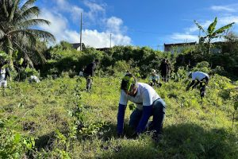
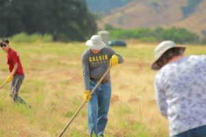

Posted  in [Uncategorized](https://www.gosemiandbeyond.com/category/uncategorized/)

# ESG Spotlight March 2024

**Global ESG Activities **

  end .et_lb_text_block 

#### Advantest Philippines South Volunteers to Plant 500 Tree Saplings

  end .et_lb_text_block 

   end .et_lb_module_content_inner 
  end .et_lb_module_content 
  end .et_lb_widget_area 
Last November, Advantest Philippines South teamed up with the Nature Awareness and Conservation Club to plant 500 tree saplings in Lemery, Batangas, Philippines. 

Batangas Province, known for its unspoiled beaches, lush forests, and breathtaking landscapes, faces urgent threats to its ecosystem driven by industrialization. In response, a local Tree Planting Program has been launched by the Nature Awareness and Conservation Club to unite public and private entities to combat critical issues such as deforestation and soil erosion. 

Advantest Philippines’ collaboration with Nature Awareness and Conservation Club emphasizes the company’s commitment to the conservation of local ecosystems through sustainable practices. This tree-planting initiative represents a practical step towards creating a greener, more resilient environment in South Luzon.

  end .et_lb_text_block 
  end .et_lb_column_et_lb_1_3 

#### Advantest America Works to Remove Invasive Weed from Local Habitat

  end .et_lb_text_block 

   end .et_lb_module_content_inner 
  end .et_lb_module_content 
  end .et_lb_widget_area 
In October of last year, AAI employees joined Open Space Authority staff to remove an invasive weed known as stinkwort (dittrichia graveolens) from the Spreckles Wetland Restoration Area in Santa Clara, California. Stinkwort overwhelms native vegetation and poses a danger to grazing animals that may eat it accidentally. 

Despite being a small team of volunteers, they worked diligently all day and were able to clear the invasive species from a large area of the wetlands. The efforts of Advantest's volunteers have made significant progress in controlling this invasive species and restoring the habitat in Coyote Valley.

  end .et_lb_text_block 
  end .et_lb_column_et_lb_1_3 

#### Advantest China Participates in Local Mountain and Riverbank Cleanup

  end .et_lb_text_block 

   end .et_lb_module_content_inner 
  end .et_lb_module_content 
  end .et_lb_widget_area 
Advantest China joined the organization Clean Up China to organize environmental clean-up activities in Tianping Mountain in Suzhou, Hao River in Xi’an, and Fragrance Hill in Beijing. Over 100 volunteers worked together over the course of two days last October to remove over 117 kilograms of trash from these beloved ecosystems. This dedicated group of volunteers hiked 10 kilometers at 850 meters of elevation to clean these sites—their hard work reflecting a deep commitment to protecting their local environment.

Advantest is grateful for the opportunity to work with Clean Up China to raise awareness about environmental threats and inspire people to take action in protecting their local ecosystems. Through a shared commitment to environmental conservation, Advantest is leading the way towards a sustainable future. 

  end .et_lb_text_block 
  end .et_lb_column_et_lb_1_3 

**Biotope Update**

This quarter’s biotope update chronicles the unique plants and trees that grow in the winter. Deciduous trees that leaves turn beautiful shades of red and yellow in autumn, completely lose their leaves in winter, revealing their trunks and branches.

Our biotope contains many different varieties of trees, including the Japanese maple tree, which displays beautiful, red foliage in the fall, completely loses its leaves in the winter. The bark of a young maple tree is green and smooth, while the bark of a mature tree turns light brown and has shallow vertical cracks.

The biotope is also home to the crape myrtle tree. The Japanese name for this tree is “saru-suberi” or “monkey slip,” which is derived from the fact that the trunk is so smooth and slippery, even a monkey may have difficulty climbing it. The bark is reddish brown and very smooth, and the trunk and branches grow in a sinuous pattern from side-to-side. Some crape myrtles can reach up to 10 meters in height. 

  end .et_lb_text_block 

## Recent ESG Recognition

  end .et_lb_text_block 

**Advantest Selected for the Second Consecutive Year for DJSI Asia Pacific**

Advantest has been selected for the second consecutive year as a constituent stock of the Dow Jones Sustainability Asian Pacific Index (DJSI Asia Pacific), which is operated by S&P Dow Jones Indices in the United States. 

The Dow Jones Sustainability Indexes (DJSI) are composed of companies selected for their excellent sustainability performance on both general and industry-specific criteria. Since its launch in 1999, the DJSI has been recognized worldwide as an important indicator of corporate sustainability performance. One hundred and fifty-six companies from the Asia Pacific region were selected for DJSI Asia Pacific in 2023, including 75 Japanese companies, one of which is Advantest. 

The selection highlights Advantest’s commitment to sustainability in the form of an ESG Basic Policy established to promote company-wide ESG initiatives and the ESG Action Plan 2021-2023 that guides the implementation of this policy. Under the ESG Action Plan, Advantest set 27 goals and KPIs based on priority themes such as climate change, employee engagement, and the effectiveness of the Board of Directors.

  end .et_lb_text_block 
  end .et_lb_column_et_lb_2_3 

   end .et_lb_module_content_inner 
  end .et_lb_module_content 
  end .et_lb_widget_area 
  end .et_lb_column_et_lb_1_3 

**Advantest Selected for S&P Sustainability Yearbook 2024**

Advantest announced that it has been selected for inclusion in the S&P Sustainability Yearbook 2024, which recognizes companies with ESG evaluation scores within the top 15% of their industries. 

S&P Global publishes The Sustainability Yearbook annually, evaluating the sustainability of companies around the world from the perspectives of economy, the environment, and society. This year, out of more than 9,400 companies, 759 companies (including 83 Japanese companies) were selected for inclusion in The S&P Sustainability Yearbook 2024.

Advantest is honored to be listed again in The Sustainability Yearbook and will continue to seek sustainability through ESG as an essential part of the company’s philosophy and mid/long-term growth strategy, aiming to contribute to the common good while improving corporate value.

For more on Advantest’s ESG initiatives, please see the company’s [sustainability website](https://www.advantest.com/sustainability/).

  end .et_lb_text_block 
  end .et_lb_column_et_lb_2_3 

   end .et_lb_module_content_inner 
  end .et_lb_module_content 
  end .et_lb_widget_area 
  end .et_lb_column_et_lb_1_3 
  .et_builder 
  end .post_content

