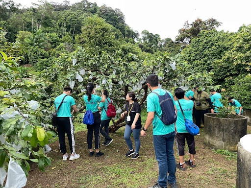
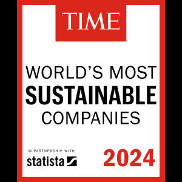

Posted  in [Uncategorized](https://www.gosemiandbeyond.com/category/uncategorized/)

# Global ESG Activities

  end .et_lb_column_et_lb_1_3 

  end .et_lb_column_et_lb_1_3 
  end .et_lb_text_block 

**Advantest Malaysia Volunteers at Tropical Fruit Farm for World Environment Day**

  end .et_lb_text_block 

  end .et_lb_image_content    end .et_lb_module_content_inner 
  end .et_lb_module_content 
  end .et_lb_widget_area 
On June 21, 2024, in conjunction with World Environment Day, Penang State’s initiative to plant 1 million trees, and our very own launch of the Advantest Forest initiative, Advantest Malaysia organized a Tree Planting & Farm Work Program for Advantest Malaysia employees. Our employees collaborated with Penang Tropical Fruit Farm, which was established to educate the public and play a positive role in agriculture and eco/agritourism amid the intensive development in Penang state’s rural areas.

  end .et_lb_text_block 
  end .et_lb_column_et_lb_1_3 

**Advantest America Employees Volunteer for Second Harvest **

  end .et_lb_text_block 

  end .et_lb_image_content    end .et_lb_module_content_inner 
  end .et_lb_module_content 
  end .et_lb_widget_area 
On July 12, 2024, AAI San Jose employees volunteered at Second Harvest of Silicon Valley for the third time this year. During this visit, AAI employees sorted through 22,500 pounds (approximately 12,250 kg) of nutritious food, preparing it for distribution to Silicon Valley residents. This significant effort will ensure that 900 households, or roughly 3,600 individuals, receive the nutritious food they need to thrive. Advantest's partnership with Second Harvest continues to have a remarkable positive impact on the lives of numerous individuals and families facing food insecurity in the area. 

  end .et_lb_text_block 
  end .et_lb_column_et_lb_1_3 

**Advantest Singapore Organizes Annual Coastal Cleanup and Charity Event**

  end .et_lb_text_block 

  end .et_lb_image_content    end .et_lb_module_content_inner 
  end .et_lb_module_content 
  end .et_lb_widget_area 
On September 21, Advantest Singapore employees participated in the office’s annual coastal cleanup event at Changi Beach Park. The event aimed to raise awareness about preservation activities and protect the world's oceans and waterways, encouraging community members to maintain public spaces. This practice protects marine habitats and wildlife, providing a clean and safe beach area for everyone to enjoy. 

Additionally, Advantest Singapore also organized its first “FEST” (Fun, Exercise, Sweat it out for Treasure hunt) event, a treasure hunting fundraiser for the local Chen Su Lan Methodist Children’s Home. Both events were successful, and over 60 volunteers participated to contribute to the local community and Advantest’s overall sustainability goals.

  end .et_lb_text_block 
  end .et_lb_column_et_lb_1_3 

**Biotope Virtual Tour: Spring in Advantest’s Biotope**

One of the largest biotopes to be created by a company in Japan, the Advantest biotope serves a diverse ecosystem of amazing organisms. We are excited to invite you to explore this special habitat through a 360-degree virtual tour. This tour captures the lush green landscape of springtime in the biotope.

You can access the tour [here](https://www.advantest.com/en/about/sustainability/environment/environmental-communication/biotope/). Start the virtual tour by clicking on the 'Click to Load Panorama' button in the center of the screen.

Once the virtual tour starts, you can use your mouse or the arrow keys on the keyboard to select and change your viewpoint. Move around inside the tour by clicking the arrows on the screen. To move to a different area of the biotope, click the yellow buttons on the map in the bottom right corner of the screen.

  end .et_lb_text_block 

### Recent ESG Recognition

  end .et_lb_text_block 

**Advantest Ranked 38th in ****TIME**** Magazine’s “World’s Most Sustainable Companies” of 2024**

Advantest has been ranked 38th out of 500 companies listed in *TIME* Magazine’s  “World’s Most Sustainable Companies of 2024.” 

*TIME* partnered with data firm Statista to create a rigorous methodology with which to measure the world’s most sustainable companies in 2024. The companies at the top of the list have signed on to some of the most respected climate programs and received high scores from CDP (formerly the Carbon Disclosure Project). *TIME* and Statista set high standards for companies regarding their Scope 1 and 2 emissions and energy consumption in relation to company size. They assessed emissions reductions for the years 2021 and 2022 (the most recent years for which complete data is available) as well as the percentage of renewable energy utilized in the company’s operations. And perhaps most importantly, many of the top companies have incorporated sustainability into their business models. 

  end .et_lb_text_block 
  end .et_lb_column_et_lb_2_3 

  end .et_lb_image_content    end .et_lb_module_content_inner 
  end .et_lb_module_content 
  end .et_lb_widget_area 
  end .et_lb_column_et_lb_1_3 
  .et_builder 
  end .post_content

