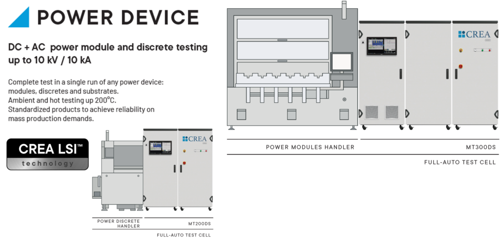

Posted  in [Top Stories](https://www.gosemiandbeyond.com/category/topstories/)

# Solving High-Energy Testing Challenges

*This article is a condensed version of an article that appeared in the November 2023 issue of *Electronic Specifier*. Adapted with permission. Read the original article *[here](https://www.electronicspecifier.com/pages/es-design-november-2023)*, p. 12.*

*By Fabio Marino, Managing Director, CREA, an Advantest company*

Although the global semiconductor market is currently experiencing a slowdown, the automotive sector remains solid fueled by the demand for EVs. What used to be a niche market is now rapidly expanding to the mainstream, and companies that supply power IC technology must increase production volume to meet growing demand. 

Last year, CREA leased a new building to expand production capacity and keep up with ongoing business growth. This will allow CREA to produce test equipment for a wide variety of power semiconductors, including insulated-gate bipolar transistors (IGBT) and silicon carbide (SiC) and gallium nitride (GaN) semiconductors. SiCs’ advantages over traditional IGBTs include higher thermal conductivity, better ability to tolerate high voltages, higher switching speeds and lighter weight. Wide-bandgap technology such as SiC is the key to developing more efficient advanced battery systems that will enable new electric vehicles (EVs) to go farther and faster. 

**Addressing high-power test requirements**

Parasitic inductance and capacitance, which play an important role in the measurement, can create conditions that may damage the tester. Thus, testing high-powered SiC devices requires highly refined, specialized test equipment. CREA’s low-stray-inductance and probe card interface (PCI) technology enables engineers to minimize parasitic values. This allows the performance of specialized tests needed to ensure reliability and quality, facilitating the development of efficient batteries for new EVs. 

To meet customer demands for lower cost, CREA is expanding its bare-die test capabilities. Bare-die test utilizing the PCI and thermal control technology holds the key to expanding dynamic test to the wafer level. Package test is simpler, but if a single switch malfunctions, the entire package must be discarded. Bare-die test is more cost-efficient and creates less waste—the only challenge is that a probe card is needed to perform the test. Probe cards are fragile, and the high amount of energy generated during dynamic test can break the probe card and damage the tester itself.

CREA’s PCI technology monitors each probe needle for abnormal current distributions, shutting off the tester when such an abnormality is detected to prevent damage. CREA also developed a chamber for bare-die test that moderates temperature by controlling airflow to prevent sparking that can occur while working with high voltages, ultimately reducing the threat of harm to the ATE.

SiC technology provides many benefits over traditional IGBT technology, as noted earlier. While many major semiconductor companies are investing in R&D to support SiC technology, SiC is very different from silicon wafer technology. It requires completely different equipment, and the automated tools that factories currently have are designed for silicon wafers and will not work with SiC. Because SiC is a maturing technology, production yields are low. This creates a significant opportunity for test companies to deliver SiC-optimized test equipment. CREA continues to refine its power IC testing technology to increase yield and help customers maintain sustainable business models that can keep up with rising demand.

**Conclusion**

Fueled by major investments from the global semiconductor community, the power IC industry is evolving quickly. This creates significant opportunities for companies like CREA that are building solutions to address high-power specs and overcome industry challenges.

CREA’s patented LSI™ and PCI™ technology provides specialized testing solutions for power ICs found in hybrid and EV automotive engines. These solutions will accelerate the shift from 400V to 800V batteries, accommodating the testing specs needed to develop cutting-edge EV technology. Today, CREA engineers are developing techniques to run high-energy tests in parallel – increasing yield and helping to accommodate rising global demand for SiC and other advanced power semiconductors. 

 

CREA’s Power Device Testers

  end .post_content

