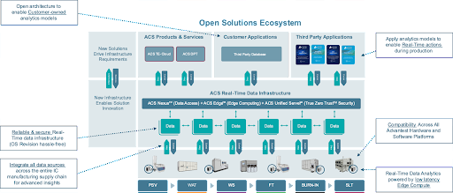

Posted  in [Top Stories](https://www.gosemiandbeyond.com/category/topstories/)

# The Future of Data Analytics and Semiconductor Testing

*This article is adapted with permission from a recent Advantest blog post.*

*By Michael Chang, Vice President & GM ACS, Advantest*

The world is changing more rapidly than ever. With the explosion of Artificial Intelligence (AI), Machine Learning (ML) and data analytics, semiconductor manufacturers now have the opportunity to extract valuable insights from the massive amounts of data being generated throughout the silicon lifecycle. By leveraging AI algorithms and ML, semiconductor manufacturers can now optimize silicon design, assembly, and testing processes. It is through the analysis of these vast amounts of data, AI can quickly identify patterns, predict failures, and optimize quality. 

So, what does this all mean? It means that we now have the capability to greatly improve yield rates, reduce production costs, and accelerate time-to-market. Ultimately, the goal is to create an end-to-end utilization of analytics throughout manufacturing and test operations so that data analytics and ML will enhance the speed and accuracy of the testing process, reduce the risk of defects, and help the entire industry move ever closer to its goal of zero defects.  

This is where Advantest is revolutionizing the test industry. We just announced Advantest’s ACS Real-Time Data Infrastructure (ACS RTDI™), a solution that offers advanced analytics, including machine learning capabilities and future-proof, real-time, automated production control. The Advantest ACS ecosystem integrates all data sources across the entire IC manufacturing supply chain, a revolutionary first in the industry. In fact, ACS has been collaborating with multiple major data analytics companies as part of an industry-wide collaboration to accelerate data analytics and AI/ML decision-making within a single, integrated platform. These partnerships will help customers take advantage of new levels of data integrity and security across different test nodes and benefit from proven infrastructure solutions that will enable them to achieve new levels of operational efficiency. 

This is how Advantest is unlocking the intrinsic value of AI in semiconductor testing. 

The ACS RTDI platform integrates data sources across the entire IC manufacturing supply chain while employing low-latency edge computing and analytics in a secure True Zero Trust™ environment. This innovative infrastructure minimizes the need for human intervention, streamlining overall data utilization across multiple insertions and supporting customers’ databases. Because security remains a top concern among customers, the ACS RTDI platform has been architected to be reliable and safe, ensuring hassle-free OS revisions, while protecting data from unauthorized access or loss. This is accomplished by leveraging True Zero Trust™. Overall, the new ACS ecosystem will enable customers to boost quality, yield, and operational efficiencies, and to accelerate product development and new product introductions for years to come.

To fully support ACS’s revolutionary strategy, we also offer the [ACS Solution Store](https://acs.advantest.com/s/?language=en_US) which enables customers to choose from a comprehensive collection of software solutions designed for the digital age, addressing major challenges facing the semiconductor industry and that can be tailored to individual customer needs. Customers can select from the ever-expanding catalog of solutions in an easy-to-navigate browsable online catalog ― from a growing list/ team of partners joining the Advantest open solution ecosystem revolution.

*Figure 1: Semiconductor Integrated Workflow and Benefits*

Learn more about how Advantest is improving the technological world by setting a new standard in the semiconductor industry on our website: [https://www.advantest.com/acs/overview/](https://www.advantest.com/acs/overview/).

  end .post_content

