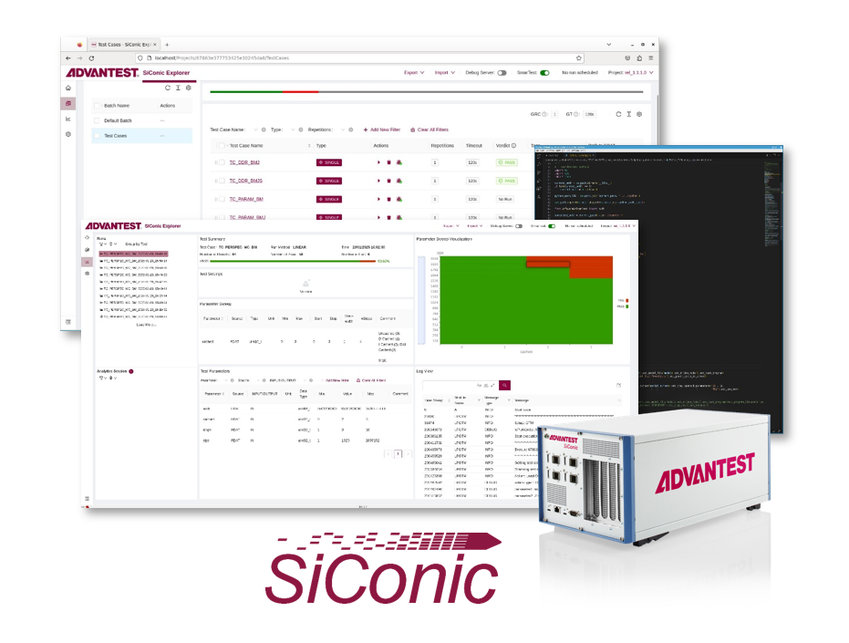

Posted  in [Featured Products](https://www.gosemiandbeyond.com/category/featuredproducts/)

# Advantest Introduces SiConic: Groundbreaking Solution for Automated Silicon Validation

This past February, Advantest unveiled [SiConic](https://www.advantest.com/en/products/siconic/): a scalable solution for automated silicon validation. Designed to address the increasing complexity of advanced systems-on-chip (SoCs), SiConic enables design verification (DV) and silicon validation (SV) engineers to achieve faster sign-off with unparalleled reliability, efficiency and collaboration. SiConic signals Advantest’s commitment to transforming the R&D process for its customers.

The semiconductor industry is facing unprecedented challenges. Growing SoC design complexity, together with the adoption of 3D packaging and heterogeneous integration, is straining traditional validation workflows. DV and SV teams are under pressure to reduce time-to-market and time-to-quality – even as more devices with more intricate features are being developed within constrictive timelines. Reusing the wealth of verification content developed in pre-silicon would provide an efficiency and quality breakthrough. However, the industry lacks the automated flow and tools to reliably re-use and extend verification tests for silicon validation. SiConic’s ecosystem – including EDA partners such as Cadence, Siemens and Synopsys – overcomes this barrier to reuse, enabling engineering efficiency and accelerated test execution on real silicon.

SiConic Explorer, the platform’s software backbone, offers an automated flow by integrating seamlessly with EDA verification tools based on the Accellera Portable Test and Stimulus Standard (PSS), e.g., the Cadence Perspec System Verifier. In addition, integration with debuggers, such as Lauterbach’s TRACE32 debugging tool, accelerates the bring-up of complex multi-IP test cases.

SiConic Link is the hardware foundation of the SiConic solution on a bench. With its high-speed I/O (HSIO) capability, SiConic Link supports protocols such as PCIe and USB to enable functional validation with high throughput and rich tracing capabilities during test execution. The test instrument provides control interfaces (e.g., JTAG, SPI) and general-purpose I/Os, improves the debugging workflow and provides extensive control and observability of the device in its target board environment.

With SiConic, DV engineers can now leverage familiar pre-silicon techniques, expanding their functional coverage in post-silicon. Similarly, SV engineers benefit from seamless load, set parameters and debug of PSS-based or manually directed content on silicon, thereby enabling rapid and reliable device bring-up and functional characterization. The highly portable solution can be easily scaled for use by distributed global R&D teams collaborating on a complex SoC with diverse IP blocks. SiConic enables confident sign-off decisions through team collaboration and data-driven insights – building trust with customers receiving early samples and expecting reliable ramp and operation during the lifetime of their systems.

  end .post_content

