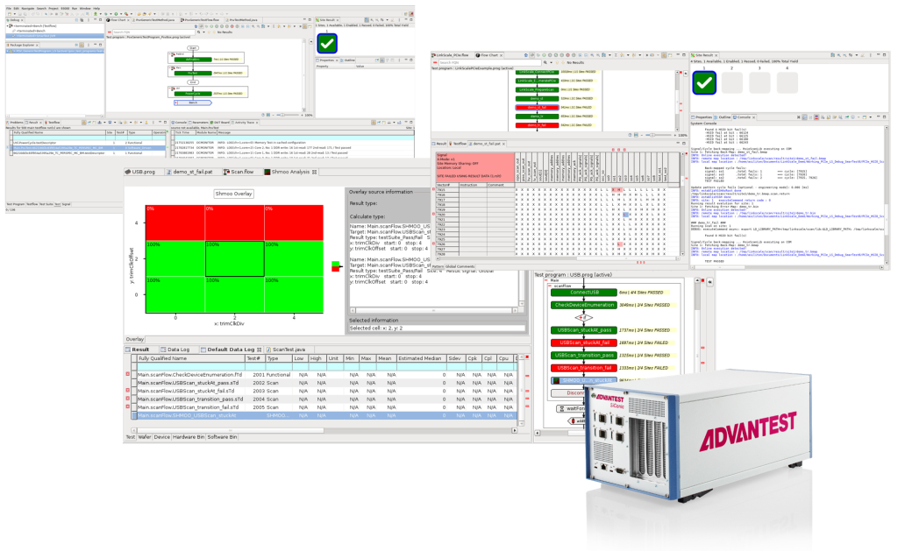

Posted  in [Featured Products](https://www.gosemiandbeyond.com/category/featuredproducts/)

# Advantest Unveils SiConic™ Test Engineering: Unified, Scalable Bench Environment for Debug and Validation

In May, Advantest unveiled SiConic™ Test Engineering (TE), the newest addition to the SiConic™ family introduced in February 2025. SiConic TE offers test engineers the ability to bring up and validate structural and functional tests over high-speed I/O (HSIO) interfaces in a scalable bench environment, enabling earlier validation and debug without occupying valuable ATE systems.

SiConic Link flexibly connects to standard evaluation boards through functional interfaces like USB, PCIe, control interfaces, and GPIOs. This is the foundation for SiConic TE to enable test engineers to rapidly validate and debug design verification (DV) and design for test (DFT) content in SiConic’s unified environment on the bench.

Building on V93000 leadership in scan over USB or PCIe, SiConic’s unified environment brings native DV test content to test engineering without the error-prone and lengthy conversion and debug cycles typical for bring-up of advanced functional tests on ATE. These tests are required for high-quality test coverage in verification and test, enabling a productivity boost for the bench collaboration of DV, DFT and test engineering. SiConic TE accelerates time-to-quality for both V93000 as well as Advantest’s SLT and burn-in platforms with the ActivATE360™ suite of software tools.

Integrating seamlessly with SiConic Link hardware and the SmarTest 8 software platform, SiConic TE provides users with comprehensive access to functional HSIO links for enhanced throughput and rich trace capabilities during test execution. By enabling smoother handoffs between silicon validation (SV), DV and TE teams, SiConic TE fosters tighter cross-domain collaboration.

Through its unified test environment and shared ecosystem, SiConic TE improves the correlation between bench, ATE and SLT systems. The tool’s optimized engineering resources allow bring-up and debug to be offloaded from ATE to the bench, freeing up valuable tester capacity and enabling more effective scaling. In addition, tight integration with leading EDA partners enables cross-functional collaboration with DV and DFT teams, improving test content development and speeding first-silicon success.

According to G. Dan Hutcheson, vice chair, TechInsights, “Improving productivity at the R&D level is vital for design engineers. Advantest’s automated silicon validation approach would allow sign-off and test engineering to proceed concurrently using shared test data, helping ramp SoC designs more quickly, and shortening time-to-money, while ensuring design-to-system quality.”

**Industry Support**

Advantest developed SiConic TE in close collaboration with leading customers and EDA partners to ensure seamless integration into existing design and validation flows.

“Siemens EDA and Advantest have a long history of joint development on many DFT technologies, including Tessent Streaming Scan Network (SSN) and IJTAG,” added Ankur Gupta, senior vice president and general manager, Digital Design Creation Platform, Siemens EDA, Siemens Digital Industries Software. “Collaborating on Advantest SiConic and Tessent In-System Test strengthens this long-running collaboration and helps to provide our users with time-to-market improvements and higher productivity.” 

“As the scale and complexity of chips continues to increase, new verification approaches are needed to shift verification cycles earlier and deliver silicon with higher quality,” said Tom De Schutter, senior vice president of product management at Synopsys. “Our collaboration with Advantest enables users to develop drivers for high-speed interfaces, validate SERDES and perform functional testing and structural testing through the combination of Advantest’s SiConic platform and Synopsys’ HAPS-100 platform, VC Portable Stimulus, TestMAX SF/SEQ and SLM HSAT IP solutions.”

More information:[https://www.advantest.com/en/news/2025/20250508.html](https://www.advantest.com/en/news/2025/20250508.html)

  end .post_content

